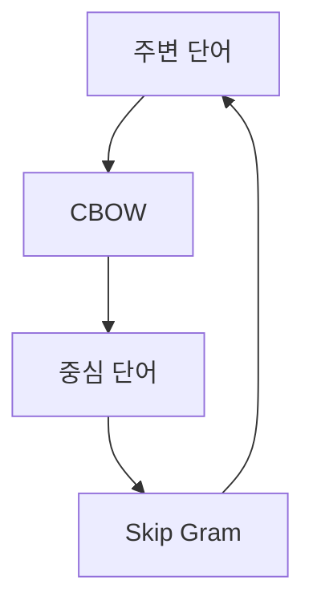

> [!NOTE]
> Word2Vec는 큰 one-hot vector를 낮은 차원의 실수 embedding으로 바꾸고, 주변 문맥을 이용해 단어 사이 관계가 반영되도록 가중치를 학습한다.

---

## One-hot에서 embedding으로

<Tabs>
  <Tab label="One-hot">각 단어를 고유 index에 대응하는 희소 vector로 표현한다. 단어 수가 늘면 vector가 커지고 서로 다른 단어 사이의 관계를 직접 나타내지 못한다.</Tab>
  <Tab label="Embedding">Word2Vec의 embedding layer가 각 단어를 $d$차원 실수 vector로 변환한다. $d$는 원본에서 hyperparameter로 정의된다.</Tab>
</Tabs>

| 단어 | embedding 첫째 값 | embedding 둘째 값 | 원본의 배치 |
| :-- | --: | --: | :-- |
| cat | 0.8 | 0.7 | 동물 영역 |
| dog | 0.7 | 0.6 | 동물 영역 |
| apple | 0.2 | 0.4 | 과일 영역 |
| banana | 0.3 | 0.2 | 과일 영역 |

원본은 가까운 embedding끼리 유사 단어를 묶고, woman→man과 queen→king의 방향 관계가 유사한 예를 제시한다.

---

## 독립 학습 예의 규모

```html preview
<div style="font-family:system-ui,sans-serif;padding:20px">
  <div id="cards" style="display:flex;gap:14px;flex-wrap:wrap"></div>
  <script>
    var stats = [
      ['Vocabulary', '100,000', '대규모 one-hot 예', 'var(--chart-2)'],
      ['Hidden dimension', '2', '4단어 모델 예', 'var(--chart-1)'],
      ['Cross entropy', '1.38', '미학습 love 예', 'var(--chart-5)']
    ];
    document.getElementById('cards').innerHTML = stats.map(function (s) {
      return '<div style="flex:1;min-width:150px;padding:16px;background:var(--card);' +
        'color:var(--card-foreground);border:1px solid var(--border);' +
        'border-radius:var(--radius)">' +
        '<div style="font-size:13px;color:var(--muted-foreground)">' + s[0] + '</div>' +
        '<div style="font-size:26px;font-weight:700;margin-top:4px">' + s[1] + '</div>' +
        '<div style="font-size:12px;font-weight:600;margin-top:4px;color:' + s[3] + '">' +
        s[2] + '</div>' +
        '</div>';
    }).join('');
  </script>
</div>
```

4단어 예에서 입력층과 출력층은 각각 4차원이고, 두 가중치 행렬은 $W_1 \in \mathbb{R}^{4 \times 2}$와 $W_2 \in \mathbb{R}^{2 \times 4}$다.

---

## 단어 하나를 독립적으로 학습하기

**핵심:** 입력 단어와 같은 label을 맞히도록 softmax와 cross-entropy를 사용하면 hidden vector가 그 단어의 embedding이 된다.

$$
CE(Y,\widehat{Y})
=-\sum_{i=0}^{N-1}Y_i\log(\widehat{Y}_i)
$$

<details>
<summary>love 예의 두 학습 상태</summary>

- 충분히 학습되지 않은 예의 logits는 $[-0.3,0.5,1.2,-0.1]$이다.
- 충분히 학습된 예의 logits는 $[-0.1,3.2,0.2,-0.2]$이다.
- 훈련이 끝난 뒤 love에 해당하는 가중치 행의 예는 $[-0.72,0.45]$다.
- 원본은 embedding vector를 훈련 완료된 weight의 각 행으로 설명한다.

</details>

---

## 충분히 학습된 출력 분포

```html preview
<div style="font-family:system-ui,sans-serif;padding:20px;color:var(--foreground)">
  <h3 style="margin:0 0 14px;font-size:15px;font-weight:600">love 입력의 softmax 출력</h3>
  <div id="bars" style="display:flex;align-items:flex-end;gap:14px;height:170px"></div>
  <script>
    var data = [['I', 0.03], ['love', 0.90], ['cute', 0.05], ['cat', 0.02]];
    var max = Math.max.apply(null, data.map(function (d) { return d[1]; }));
    document.getElementById('bars').innerHTML = data.map(function (d, i) {
      return '<div style="flex:1;display:flex;flex-direction:column;align-items:center;' +
        'gap:6px;height:100%;justify-content:flex-end">' +
        '<span style="font-size:12px;font-weight:600">' + d[1] + '</span>' +
        '<div style="width:100%;height:' + (d[1] / max * 100) + '%;' +
        'background:var(--chart-' + (i + 1) + ');' +
        'border-radius:var(--radius) var(--radius) 0 0"></div>' +
        '<span style="font-size:12px;color:var(--muted-foreground)">' + d[0] + '</span>' +
        '</div>';
    }).join('');
  </script>
</div>
```

이 분포는 원본의 4단어 예에만 해당하며 일반적인 Word2Vec 성능값이 아니다.

---

## 문맥을 학습하는 두 방법



<Tabs>
  <Tab label="CBOW">여러 주변 단어를 입력해 가운데 단어 하나를 예측한다. I love cat 예에서는 I와 cat의 one-hot 정보를 각각 0.5 비중으로 합쳐 love를 맞힌다.</Tab>
  <Tab label="Skip-Gram">가운데 단어 하나를 입력해 주변에 나타날 여러 단어를 예측한다. 같은 예에서는 love를 입력해 I와 cat을 target으로 둔다.</Tab>
</Tabs>

| 구분 | 입력 | 정답 | 학습 방향 |
| :-- | :-- | :-- | :-- |
| 독립 학습 | 단어 하나 | 같은 단어 | 개별 embedding 형성 |
| CBOW | 여러 주변 단어 | 중심 단어 하나 | 문맥에서 중심 추론 |
| Skip-Gram | 중심 단어 하나 | 여러 주변 단어 | 중심에서 문맥 추론 |

---

## 수식과 추출 경계

> [!WARNING]
> one-hot vector 사이의 L2-distance 식은 norm 기호와 제곱합이 추출 과정에서 모호하게 결합되어 있다. 이를 외부의 표준식으로 교체하지 않았으며, 일부 layer 이름도 글자가 누락되어 있다. 앞부분의 RNN·LSTM 리뷰는 이 문서의 고유 책임에서 제외한다.

---

## 정리

| 핵심 개념 | 의미 | 적용 또는 경계 |
| :-- | :-- | :-- |
| One-hot | index 하나만 1인 희소 표현 | 큰 vocabulary에서 차원이 커짐 |
| Embedding | 학습된 가중치 행으로 얻는 실수 vector | 차원 $d$는 hyperparameter |
| 독립 학습 | 같은 단어를 출력하도록 학습 | 단어 사이 문맥은 반영하지 못함 |
| CBOW | 주변에서 중심 단어 예측 | many-to-one |
| Skip-Gram | 중심에서 주변 단어 예측 | one-to-many |