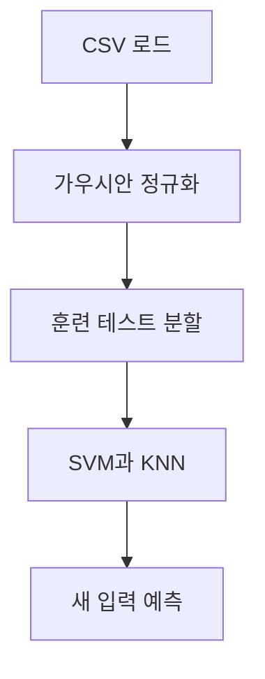

> [!NOTE]
> 이 대비 문제는 영화 선호도 두 특성을 정규화한 뒤 세 개의 one-vs-rest SVM과 홀수 K 후보의 KNN을 비교해 새 취향의 영화를 추천하게 한다.

---

## 문제 구성

문제 2의 총점은 70점이며, 세 소문항이 SVM 학습, KNN 선택, 새 입력 예측을 차례로 요구한다.

```html preview
<div style="font-family:system-ui,sans-serif;padding:20px;color:var(--foreground)">
  <h3 style="margin:0 0 14px;font-size:15px;font-weight:600">문제 2 배점</h3>
  <div id="bars" style="display:flex;align-items:flex-end;gap:14px;height:170px"></div>
  <script>
    var data = [['2-1 SVM', 25], ['2-2 KNN', 25], ['2-3 예측', 20]];
    var max = Math.max.apply(null, data.map(function (d) { return d[1]; }));
    document.getElementById('bars').innerHTML = data.map(function (d, i) {
      return '<div style="flex:1;display:flex;flex-direction:column;align-items:center;' +
        'gap:6px;height:100%;justify-content:flex-end">' +
        '<span style="font-size:12px;font-weight:600">' + d[1] + '</span>' +
        '<div style="width:100%;height:' + (d[1] / max * 100) + '%;' +
        'background:var(--chart-' + (i + 1) + ');' +
        'border-radius:var(--radius) var(--radius) 0 0"></div>' +
        '<span style="font-size:12px;color:var(--muted-foreground)">' + d[0] + '</span>' +
        '</div>';
    }).join('');
  </script>
</div>
```

---

## 데이터와 label

| index 예시 | Action | Romance | 영화 |
| --: | --: | --: | :-- |
| 0 | 49.14 | 79.97 | The Notebook |
| 1 | 85.28 | 53.01 | John Wick |
| 2 | 33.51 | 23.33 | Leon |
| 1999 | 25.88 | 40.63 | Leon |

label mapping은 John Wick 0, The Notebook 1, Leon 2다. source는 index 0과 1999를 보여 주지만 행 개수를 별도 문장으로 확정하지는 않는다.

---

## 전처리 순서



해설 source는 Action과 Romance를 각각 다음 식으로 정규화하고 `random_state=1234`인 80:20 분할을 사용한다.

$$
x'=\frac{x-\mu}{\sigma}
$$

---

## 소문항별 요구

<Tabs>
  <Tab label="2-1 SVM">

정규화된 훈련 set에서 영화별 one-vs-rest SVM 세 개를 학습하고 각 모델의 $\mathbf{w}$와 $b$를 출력한다. 지정 조건은 학습률 $0.001$, 반복 $1000$, hinge loss 기반 gradient update다.

  </Tab>
  <Tab label="2-2 KNN">

$1$부터 $30$ 사이의 홀수 K를 test accuracy로 비교하고 최적 K를 선택한다. 거리 함수는 L2 distance다.

$$
d(\mathbf{x},\mathbf{z})=
\sqrt{\sum_j(x_j-z_j)^2}
$$

  </Tab>
  <Tab label="2-3 새 입력">

Action $26.5$, Romance $66.5$를 같은 통계량으로 정규화한 뒤 SVM과 KNN으로 각각 추천한다. prompt는 SVM에서 출력이 $+1$인 모델을 고르라고 명시한다.

  </Tab>
</Tabs>

---

## one-vs-rest SVM 구성

| 모델 | 양의 class | 음의 class |
| :-- | :-- | :-- |
| John Wick 모델 | John Wick | 나머지 두 영화 |
| Notebook 모델 | The Notebook | 나머지 두 영화 |
| Leon 모델 | Leon | 나머지 두 영화 |

각 모델은 다음 margin score를 기준으로 source의 반복 갱신을 수행한다.

$$
y_i(\mathbf{w}^{T}\mathbf{x}_i+b)
$$

---

## KNN 후보 선택

- **후보:** 1부터 30 사이의 홀수
- **평가:** 각 후보의 test accuracy
- **선택:** accuracy가 가장 높은 K
- **예측:** 선택한 K개의 label 다수결

> [!IMPORTANT]
> 후보 범위와 홀수 간격은 주어졌지만 동일 accuracy의 tie-break와 기본 K는 없다. 따라서 source 근거만으로 interactive control의 default를 만들 수 없다.

---

## 해설에 남은 SVM 점수

| 영화 모델 | 새 입력의 score |
| :-- | --: |
| John Wick | -4.3933 |
| The Notebook | 0.2566 |
| Leon | -0.1623 |

> [!SUCCESS]
> 해설은 세 score의 최댓값을 선택해 The Notebook을 답으로 제시한다.

---

## 부분 해설의 코드 흐름

<details>
<summary>제공된 단계와 누락된 단계</summary>

해설은 CSV load, 불필요 열 제거, Action·Romance 정규화, 80:20 분할, 세 SVM label 생성과 모델 학습, 경계 시각화 코드를 제공한다. 이후 새 입력에 대한 score 계산과 `argmax` 선택을 보여 준다. 그러나 문제 2-2의 KNN 후보 탐색 구현과 선택 결과는 제공하지 않는다. 새 입력 정규화라는 제목 아래에는 정규화 코드 대신 앞선 SVM 시각화 코드가 반복된다.

</details>

---

## 답안 점검 순서

| 점검 대상 | 확인할 내용 |
| :-- | :-- |
| 정규화 | 훈련 데이터의 $\mu$, $\sigma$를 새 입력에도 재사용 |
| SVM | 세 one-vs-rest 모델의 $\mathbf{w}$, $b$와 판별 score |
| KNN | 홀수 K별 test accuracy와 최종 K |
| 새 입력 | SVM 결과와 KNN 결과를 각각 기록 |
| 규칙 | prompt의 선택 기준과 해설 코드가 일치하는지 확인 |

---

## 원본 결손과 모순

> [!WARNING]
> prompt는 출력이 $+1$인 SVM을 고르라고 하지만 해설의 세 score에는 $+1$이 없고, 실제 코드는 최댓값 $0.2566$을 선택한다. 해설에는 2-2 KNN 구현·최적 K·KNN 추천 결과가 없으며, 새 입력 정규화 구간은 이전 시각화 코드를 중복한다. 수동 SVM 코드는 마진 충족 표본을 건너뛰고 가중치 감쇠 항을 두지 않아 완전한 soft-margin 목적함수 구현으로 볼 수 없다. prompt 첫 페이지와 일부 수식은 text-poor이므로 추출문과 원본 화면을 함께 대조했다.

---

## 정리

| 소문항 | source로 확정 가능한 것 | 남은 결손 |
| :-- | :-- | :-- |
| 2-1 | 세 SVM, 학습률, 반복 수, 출력 항목 | 목적함수 전체 구현은 불완전 |
| 2-2 | 홀수 K 탐색과 L2 distance | 코드·최적 K·예측 결과 없음 |
| 2-3 | 새 입력과 SVM score, 해설 답 | prompt의 $+1$ 규칙과 argmax가 충돌 |
