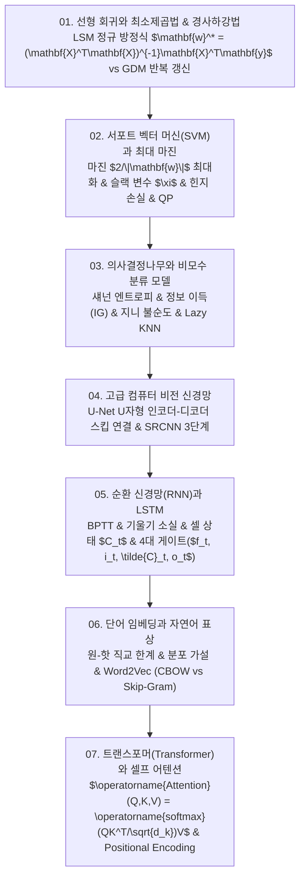

# 📚 머신러닝 (Machine Learning & Deep Architectures) 전체 강의 로드맵

선형 회귀의 최소제곱법(LSM) 정규 방정식과 경사하강법(GDM), 서포트 벡터 머신(SVM)의 최대 마진 초평면 및 힌지 손실·2차 계획법(QP), 의사결정나무의 정보 이득(엔트로피/지니 계수) 및 KNN, 고급 컴퓨터 비전(U-Net 분할 스킵 연결 및 SRCNN 초해상도), 순환 신경망(RNN)과 LSTM 4대 게이트 시계열 모델링, 자연어 분산 표상 Word2Vec(CBOW/Skip-Gram), 그리고 셀프 어텐션 기반의 트랜스포머(Transformer) 아키텍처까지 머신러닝의 전 과정을 포괄적으로 학습합니다.

---

## 🗺️ 강의 목차 (Curriculum Overview)

---

## 📑 개별 정리 문서 목록

1. [01. 선형 회귀와 최소제곱법(LSM) 및 경사하강법(GDM) - 단일·다중 회귀와 정규 방정식](file:///Users/um-yunsang/work/edu/ComputerScience/03_ai-ml-data/machine-learning/notes/01.%20%EC%84%A0%ED%98%95%20%ED%9A%8C%EA%B7%80%EC%99%80%20%EC%B5%9C%EC%86%8C%EC%A0%9C%EA%B3%B1%EB%B2%95(LSM)%20%EB%B0%8F%20%EA%B2%BD%EC%82%AC%ED%95%98%EA%B0%95%EB%B2%95(GDM)%20-%20%EB%8B%A8%EC%9D%BC%C2%B7%EB%8B%A4%EC%A4%91%20%ED%9A%8C%EA%B7%80%EC%99%80%20%EC%A0%95%EA%B7%9C%20%EB%B0%A9%EC%A0%95%EC%8B%9D.md)
   - 잔차 제곱합 미분 및 정규 방정식 닫힌 해 유도, 대화형 LSM vs GDM 피팅기
2. [02. 서포트 벡터 머신(SVM)과 최대 마진 분류 - 하드·소프트 마진, 힌지 손실과 2차 계획법(QP)](file:///Users/um-yunsang/work/edu/ComputerScience/03_ai-ml-data/machine-learning/notes/02.%20%EC%84%9C%ED%8F%AC%ED%8A%B8%20%EB%B2%A1%ED%84%B0%20%EB%A8%B8%EC%8B%A0(SVM)%EA%B3%BC%20%EC%B5%9C%EB%8C%80%20%EB%A7%88%EC%A7%84%20%EB%B6%84%EB%A5%98%20-%20%ED%95%98%EB%93%9C%C2%B7%EC%86%8C%ED%84%84%ED%8A%B8%20%EB%A7%88%EC%A7%84,%20%ED%9E%8C%EC%A7%80%20%EC%86%90%EC%8B%A4%EA%B3%BC%202%EC%B0%A8%20%EA%B3%84%ED%9A%8D%EB%B2%95(QP).md)
   - 최대 마진 초평면, 슬랙 변수 $\xi$ 및 힌지 손실, 대화형 $C$ 하이퍼파라미터 마진 시뮬레이터
3. [03. 의사결정나무와 비모수 분류 모델 - 정보 이득(엔트로피·지니 계수)과 K-최근접 이웃(KNN)](file:///Users/um-yunsang/work/edu/ComputerScience/03_ai-ml-data/machine-learning/notes/03.%20%EC%9D%98%EC%82%AC%EA%B2%B0%EC%A0%95%EB%82%98%EB%AC%B4%EC%99%80%20%EB%B9%84%EB%AA%A8%EC%88%98%20%EB%B6%84%EB%A5%98%20%EB%AA%A8%EB%8D%B8%20-%20%EC%A0%95%EB%B3%B4%20%EC%9D%B4%EB%93%9D(%EC%97%94%ED%8A%B8%EB%A1%9C%ED%94%BC%C2%B7%EC%A7%80%EB%8B%88%20%EA%B3%84%EC%88%98)%EA%B3%BC%20K-%EC%B5%9C%EA%B7%BC%EC%A0%91%20%EC%9D%B4%EC%9B%83(KNN).md)
   - 섀넌 엔트로피 및 정보 이득 수식 유도, 의사결정나무 vs KNN 비교, 실시간 불순도 계산기
4. [04. 고급 컴퓨터 비전 신경망 - U-Net 인코더-디코더 잔차 구조와 초해상도(SRCNN)](file:///Users/um-yunsang/work/edu/ComputerScience/03_ai-ml-data/machine-learning/notes/04.%20%EA%B3%A0%EA%B8%89%20%EC%BB%B4%ED%93%A8%ED%84%B0%20%EB%B9%84%EC%A0%84%20%EC%8B%A0%EA%B2%BD%EB%A7%9D%20-%20U-Net%20%EC%9D%B8%EC%BD%94%EB%8D%94-%EB%94%94%EC%BD%94%EB%8D%94%20%EC%9E%94%EC%B0%A8%20%EA%B5%AC%EC%A1%B0%EC%99%80%20%EC%B4%88%ED%95%B4%EC%83%81%EB%8F%84(SRCNN).md)
   - U-Net 수축/확장 경로 및 스킵 연결 채널 병합, SRCNN 3단계, 실시간 세그멘테이션 시뮬레이터
5. [05. 순환 신경망(RNN)과 장단기 메모리(LSTM) - 시계열 모델링, BPTT와 4대 게이트 메커니즘](file:///Users/um-yunsang/work/edu/ComputerScience/03_ai-ml-data/machine-learning/notes/05.%20%EC%88%9C%ED%99%98%20%EC%8B%A0%EA%B2%BD%EB%A7%9D(RNN)%EA%B3%BC%20%EC%9E%A5%EB%8B%A8%EA%B8%B0%20%EB%A9%94%EB%AA%A8%EB%A6%AC(LSTM)%20-%20%EC%8B%9C%EA%B3%84%EC%97%B4%20%EB%AA%A8%EB%8D%B8%EB%A7%81,%20BPTT%EC%99%80%204%EB%8C%80%20%EA%B2%8C%EC%9D%B4%ED%8A%B8%20%EB%A9%94%EC%BB%A4%EB%8B%88%EC%A6%98.md)
   - BPTT 기울기 소실, LSTM 셀 상태 $C_t$ 덧셈 갱신 및 3대 시그모이드 게이트, 대화형 게이트 제어기
6. [06. 단어 임베딩과 자연어 표상 - One-Hot의 한계, 분산 표상과 Word2Vec(CBOW vs Skip-Gram)](file:///Users/um-yunsang/work/edu/ComputerScience/03_ai-ml-data/machine-learning/notes/06.%20%EB%8B%A8%EC%96%B4%20%EC%9E%84%EB%82%B4%EB%94%A9%EA%B3%BC%20%EC%9E%90%EC%97%B0%EC%96%B4%20%ED%91%9C%EC%83%81%20-%20One-Hot%EC%9D%98%20%ED%95%9C%EA%B3%84,%20%EB%B6%84%EC%82%B0%20%ED%91%9C%EC%83%81%EA%B3%BC%20Word2Vec(CBOW%20vs%20Skip-Gram).md)
   - 분포 가설, CBOW vs Skip-Gram 모델 구조, 코사인 유사도, 대화형 단어 벡터 연산기
7. [07. 트랜스포머(Transformer)와 셀프 어텐션 - 스케일드 닷 프로덕트, 멀티헤드 어텐션과 위치 인코딩](file:///Users/um-yunsang/work/edu/ComputerScience/03_ai-ml-data/machine-learning/notes/07.%20%ED%8A%B8%EB%9E%9C%EC%8A%A4%ED%8F%AC%EB%A8%B8(Transformer)%EC%99%80%20%EC%85%80%ED%94%84%20%EC%96%B4%ED%85%90%EC%85%98%20-%20%EC%8A%A4%EC%BC%80%EC%9D%BC%EB%93%9C%20%EB%8B%B7%20%ED%94%84%EB%A1%9C%EB%8D%95%ED%8A%B8,%20%EB%A9%80%ED%8B%B0%ED%97%A4%EB%93%9C%20%EC%96%B4%ED%85%90%EC%85%98%EA%B3%BC%20%EC%9C%84%EC%B9%98%20%EC%9D%B8%EC%BD%94%EB%94%A9.md)
   - $\operatorname{Attention}(Q,K,V)$ 수식, 삼각함수 Positional Encoding, 대화형 문맥 어텐션 가중치 매트릭스
