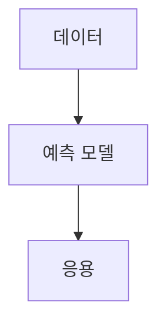

> [!abstract] 학습 경로
> 데이터 표현에서 시작해 거리 기반 모델, 선형 모형, 트리, 점진 학습, 언어 모델 애플리케이션으로 확장한다.

## 강의 흐름 지도

[00. ml-projects 강의 흐름 지도](<./notes/00. ml-projects 강의 흐름 지도.md>)

## 학습 지도

## 노트

| 순서 | 주제 | 노트 |
| :-- | :-- | :-- |
| 1 | 거리 기반 분류 | [K-최근접 이웃 분류](./notes/01.%20K-%EC%B5%9C%EA%B7%BC%EC%A0%91%20%EC%9D%B4%EC%9B%83%20%EB%B6%84%EB%A5%98.md) |
| 2 | 문맥 기반 언어 모델 응용 | [LangChain 기반 RAG 챗봇](./notes/01.%20LangChain%20%EA%B8%B0%EB%B0%98%20RAG%20%EC%B1%97%EB%B4%87.md) |
| 3 | 데이터와 오차 | [Python 데이터와 평균제곱오차](./notes/01.%20Python%20%EB%8D%B0%EC%9D%B4%ED%84%B0%EC%99%80%20%ED%8F%89%EA%B7%A0%EC%A0%9C%EA%B3%B1%EC%98%A4%EC%B0%A8.md) |
| 4 | 배열 연산 | [퍼셉트론과 벡터화](./notes/01.%20%ED%8D%BC%EC%85%89%ED%8A%B8%EB%A1%A0%EA%B3%BC%20%EB%B2%A1%ED%84%B0%ED%99%94.md) |
| 5 | 거리 기반 회귀 | [K-최근접 이웃 회귀](./notes/02.%20K-%EC%B5%9C%EA%B7%BC%EC%A0%91%20%EC%9D%B4%EC%9B%83%20%ED%9A%8C%EA%B7%80.md) |
| 6 | 선형·다항 모형 | [선형 회귀와 다항 특성](./notes/03.%20%EC%84%A0%ED%98%95%20%ED%9A%8C%EA%B7%80%EC%99%80%20%EB%8B%A4%ED%95%AD%20%ED%8A%B9%EC%84%B1.md) |
| 7 | 다중 특성과 변환 | [다중 회귀와 특성 공학](./notes/04.%20%EB%8B%A4%EC%A4%91%20%ED%9A%8C%EA%B7%80%EC%99%80%20%ED%8A%B9%EC%84%B1%20%EA%B3%B5%ED%95%99.md) |
| 8 | 클래스 확률 | [로지스틱 회귀와 클래스 확률](./notes/05.%20%EB%A1%9C%EC%A7%80%EC%8A%A4%ED%8B%B1%20%ED%9A%8C%EA%B7%80%EC%99%80%20%ED%81%B4%EB%9E%98%EC%8A%A4%20%ED%99%95%EB%A5%A0.md) |
| 9 | 연속 데이터 학습 | [점진 학습과 확률적 경사 하강법](./notes/06.%20%EC%A0%90%EC%A7%84%20%ED%95%99%EC%8A%B5%EA%B3%BC%20%ED%99%95%EB%A5%A0%EC%A0%81%20%EA%B2%BD%EC%82%AC%20%ED%95%98%EA%B0%95%EB%B2%95.md) |
| 10 | 트리 기반 분류 | [결정 트리와 가지치기](./notes/07.%20%EA%B2%B0%EC%A0%95%20%ED%8A%B8%EB%A6%AC%EC%99%80%20%EA%B0%80%EC%A7%80%EC%B9%98%EA%B8%B0.md) |

출처 매핑

거리 기반 분류부터 결정 트리까지는 각각의 번호가 붙은 강의 추출 텍스트에 대응한다. 배열·MSE·벡터화는 2024세미나자료 추출 텍스트, 챗봇 노트는 LangChain_RAG 추출 텍스트를 사용했다.

> [!warning] source warning
> 퍼셉트론의 가중합·활성화 설명은 제공된 추출 텍스트에서 확인되지 않아 해당 노트에 주장으로 넣지 않았다. RAG의 세부 검색 절차도 추출 근거가 희소해 기록하지 않았다.
