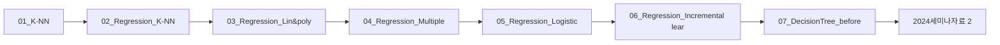

> [!abstract] 사용법
> 이 문서는 원본 PDF의 **순서 → 핵심 단서 → 학습 점검**을 한 번에 보는 지도입니다. 세부 개념은 같은 폴더의 주제 노트와 원본 PDF를 함께 대조하세요.

## 강의 흐름



<Tabs>
  <Tab label="파일 순서">파일명과 주차·장 제목을 강의 진행 신호로 삼아 처음부터 읽습니다.</Tab>
  <Tab label="읽기 전략">이론에서 실습·평가로 이동하며 같은 주제의 중복 PDF는 보조 자료로 비교합니다.</Tab>
  <Tab label="검증">텍스트가 빈약한 자료는 추출되지 않은 도식·수식을 임의로 채우지 않고 원본에서 확인합니다.</Tab>
</Tabs>

## 원본 PDF 목록

| 파일 | 쪽수 | 첫 페이지 단서 |
| :-- | --: | :-- |
| 01_K-NN.pdf | — | 이번에 만들 머신러닝 프로그램 http://muntermag.com/2016/09/her-y-el-amor-en-la-era-tecnologica/ 1 전통적인 프로그램 |
| 02_Regression_K-NN.pdf | — | 농어의 무게를 예측하라 http://muntermag.com/2016/09/her-y-el-amor-en-la-era-tecnologica/ 1 회귀 |
| 03_Regression_Lin&poly.pdf | — | 농어의 무게를 예측하라 2 http://muntermag.com/2016/09/her-y-el-amor-en-la-era-tecnologica/ 1 선형 회귀 Linear regression |
| 04_Regression_Multiple.pdf | — | 농어의 무게를 예측하라 3 ((The Last)) http://muntermag.com/2016/09/her-y-el-amor-en-la-era-tecnolo |
| 05_Regression_Logistic.pdf | — | 로지스틱 회귀로 클래스 확률 구하기! 내가 가진 데이터로 어떤 생선이 나올지 확인해 보자! 1 목표 : 내가 가진 데이터로 생선 종류의 확률 구하기  총 7가지 생선 존재 가정  생선의 크기, 무게 등이 |
| 06_Regression_Incremental learning.pdf | — | 점진적인 학습 확률적 경사 하강법! 1 만약에…  훈련데이터가 한 번에 준비되는 것이 아니라 조금씩 전달된다면?  기존의 훈련 데이터에 새로운 데이터 추가해서 매일매일 |
| 07_DecisionTree_before.pdf | — | 레드 와인과 화이트 와인 구별해보기! 이번엔 여러 데이터(특징)으로 레드 와인과 화이트 와인을 구별해 보자! 1 먼저 로지스틱 회귀로 모델 만들어보자! 2 |
| 2024세미나자료 2.pdf | — | Python Programing 김민영(kmyco@deu.ac.kr) 1 • 파이썬Python은 귀도 반 로섬Guido van |
| 2024세미나자료.pdf | — | Python Programing 김민영(kmyco@deu.ac.kr) 1 • 파이썬Python은 귀도 반 로섬Guido van |
| 인공지능특강 2.pdf | — | 텍스트 추출 빈약 — 원본 시각 자료 확인 필요 |
| 인공지능특강.pdf | — | 텍스트 추출 빈약 — 원본 시각 자료 확인 필요 |
| LangChain_RAG.pdf | — | 1 LangChain을 활용한 PDF 챗봇 구축 |
| Python_Machine_Learning_Certificate.pdf | — | 발급번호 2024 0799 51 : - - 이수증 소 속 : 컴퓨터 AI공학부 AI학과 · 학 번 |

## 원본 단계 인터랙티브

```html preview
<div style="font-family:system-ui,sans-serif;padding:20px;color:var(--foreground)">
  <label for="flow814992" style="font-size:14px;font-weight:600">원본 자료 단계</label>
  <div id="flow814992-out" style="font-size:24px;font-weight:700;color:var(--chart-1);margin:6px 0">01_K-NN</div>
  <input id="flow814992" type="range" min="1" max="13" step="1" value="1" style="width:100%;accent-color:var(--primary)" />
  <p style="font-size:13px;color:var(--muted-foreground)">슬라이더를 움직이면 파일명 순서대로 자료의 역할을 확인합니다.</p>
  <script>
    var flow814992 = document.getElementById('flow814992');
    var flow814992Out = document.getElementById('flow814992-out');
    var flow814992Steps = ["01_K-NN","02_Regression_K-NN","03_Regression_Lin&poly","04_Regression_Multiple","05_Regression_Logistic","06_Regression_Incremental learning","07_DecisionTree_before","2024세미나자료 2","2024세미나자료","인공지능특강 2","인공지능특강","LangChain_RAG","Python_Machine_Learning_Certificate"];
    flow814992.addEventListener('input', function () {
      flow814992Out.textContent = flow814992Steps[Number(flow814992.value) - 1];
    });
  </script>
</div>
```

## 점검 포인트

- **범위:** 13개 PDF, 총 0쪽.
- **근거:** 첫 페이지 추출 단서를 표에 남겨 주제명과 흐름을 확인했습니다.
- **시각 자료:** 3개 파일은 첫 페이지 텍스트가 빈약하므로 필요한 경우 승인된 크롭 후보로만 별도 검토합니다.

> [!warning] 과해석 방지
> 이 지도에는 파일명·쪽수·추출된 첫 페이지 단서만 기록했습니다. PDF에 없는 구현 세부, 성능 수치, 권장 설정은 추가하지 않습니다.

<details>
<summary>다음 읽기</summary>

현재 단계의 파일을 선택한 뒤, 같은 폴더의 주제 노트에서 정의·절차·실습 결과를 대조하세요.

</details>
