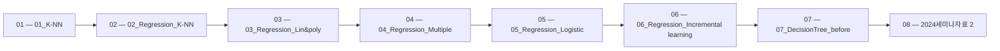

 > [!abstract] 사용법
 > 이 지도는 현재 폴더의 원본 PDF를 파일 순서대로 묶어 **강의 진행 → 핵심 단서 → 점검 포인트**를 연결합니다. 세부 개념은 같은 폴더의 주제 노트와 함께 대조하세요.

## 강의 흐름



<Tabs>
  <Tab label="파일 순서">파일명에 포함된 주차·장·버전 표기를 먼저 읽어 강의의 큰 흐름을 잡습니다.</Tab>
  <Tab label="중복 자료">같은 접두사나 버전이 겹치면 앞 자료를 기준으로 뒤 자료의 보충·실습 여부를 비교합니다.</Tab>
  <Tab label="검증">첫 페이지 단서는 방향만 제시하므로 정의·식·코드·수치는 원본 PDF에서 다시 확인합니다.</Tab>
</Tabs>

## 원본 PDF 목록

| 파일 | 쪽수 | 첫 페이지 단서 |
| :-- | --: | :-- |
| 01_K-NN.pdf | 14 | 이번에 만들 머신러닝 프로그램 http://muntermag.com/2016/09/her-y-el-amor-en-la-era-tecnologica/ 1 전통적인 프로그램 http://muntermag.com/2016/09/her-y-el-amor-en-la-era-tecnologica/ 2 1 |
| 02_Regression_K-NN.pdf | 10 | 농어의 무게를 예측하라 http://muntermag.com/2016/09/her-y-el-amor-en-la-era-tecnologica/ 1 회귀 Regression  지도학습은 크게 분류와 회귀(Regression)로 나눔  분류 : 샘플을 몇 개의 클래스 중 하나로 분류하는 문제  회귀 : 클래스 중 하나로 분류하는 것이 아닌 임의의 어떤 숫자를 예측하는 문제임 • 내년 경제 성 |
| 03_Regression_Lin&poly.pdf | 5 | 농어의 무게를 예측하라 2 http://muntermag.com/2016/09/her-y-el-amor-en-la-era-tecnologica/ 1 선형 회귀 Linear regression  대표적인 회귀 알고리즘  비교적 간단하고 성능이 뛰어남  특성이 하나인 경우 어떤 직선을 학습하는 알고리즘 2 1 |
| 04_Regression_Multiple.pdf | 17 | 농어의 무게를 예측하라 3 ((The Last)) http://muntermag.com/2016/09/her-y-el-amor-en-la-era-tecnologica/ 1 이전까지 내용 훈련세트보다 테스트 세트의 점수가 여전히 높음! 2 1 |
| 05_Regression_Logistic.pdf | 12 | 로지스틱 회귀로 클래스 확률 구하기! 내가 가진 데이터로 어떤 생선이 나올지 확인해 보자! 1 목표 : 내가 가진 데이터로 생선 종류의 확률 구하기  총 7가지 생선 존재 가정  생선의 크기, 무게 등이 주어 졌을 때 7가지 생선에 대한 확률을 출력 하는 것이 목표!  이를 위해 길이, 높이, 두께 이외에 대각선 길이, 무게 데이터 사용 2 1 |
| 06_Regression_Incremental learning.pdf | 15 | 점진적인 학습 확률적 경사 하강법! 1 만약에…  훈련데이터가 한 번에 준비되는 것이 아니라 조금씩 전달된다면?  기존의 훈련 데이터에 새로운 데이터 추가해서 매일매일 훈련한다면? • 새로운 데이터를 활용해 모델을 훈련할 수 있음 • 시간이 지날수록 데이터가 늘어나는 단점  데이터 용량 증가 • 데이터 용량 증가로 인한 학습/검증용 서버 성능/용량 증설 필요 • 지속적인 방법은 아님 2 |
| 07_DecisionTree_before.pdf | 12 | 레드 와인과 화이트 와인 구별해보기! 이번엔 여러 데이터(특징)으로 레드 와인과 화이트 와인을 구별해 보자! 1 먼저 로지스틱 회귀로 모델 만들어보자! 2 1 |
| 2024세미나자료 2.pdf | 229 | Python Programing 김민영(kmyco@deu.ac.kr) 1 • 파이썬Python은 귀도 반 로섬Guido van Rossum이 1991년에 개발한 대화형 프로그래밍 언어인데 최근 많은 인기를 얻고 있다. • 가장 큰 이유는 생산성이 뛰어나기 때문이다. • 파이썬을 이용하면 간결하면서도 효율적인 프로그램을 빠르게 작성할 수 있다. • 파이썬은 오픈 소스이어서 무료이고 패키지들이 |
| 2024세미나자료.pdf | 229 | Python Programing 김민영(kmyco@deu.ac.kr) 1 • 파이썬Python은 귀도 반 로섬Guido van Rossum이 1991년에 개발한 대화형 프로그래밍 언어인데 최근 많은 인기를 얻고 있다. • 가장 큰 이유는 생산성이 뛰어나기 때문이다. • 파이썬을 이용하면 간결하면서도 효율적인 프로그램을 빠르게 작성할 수 있다. • 파이썬은 오픈 소스이어서 무료이고 패키지들이 |
| 인공지능특강 2.pdf | 356 | 텍스트 추출 단서 없음 |
| 인공지능특강.pdf | 356 | 텍스트 추출 단서 없음 |
| LangChain_RAG.pdf | 39 | 1 LangChain을 활용한 PDF 챗봇 구축 |
| Python_Machine_Learning_Certificate.pdf | 1 | 발급번호 2024 0799 51 : - - 이수증 소 속 : 컴퓨터 AI공학부 AI학과 · 학 번 : 1705817 성 명 : 엄윤상 프로그램명 : Python으로 시작하는 머신러닝 기 간 : 2024.07.29 ~ 2024.08.16 위 학생은 Python으로 시작하는 머신러닝 프로그램을 위와 같이 이수하 였기에 이 증서를 수여합니다 . 2024.08.16 동아대학교 동아대학교 컴퓨터AI공 |

## 원본 단계 인터랙티브

```html preview
<div style="font-family:system-ui,sans-serif;padding:20px;color:var(--foreground)">
  <label for="flow4144467234" style="font-size:14px;font-weight:600">원본 자료 단계</label>
  <div id="flow4144467234-out" style="font-size:24px;font-weight:700;color:var(--chart-1);margin:6px 0">01_K-NN</div>
  <input id="flow4144467234" type="range" min="1" max="13" step="1" value="1" style="width:100%;accent-color:var(--primary)" />
  <p style="font-size:13px;color:var(--muted-foreground)">슬라이더를 움직이면 파일명 순서대로 자료의 위치를 확인합니다.</p>
  <script>
    var flow4144467234 = document.getElementById('flow4144467234');
    var flow4144467234Out = document.getElementById('flow4144467234-out');
    var flow4144467234Steps = ["01_K-NN","02_Regression_K-NN","03_Regression_Lin&poly","04_Regression_Multiple","05_Regression_Logistic","06_Regression_Incremental learning","07_DecisionTree_before","2024세미나자료 2","2024세미나자료","인공지능특강 2","인공지능특강","LangChain_RAG","Python_Machine_Learning_Certificate"];
    flow4144467234.addEventListener('input', function () {
      flow4144467234Out.textContent = flow4144467234Steps[Number(flow4144467234.value) - 1] || '';
    });
  </script>
</div>
```

## 점검 포인트

- **범위:** 13개 PDF, 총 1295쪽.
- **근거:** 표의 쪽수와 첫 페이지 단서는 현재 sources/ 파일에서 직접 추출했습니다.
- **학습 순서:** 흐름도와 슬라이더를 먼저 훑은 뒤, 주제 노트의 정의·절차·실습 결과를 순서대로 대조합니다.

> [!warning] 과해석 방지
> 이 지도에는 파일명·쪽수·첫 페이지 추출 단서만 기록했습니다. PDF에 없는 구현 세부, 성능 수치, 권장 설정은 추가하지 않습니다.

<details>
<summary>다음 읽기</summary>

현재 단계의 원본을 열어 제목·절차·도식을 확인한 뒤, 같은 폴더의 주제 노트에 해당 근거가 반영되었는지 점검하세요.

</details>
