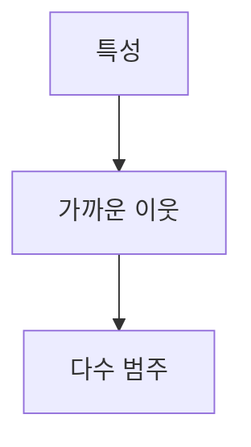

> [!abstract] 한 줄 요약
> K-최근접 이웃은 새 입력 주변의 관측치를 보고 ==가장 많은 범주==를 예측에 쓴다.

## 이 노트의 지도



## 이진 분류 사례

강의 예제는 길이와 무게를 특성으로 쓰며, 도미 35마리와 빙어 14마리를 다룬다. 두 범주를 나누므로 ==이진 분류==의 사례다.

> [!important] 판단 규칙
> 새 데이터의 답은 주변 데이터 중 다수를 차지하는 범주로 정한다. 이 규칙을 쓰려면 기존 데이터를 보관해야 한다.

$$
d(\mathbf{x},\mathbf{x}_i)=\sqrt{(x_1-x_{i1})^2+(x_2-x_{i2})^2}
$$

<details>
<summary>다수결을 수식으로 읽기</summary>

가까운 $k$개 이웃의 레이블 가운데 가장 자주 등장한 값을 예측으로 둘 수 있다.

$$
\hat y=\operatorname{mode}\{y_i: i\in N_k(\mathbf{x})\}
$$

</details>

<Tabs>
  <Tab label="분류 관점">도미와 빙어처럼 가능한 범주가 정해진 문제에서, 이웃의 범주가 답의 후보가 된다.</Tab>
  <Tab label="자원 관점">예측마다 가까운 데이터를 살피므로, 데이터가 커지면 저장 공간과 거리 계산 시간이 함께 문제된다.</Tab>
</Tabs>

<details>
<summary>지도 학습과의 관계</summary>

강의는 답을 알려 주는 데이터를 지도 학습, 답을 알려 주지 않는 데이터를 비지도 학습으로 구분한다. 이 예제는 물고기 범주가 주어진 학습 데이터를 사용한다.

</details>

> [!tip] 특성 읽기
> 길이와 무게는 물고기를 설명하는 ==특성==이다. 새 관측치도 같은 특성 공간에서 기존 관측치와 비교해야 한다.

## 분류 사례의 수치

```html preview
<div style="font-family:system-ui,sans-serif;padding:20px">
  <div id="cards" style="display:flex;gap:14px;flex-wrap:wrap"></div>
  <script>
    var stats = [
      ['도미 표본', '35', '길이와 무게', 'var(--chart-2)'],
      ['빙어 표본', '14', '길이와 무게', 'var(--chart-1)'],
      ['분류 형태', '이진', '두 범주 구별', 'var(--chart-5)']
    ];
    document.getElementById('cards').innerHTML = stats.map(function (s) {
      return '<div style="flex:1;min-width:150px;padding:16px;background:var(--card);' +
        'color:var(--card-foreground);border:1px solid var(--border);' +
        'border-radius:var(--radius)">' +
        '<div style="font-size:13px;color:var(--muted-foreground)">' + s[0] + '</div>' +
        '<div style="font-size:26px;font-weight:700;margin-top:4px">' + s[1] + '</div>' +
        '<div style="font-size:12px;font-weight:600;margin-top:4px;color:' + s[3] + '">' +
        s[2] + '</div>' +
        '</div>';
    }).join('');
  </script>
</div>
```

<details>
<summary>장점과 한계</summary>

가까운 데이터만 살피면 예측할 수 있다는 점이 장점이다. 반면 데이터가 많아지면 메모리가 더 필요하고 직선거리 계산 시간도 늘어난다.

</details>

> [!question]- 스스로 점검
> **Q.** 많은 데이터를 모두 보관해야 하는 이유는 무엇인가?
>
> **A.** 새 입력마다 가까운 기존 관측치를 찾아 다수결을 계산하기 때문이다.

## 작성 경계

> [!warning] 출처 경계
> 제공된 추출 텍스트만 사용했으며, 원본 시각자료와 페이지 표기는 넣지 않았다.

---

## 원본 강의 흐름 인터랙티브

```html preview
<div style="font-family:system-ui,sans-serif;padding:20px;color:var(--foreground)">
  <label for="noteFlow758070" style="font-size:14px;font-weight:600">K-최근접 이웃 분류 단계</label>
  <div id="noteFlow758070-out" style="font-size:26px;font-weight:700;color:var(--chart-1);margin:6px 0">K-최근접 이웃 분류 핵심 개념</div>
  <input id="noteFlow758070" type="range" min="1" max="3" step="1" value="1" style="width:100%;accent-color:var(--primary)" />
  <p style="font-size:13px;color:var(--muted-foreground)">슬라이더를 움직이면 원본 PDF에서 정리한 이 노트의 흐름을 확인합니다.</p>
  <script>
    var noteFlow758070 = document.getElementById('noteFlow758070');
    var noteFlow758070Out = document.getElementById('noteFlow758070-out');
    var noteFlow758070Steps = ["K-최근접 이웃 분류 핵심 개념","K-최근접 이웃 분류 처리 절차","K-최근접 이웃 분류 검증·응용"];
    noteFlow758070.addEventListener('input', function () { noteFlow758070Out.textContent = noteFlow758070Steps[Number(noteFlow758070.value) - 1]; });
  </script>
</div>
```
