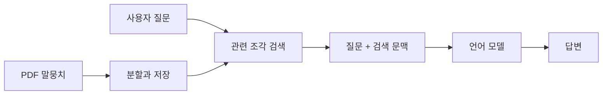

> [!abstract]
> RAG는 질문과 관련된 문서를 먼저 찾고, 찾은 내용을 언어 모델의 문맥으로 제공해 응답을 구성하는 방식이다. LangChain은 데이터 연결·프롬프트·모델 호출을 조합하는 애플리케이션 프레임워크로 소개된다.

## 검색을 먼저 두는 이유

언어 모델은 학습된 지식만으로 모든 문서를 정확히 답하기 어렵다. PDF 챗봇에서는 문서를 말뭉치로 준비하고, 질문에 관련된 조각을 검색한 뒤 그 조각을 프롬프트에 넣어 답변 범위를 정한다.

<Tabs>
<Tab title="문서 준비">
PDF에서 검색에 쓸 텍스트 단위를 만들고, 저장 위치와 접근 방식을 정한다.
</Tab>
<Tab title="검색">
질문과 가까운 문서 조각을 찾아 응답의 근거 문맥으로 선택한다.
</Tab>
<Tab title="생성">
질문과 검색 문맥을 함께 모델에 전달해 답변을 만든다.
</Tab>
</Tabs>



> [!important]
> RAG는 모델의 가중치를 직접 바꾸는 방식이 아니라, 실행 시점에 관련 문맥을 제공하는 방식이다. 따라서 검색 품질과 프롬프트 설계가 답변 품질에 직접 영향을 준다.

```html preview h=170px
<div style="font-family:system-ui,sans-serif;padding:16px;border:1px solid var(--border);border-radius:12px;background:var(--card);color:var(--foreground)">
  <strong>질문이 답변이 되는 흐름</strong>
  <div style="display:flex;flex-wrap:wrap;gap:8px;margin-top:14px">
    <span style="padding:8px;border-radius:7px;background:var(--chart-1);color:var(--background)">질문</span>
    <span style="padding:8px">→</span>
    <span style="padding:8px;border-radius:7px;background:var(--chart-2);color:var(--background)">검색</span>
    <span style="padding:8px">→</span>
    <span style="padding:8px;border-radius:7px;background:var(--chart-3);color:var(--background)">문맥</span>
    <span style="padding:8px">→</span>
    <span style="padding:8px;border-radius:7px;background:var(--chart-4);color:var(--background)">응답</span>
  </div>
</div>
```

<details>
<summary>프롬프트는 어디에 쓰일까?</summary>

프롬프트는 모델에게 역할, 질문, 검색된 문맥, 응답 형식을 전달하는 입력 구조다. 문맥에 없는 내용을 단정하지 않도록 지시를 두고, 답변 형식도 사용 목적에 맞게 정한다.
</details>

## PDF 챗봇의 운영 경계

자료는 로컬 모델 실행 환경과 라이브러리 의존성을 함께 다룬다. 구현 전에 말뭉치 경로, 모델 연결 주소, 비밀값을 분리하고, 설치된 라이브러리 조합이 재현 가능한지 기록한다.

```html preview h=170px
<div style="font-family:system-ui,sans-serif;padding:16px;border:1px solid var(--border);border-radius:12px;background:var(--card);color:var(--foreground)">
  <div style="display:grid;grid-template-columns:1fr 1fr;gap:12px">
    <section style="padding:12px;border:1px solid var(--border);border-radius:8px"><strong>내용 계층</strong><br>문서·청크·검색 결과</section>
    <section style="padding:12px;border:1px solid var(--border);border-radius:8px"><strong>실행 계층</strong><br>모델·라이브러리·환경 설정</section>
  </div>
</div>
```

<details>
<summary>검색 결과가 없거나 약하면?</summary>

챗봇은 찾지 못한 사실을 만들어 내지 않도록 응답 정책을 둬야 한다. 검색 결과의 개수·관련성·원문 위치를 확인하고, 필요한 경우 “근거를 찾지 못했다”는 응답을 허용한다.
</details>

> [!warning]
> 문서를 검색했다는 사실만으로 답변의 정확성이 보장되지는 않는다. 문서 분할, 검색 품질, 모델의 문맥 준수 여부를 각각 테스트한다.

**핵심 연결:** LangChain은 구성요소를 연결하고, RAG는 문서 검색을 응답 문맥으로 바꾸며, PDF 챗봇은 이 흐름을 실제 사용자 질문에 적용한다.

### 스스로 점검

- 검색과 생성이 각각 어떤 책임을 가지는가?
- 프롬프트에 문맥과 응답 정책을 구분해 넣었는가?
- 로컬 환경의 경로와 비밀값을 코드에서 분리했는가?
