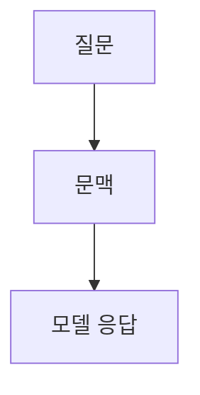

> [!abstract] 한 줄 요약
> LangChain은 언어 모델 애플리케이션을 위한 프레임워크이며 ==문맥 제공==을 통한 응답 조정을 다룬다.

## 이 노트의 지도



## 프레임워크가 맡는 범위

강의는 LangChain을 언어 모델로 구동되는 애플리케이션 개발 프레임워크로 소개한다. 대표 기능은 다른 데이터 소스에 연결하는 ==데이터 인식==과 환경 상호작용을 구성하는 에이전트 기능이다.

> [!important] 이 노트의 해석 범위
> 제공된 추출 텍스트는 RAG를 강의 항목으로 제시하지만 세부 설명을 충분히 복원하지 못한다. 검색·임베딩의 내부 절차는 추정해 적지 않는다.

$$
\text{응답}=\operatorname{LM}(\text{질문},\text{문맥})
$$

<details>
<summary>문맥 활용과 LangChain</summary>

강의는 in-context learning을 문맥을 제시해 그 문맥 기반의 출력을 얻는 방법으로 설명하고, 이를 돕는 프레임워크로 LangChain을 언급한다.

</details>

<Tabs>
  <Tab label="데이터 인식">언어 모델을 다른 데이터 소스에 연결하는 기능이다.</Tab>
  <Tab label="에이전트 기능">언어 모델이 환경과 상호작용하도록 구성하는 기능이다.</Tab>
</Tabs>

> [!tip] 설계의 첫 질문
> 어떤 문맥을 넣을지와 어떤 데이터 소스에 연결할지를 먼저 분리해 적으면 챗봇 역할을 과장하지 않는다.

<details>
<summary>강의가 비교한 세 방법</summary>

기존 모델 가중치를 조정하는 fine-tuning, 출력 예시를 제시하는 N-shot learning, 문맥을 제시하는 in-context learning이 함께 제시된다.

</details>

## 강의 구성 주제

```html preview
<div style="font-family:system-ui,sans-serif;padding:20px;display:flex;align-items:center;gap:20px;color:var(--foreground)">
  <svg width="120" height="120" viewBox="0 0 120 120" role="img" aria-label="7개 강의 주제">
    <circle cx="60" cy="60" r="46" stroke-width="14" style="fill: none; stroke: var(--border)" />
    <circle cx="60" cy="60" r="46" stroke-width="14"
      stroke-linecap="round" stroke-dasharray="289" stroke-dashoffset="0"
      transform="rotate(-90 60 60)" style="fill: none; stroke: var(--chart-1)" />
    <text x="60" y="67" text-anchor="middle" font-size="22" font-weight="700"
      style="fill: var(--foreground)">7</text>
  </svg>
  <div>
    <div style="font-weight:600;font-size:15px">강의 구성 주제</div>
    <div style="font-size:13px;color:var(--muted-foreground);margin-top:2px">이론부터 챗봇 실습까지 7개 항목</div>
  </div>
</div>
```

$$
\text{문맥 우선} \Rightarrow \text{문맥 기반 출력}
$$

<details>
<summary>구성 항목을 읽는 순서</summary>

강의 목차는 LangChain 이론, 구조, Prompt, RAG, 챗봇 구축 전략, 환경 설정, 실습의 순서다. 이 노트는 추출 문장으로 확인되는 프레임워크와 문맥 활용만 기록한다.

</details>

> [!question]- 스스로 점검
> **Q.** 이 노트가 RAG의 세부 검색 순서를 적지 않는 이유는 무엇인가?
>
> **A.** 제공된 추출 텍스트에 그 순서를 뒷받침하는 충분한 문장이 없기 때문이다.

## 작성 경계

> [!warning] 출처 경계
> RAG 설명 구간의 텍스트 근거가 희소하다. 원본 시각자료·외부 링크·페이지 표기 없이 확인된 강의 문장만 반영했다.