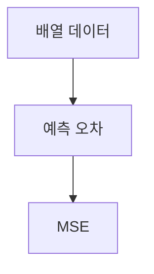

> [!abstract] 한 줄 요약
> NumPy 배열은 벡터처럼 다루고, ==평균제곱오차==는 예측 오차를 부호 상쇄 없이 읽게 해 준다.

## 이 노트의 지도



## 배열과 오차

강의는 리스트가 데이터를 단순히 나열한 것으로 다루는 반면, NumPy는 배열을 선형대수의 ==벡터== 개념으로 다룬다고 설명한다.

> [!important] 데이터 표현
> 대응 원소끼리 연산하려면 NumPy를 사용한다. 배열의 원소 단위 연산은 모델 입력과 오차 계산을 읽는 기반이 된다.

$$
e_i=y_i-\hat y_i
$$

<details>
<summary>리스트와 배열의 차이</summary>

강의의 구분은 “여러 값의 나열”과 “벡터로 해석하는 배열”의 차이다. 배열 연산은 벡터와 벡터의 덧셈이라는 수학적 의미를 갖는다.

</details>

<Tabs>
  <Tab label="단순 오차 합">양수와 음수 오차가 섞이면 서로 상쇄될 수 있어 오차 척도로 부적합하다.</Tab>
  <Tab label="평균제곱오차">오차의 제곱을 사용하므로 부호가 상쇄되는 문제를 피하는 척도다.</Tab>
</Tabs>

> [!tip] 식을 데이터와 연결하기
> 각 관측치의 오차를 먼저 $e_i$로 분리하면 실제값과 예측값을 혼동하지 않는다.

## 오차를 읽는 세 단서

```html preview
<div style="font-family:system-ui,sans-serif;padding:20px">
  <div id="cards" style="display:flex;gap:14px;flex-wrap:wrap"></div>
  <script>
    var stats = [
      ['배열 관점', '벡터', 'NumPy의 해석', 'var(--chart-2)'],
      ['오차 척도', 'MSE', '평균제곱오차', 'var(--chart-1)'],
      ['단순 합', '상쇄', '부호 영향', 'var(--chart-5)']
    ];
    document.getElementById('cards').innerHTML = stats.map(function (s) {
      return '<div style="flex:1;min-width:150px;padding:16px;background:var(--card);' +
        'color:var(--card-foreground);border:1px solid var(--border);' +
        'border-radius:var(--radius)">' +
        '<div style="font-size:13px;color:var(--muted-foreground)">' + s[0] + '</div>' +
        '<div style="font-size:26px;font-weight:700;margin-top:4px">' + s[1] + '</div>' +
        '<div style="font-size:12px;font-weight:600;margin-top:4px;color:' + s[3] + '">' +
        s[2] + '</div>' +
        '</div>';
    }).join('');
  </script>
</div>
```

$$
\operatorname{MSE}=\frac{1}{n}\sum_{i=1}^{n}(y_i-\hat y_i)^2
$$

<details>
<summary>MSE가 필요한 이유</summary>

강의는 평균제곱오차를 오차 척도 중 하나로 소개하며, 단순한 오차 합은 부호의 영향을 받는다고 설명한다.

</details>

<details>
<summary>배열 연산과 오차 계산</summary>

실제값과 예측값의 같은 위치 원소가 대응해야 오차도 관측치별로 계산된다.

</details>

> [!question]- 스스로 점검
> **Q.** 단순한 오차의 합만으로 모델 오차를 판단하기 어려운 이유는 무엇인가?
>
> **A.** 양수와 음수 오차가 서로 상쇄될 수 있기 때문이다.

## 작성 경계

> [!warning] 출처 경계
> 제공된 강의 추출 텍스트의 NumPy와 MSE 설명만 사용했으며 원본 시각자료와 페이지 표기는 넣지 않았다.

---

## 원본 강의 흐름 인터랙티브

```html preview
<div style="font-family:system-ui,sans-serif;padding:20px;color:var(--foreground)">
  <label for="noteFlow254712" style="font-size:14px;font-weight:600">Python 데이터와 평균제곱오차 단계</label>
  <div id="noteFlow254712-out" style="font-size:26px;font-weight:700;color:var(--chart-1);margin:6px 0">Python 데이터와 평균제곱오차 핵심 개념</div>
  <input id="noteFlow254712" type="range" min="1" max="3" step="1" value="1" style="width:100%;accent-color:var(--primary)" />
  <p style="font-size:13px;color:var(--muted-foreground)">슬라이더를 움직이면 원본 PDF에서 정리한 이 노트의 흐름을 확인합니다.</p>
  <script>
    var noteFlow254712 = document.getElementById('noteFlow254712');
    var noteFlow254712Out = document.getElementById('noteFlow254712-out');
    var noteFlow254712Steps = ["Python 데이터와 평균제곱오차 핵심 개념","Python 데이터와 평균제곱오차 처리 절차","Python 데이터와 평균제곱오차 검증·응용"];
    noteFlow254712.addEventListener('input', function () { noteFlow254712Out.textContent = noteFlow254712Steps[Number(noteFlow254712.value) - 1]; });
  </script>
</div>
```
