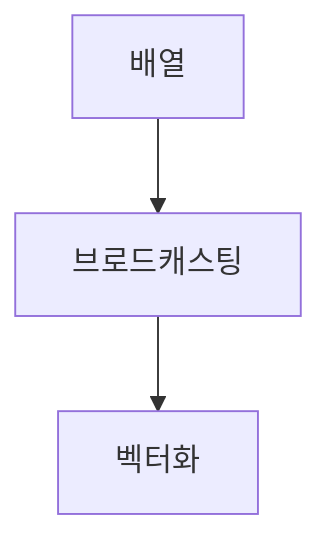

> [!abstract] 한 줄 요약
> 제공된 근거는 퍼셉트론 설명을 복원하지 못하지만, ==배열의 벡터화 연산==과 브로드캐스팅은 확인한다.

## 이 노트의 지도



## 확인 가능한 범위: 벡터화

강의는 NumPy가 배열을 선형대수의 벡터 개념으로 다루며, 배열 프로그래밍의 연산을 ==벡터화 연산==이라고 설명한다.

> [!important] 브로드캐스팅
> 스칼라를 배열의 차원에 맞는 벡터로 확장해 연산하는 일을 브로드캐스팅이라고 설명한다. 하나의 명령을 여러 데이터에 적용하는 것이 벡터화 연산이다.

$$
\mathbf{c}=\mathbf{a}+\mathbf{b}
$$

<details>
<summary>강의의 배열 덧셈 예</summary>

강의는 $[2,3,4]$를 같은 행이 하나 더 있는 배열로 바꾼 뒤, $[[10,20,30],[40,50,60]]$과 더해 $[[12,23,34],[42,53,64]]$를 얻는 예를 든다.

</details>

<Tabs>
  <Tab label="반복문 관점">각 원소를 순차적으로 처리하는 스칼라 언어의 방식을 설명한다.</Tab>
  <Tab label="벡터화 관점">대응 원소에 같은 연산을 적용해 새로운 배열을 만드는 방식으로 설명한다.</Tab>
</Tabs>

> [!tip] 배열의 모양부터 점검하기
> 배열끼리 더하려면 대응 관계가 있어야 한다. 브로드캐스팅은 그 관계를 만들기 위한 확장 규칙으로 읽을 수 있다.

## 배열 덧셈 결과

```html preview
<div style="font-family:system-ui,sans-serif;padding:20px;color:var(--foreground)">
  <h3 style="margin:0 0 14px;font-size:15px;font-weight:600">첫째 행의 벡터화 덧셈 결과</h3>
  <div id="bars" style="display:flex;align-items:flex-end;gap:14px;height:170px"></div>
  <script>
    var data = [['첫째', 12], ['둘째', 23], ['셋째', 34]];
    var max = Math.max.apply(null, data.map(function (d) { return d[1]; }));
    document.getElementById('bars').innerHTML = data.map(function (d, i) {
      return '<div style="flex:1;display:flex;flex-direction:column;align-items:center;' +
        'gap:6px;height:100%;justify-content:flex-end">' +
        '<span style="font-size:12px;font-weight:600">' + d[1] + '</span>' +
        '<div style="width:100%;height:' + (d[1] / max * 100) + '%;' +
        'background:var(--chart-' + (i + 1) + ');' +
        'border-radius:var(--radius) var(--radius) 0 0"></div>' +
        '<span style="font-size:12px;color:var(--muted-foreground)">' + d[0] + '</span>' +
        '</div>';
    }).join('');
  </script>
</div>
```

$$
[10,20,30]+[2,3,4]=[12,23,34]
$$

<details>
<summary>데이터 병렬성</summary>

강의는 데이터를 잘게 나누고 각 조각에 같은 연산을 독립적으로 수행하는 방식을 데이터 병렬성이라고 부른다.

</details>

<details>
<summary>NumPy가 강조되는 이유</summary>

강의는 벡터화 연산을 뒷받침하는 데이터 병렬성과, 이를 효율적으로 표현하는 NumPy 구문을 연결해 설명한다.

</details>

> [!question]- 스스로 점검
> **Q.** 벡터화 연산에서 “대응 원소”가 중요한 이유는 무엇인가?
>
> **A.** 같은 위치의 원소가 어떤 값과 연산되는지 정해야 결과 배열을 해석할 수 있기 때문이다.

## 작성 경계

> [!warning] source warning
> 제공된 추출 텍스트에서는 퍼셉트론의 가중합·활성화 설명을 확인할 수 없었다. 따라서 파일명에 포함된 퍼셉트론 관련 주장은 추가하지 않고, 확인 가능한 벡터화 근거만 기록했다.

---

## 원본 강의 흐름 인터랙티브

```html preview
<div style="font-family:system-ui,sans-serif;padding:20px;color:var(--foreground)">
  <label for="noteFlow896713" style="font-size:14px;font-weight:600">퍼셉트론과 벡터화 단계</label>
  <div id="noteFlow896713-out" style="font-size:26px;font-weight:700;color:var(--chart-1);margin:6px 0">퍼셉트론과 벡터화 핵심 개념</div>
  <input id="noteFlow896713" type="range" min="1" max="3" step="1" value="1" style="width:100%;accent-color:var(--primary)" />
  <p style="font-size:13px;color:var(--muted-foreground)">슬라이더를 움직이면 원본 PDF에서 정리한 이 노트의 흐름을 확인합니다.</p>
  <script>
    var noteFlow896713 = document.getElementById('noteFlow896713');
    var noteFlow896713Out = document.getElementById('noteFlow896713-out');
    var noteFlow896713Steps = ["퍼셉트론과 벡터화 핵심 개념","퍼셉트론과 벡터화 처리 절차","퍼셉트론과 벡터화 검증·응용"];
    noteFlow896713.addEventListener('input', function () { noteFlow896713Out.textContent = noteFlow896713Steps[Number(noteFlow896713.value) - 1]; });
  </script>
</div>
```
