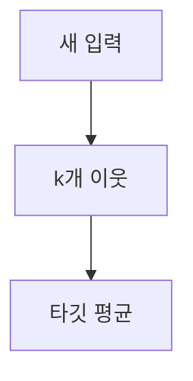

> [!abstract] 한 줄 요약
> K-최근접 이웃 회귀는 가까운 $k$개 이웃의 ==타깃 평균==을 새 샘플의 예측값으로 쓴다.

## 이 노트의 지도



## 분류와 다른 출력

강의는 분류가 범주를 예측하는 반면, 회귀는 임의의 수치를 예측한다고 설명한다. 예로 경제 성장률, 도착 시간, 생선 무게를 든다.

> [!important] 회귀의 예측값
> 이웃을 찾는 절차는 분류와 같지만, 회귀에서는 이웃 샘플의 타깃 값을 평균해 예측값으로 사용한다.

$$
\hat y=\frac{1}{k}\sum_{i\in N_k(\mathbf{x})}y_i
$$

<details>
<summary>인과관계와의 구분</summary>

강의는 회귀 분석이 변수 사이의 관계를 추정하지만, 그 관계가 인과관계를 보장하지는 않는다고 설명한다.

</details>

<Tabs>
  <Tab label="이웃 수를 줄일 때">훈련 세트의 국지적 패턴에 더 민감해진다.</Tab>
  <Tab label="이웃 수를 늘릴 때">데이터 전반의 일반적 패턴을 더 따른다.</Tab>
</Tabs>

## 이웃 수 조절 예

```html preview
<div style="font-family:system-ui,sans-serif;padding:20px;color:var(--foreground)">
  <label for="amt" style="font-size:14px;font-weight:600">이웃 수 k</label>
  <div id="out" style="font-size:30px;font-weight:700;color:var(--chart-1);margin:6px 0">5</div>
  <input id="amt" type="range" min="3" max="5" step="2" value="5"
    style="width:100%;accent-color:var(--primary)" />
  <p style="font-size:13px;color:var(--muted-foreground)">강의의 조정 예: 기본 5개에서 3개로 변경.</p>
  <script>
    var amt = document.getElementById('amt');
    var out = document.getElementById('out');
    amt.addEventListener('input', function () {
      out.textContent = amt.value;
    });
  </script>
</div>
```

> [!tip] 타깃을 구분하기
> 길이처럼 입력으로 쓰는 값과 무게처럼 평균할 값을 구분하면, 분류의 다수결과 회귀의 평균을 혼동하지 않는다.

$$
k\downarrow \Rightarrow \text{국지적 패턴에 더 민감},\qquad
k\uparrow \Rightarrow \text{전반적 패턴을 더 따름}
$$

<details>
<summary>강의의 조정 사례</summary>

강의는 기본 이웃 수 5개를 3개로 줄여 모델을 더 복잡하게 하는 사례를 제시한다.

</details>

<details>
<summary>과소적합을 다루는 방식</summary>

이웃 수를 줄이면 평균에 포함되는 이웃이 줄어 가까운 훈련 샘플의 패턴을 더 반영하게 된다.

</details>

> [!question]- 스스로 점검
> **Q.** 이웃 수를 줄이면 왜 예측이 더 국지적이 되는가?
>
> **A.** 평균에 포함되는 이웃이 줄어 가까운 훈련 샘플의 패턴에 더 민감해지기 때문이다.

## 작성 경계

> [!warning] 출처 경계
> 제공된 추출 텍스트의 회귀 정의와 이웃 수 조정 사례만 사용했으며 원본 시각자료와 페이지 표기는 넣지 않았다.