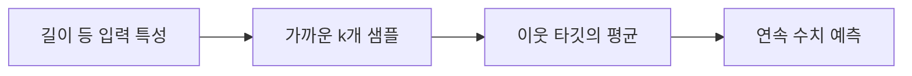

> [!abstract]
> K-최근접 이웃 회귀는 가장 가까운 (k)개 샘플의 타깃 값을 평균하여, 새 관측치의 연속적인 값을 예측한다.

## 분류와 다른 질문

회귀는 샘플을 범주 하나에 넣는 대신, 길이로 무게를 추정하거나 도착 시간을 예상하는 것처럼 **숫자 자체**를 출력한다. 같은 이웃 탐색이라도 마지막 단계가 다수결이 아니라 평균이라는 점이 핵심이다.

<Tabs>
<Tab title="입력과 타깃">
특성은 설명에 쓰는 관측값이고, 타깃은 예측하려는 연속 수치다. 길이와 무게 관계가 한 예다.
</Tab>
<Tab title="이웃 찾기">
새 입력과 가까운 훈련 샘플 (k)개를 고른다. 거리의 정의와 특성 범위가 이 단계에 영향을 준다.
</Tab>
<Tab title="예측 만들기">
선택된 이웃들의 타깃 값을 평균해 새 입력의 예측값으로 사용한다.
</Tab>
</Tabs>



> [!important]
> 회귀분석은 관측값 사이의 관계를 모형으로 표현하는 도구이며, 관찰된 관계만으로 인과관계를 증명하지는 않는다.

```html preview h=170px
<div style="font-family:system-ui,sans-serif;padding:16px;border:1px solid var(--border);border-radius:12px;background:var(--card);color:var(--foreground)">
  <strong>이웃 평균으로 예측값 만들기</strong>
  <div style="display:flex;gap:10px;align-items:end;margin-top:14px">
    <div style="flex:1;height:48px;background:var(--chart-1);border-radius:6px 6px 0 0"></div>
    <div style="flex:1;height:84px;background:var(--chart-1);border-radius:6px 6px 0 0"></div>
    <div style="flex:1;height:66px;background:var(--chart-1);border-radius:6px 6px 0 0"></div>
    <div style="flex:1;height:66px;border:2px dashed var(--chart-4);border-radius:6px">평균</div>
  </div>
  <p style="margin:12px 0 0">선택한 이웃의 타깃이 예측값의 재료가 된다.</p>
</div>
```

<details>
<summary>훈련 구간의 끝에서는 무엇이 달라질까?</summary>

가장 큰 입력값보다 더 큰 값을 예측할 때도, K-NN은 그 주변에서 찾을 수 있는 훈련 이웃만 평균한다. 따라서 훈련 데이터가 없는 바깥 영역에서는 예측의 근거가 제한된다.
</details>

## 검증으로 (k)를 정하기

(k)는 데이터에 따라 달라지는 선택값이다. 너무 적은 이웃은 개별 관측치에 민감하고, 너무 많은 이웃은 서로 다른 국소 패턴을 섞을 수 있다. 훈련용과 검증용 데이터를 구분해 후보를 비교한다.

```html preview h=180px
<div style="font-family:system-ui,sans-serif;padding:16px;border:1px solid var(--border);border-radius:12px;background:var(--card);color:var(--foreground)">
  <div style="display:grid;grid-template-columns:1fr 1fr;gap:12px">
    <section style="padding:12px;border:1px solid var(--border);border-radius:8px"><strong>작은 k</strong><br><span>가까운 사례 변화에 민감</span></section>
    <section style="padding:12px;border:1px solid var(--border);border-radius:8px"><strong>큰 k</strong><br><span>더 넓은 이웃을 함께 평균</span></section>
  </div>
  <p style="margin:14px 0 0">검증 오차가 가장 낮은 후보를 선택 기준으로 삼는다.</p>
</div>
```

<details>
<summary>회귀 결과는 무엇으로 점검할까?</summary>

실제 타깃과 예측값의 차이, 즉 오차를 관찰한다. 하나의 예측만 보지 말고 여러 검증 샘플에서 오차가 어떤 범위와 패턴을 보이는지 확인한다.
</details>

> [!warning]
> 훈련 데이터의 한계를 넘어선 값에 대해 K-NN 회귀가 새로운 추세를 만들어 내지는 않는다. 입력 범위와 이웃의 실제 분포를 함께 확인한다.

**핵심 구분:** 분류는 이웃의 클래스 빈도를, K-NN 회귀는 이웃의 타깃 평균을 사용한다. 두 작업 모두 거리와 데이터 표현에 의존한다.

### 스스로 점검

- 예측 대상이 클래스가 아니라 수치임을 명확히 했는가?
- 평균에 포함된 이웃은 새 입력과 충분히 가까운가?
- 훈련 범위 밖의 예측을 별도로 경계했는가?
