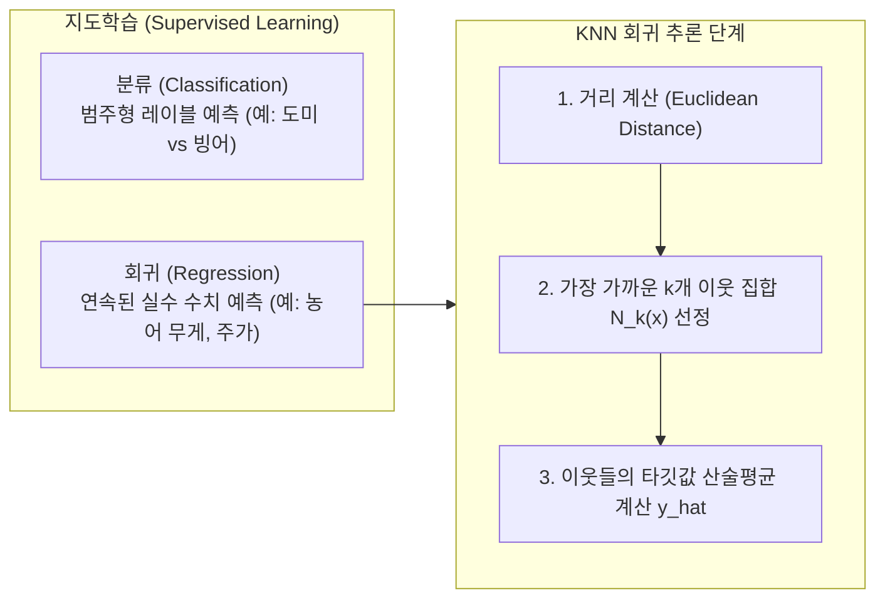
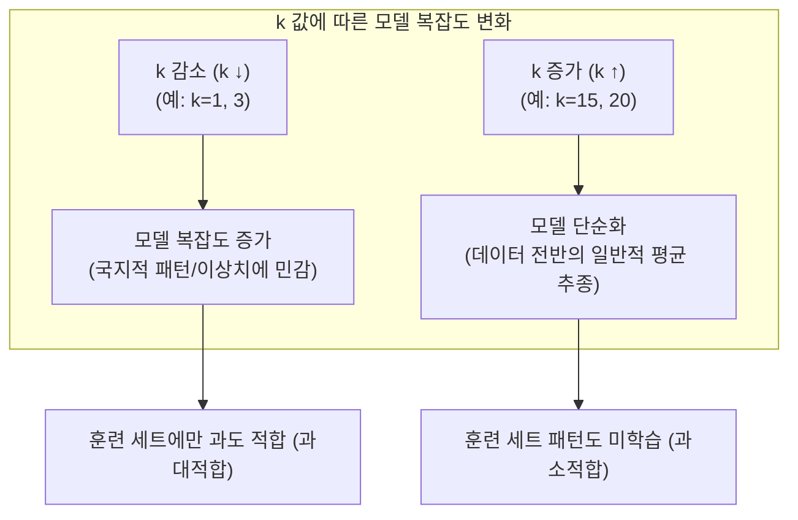

> [!abstract] 핵심 요약
> **K-최근접 이웃 회귀(K-Nearest Neighbors Regression)**는 새로운 입력 샘플 $\mathbf{x}$에 대해 훈련 데이터셋에서 가장 가까운 $k$개의 이웃 샘플들을 찾은 후, 그 이웃들의 **타깃값 평균(Target Mean)**을 계산하여 연속형 수치 예측값 $\hat{y}$로 출력하는 비모수(Non-parametric) 지도학습 알고리즘이다.
> 모델 평가는 **결정계수($R^2$)**와 **평균 절대 오차(MAE)**를 사용하며, 하이퍼파라미터 $k$를 축소하면 모델 복잡도가 증가하여 과소적합을 해소할 수 있다.

---

## 1. 분류 vs 회귀와 KNN 회귀의 수학적 모델링

머신러닝 지도학습은 출력 변수의 특성에 따라 **분류(Classification)**와 **회귀(Regression)**로 구분된다.



### KNN 회귀 예측 수식
새로운 입력 벡터 $\mathbf{x}$에 대한 예측값 $\hat{y}$는 거리 $d(\mathbf{x}, \mathbf{x}_i)$가 가장 작은 $k$개 샘플의 집합 $N_k(\mathbf{x})$의 평균으로 정의된다:

$$\hat{y} = \frac{1}{k} \sum_{i \in N_k(\mathbf{x})} y_i$$

---

## 2. 회귀 모델 평가 지표: 결정계수($R^2$)와 MAE

회귀 모델의 성능은 분류의 정확도(Accuracy) 대신 오차 기반 척도로 정량화한다.

<Tabs>
  <Tab label="1. 결정계수 (R² Score)">
    <strong>결정계수 (Coefficient of Determination, $R^2$)</strong><br/>
    모델이 데이터의 분산을 얼마나 잘 설명하는지 나타내는 척도($0 \le R^2 \le 1$):
    $$R^2 = 1 - \frac{\sum_{i=1}^n (y_i - \hat{y}_i)^2}{\sum_{i=1}^n (y_i - \bar{y})^2} = 1 - \frac{\text{SSE (잔차제곱합)}}{\text{SST (총제곱합)}}$$
    <ul>
      <li>$R^2 \approx 1$: 예측값이 타깃값에 거의 완벽하게 일치함.</li>
      <li>$R^2 \approx 0$: 타깃의 평균값 $\bar{y}$을 단순 예측하는 수준에 불과함.</li>
    </ul>
  </Tab>
  <Tab label="2. 평균 절대 오차 (MAE)">
    <strong>평균 절대 오차 (Mean Absolute Error, MAE)</strong><br/>
    실제 타깃값과 예측값 사이의 절대 오차의 평균으로, 직관적인 단위(g, kg 등)의 오차 크기를 제공:
    $$\text{MAE} = \frac{1}{n} \sum_{i=1}^n |y_i - \hat{y}_i|$$
  </Tab>
</Tabs>

---

## 3. 실시간 인터랙티브 농어 무게 예측 및 $k$ 하이퍼파라미터 시뮬레이터

아래 위젯에서 농어의 길이($\text{cm}$)와 탐색할 이웃의 개수 $k$를 변경하면, 가장 인접한 $k$개 훈련 샘플을 탐색하여 실시간으로 예상 무게($\text{g}$)를 계산하고 과대/과소적합 상태를 진단한다.

```html preview
<div style="font-family:system-ui,-apple-system,sans-serif;padding:20px;background:var(--card);color:var(--card-foreground);border:1px solid var(--border);border-radius:var(--radius)">
  <div style="font-size:16px;font-weight:700;margin-bottom:14px;color:var(--primary);display:flex;align-items:center;gap:8px">
    <span>🐟 농어 길이 기반 KNN 회귀 예측 시뮬레이터</span>
  </div>

  <div style="display:grid;grid-template-columns:1fr 1fr;gap:14px;margin-bottom:16px">
    <div>
      <div style="display:flex;justify-content:space-between;font-size:12px;font-weight:600;margin-bottom:4px">
        <span>농어 길이 (Length):</span>
        <span id="lenVal" style="color:var(--primary);font-weight:700">25.0 cm</span>
      </div>
      <input id="lenSlider" type="range" min="10" max="45" step="0.5" value="25" style="width:100%;accent-color:var(--primary)" />
    </div>

    <div>
      <div style="display:flex;justify-content:space-between;font-size:12px;font-weight:600;margin-bottom:4px">
        <span>이웃 개수 (k):</span>
        <span id="kVal" style="color:var(--chart-2);font-weight:700">3 개</span>
      </div>
      <input id="kSlider" type="range" min="1" max="9" step="2" value="3" style="width:100%;accent-color:var(--chart-2)" />
    </div>
  </div>

  <div style="display:grid;grid-template-columns:repeat(3, 1fr);gap:10px;margin-bottom:14px">
    <div style="padding:10px;background:var(--background);border:1px solid var(--border);border-radius:var(--radius);text-align:center">
      <div style="font-size:11px;color:var(--muted-foreground)">예측 무게 (y_hat)</div>
      <div id="predWeight" style="font-size:20px;font-weight:800;color:var(--chart-1);margin-top:2px">200.0 g</div>
    </div>
    <div style="padding:10px;background:var(--background);border:1px solid var(--border);border-radius:var(--radius);text-align:center">
      <div style="font-size:11px;color:var(--muted-foreground)">모델 복잡도 및 상태</div>
      <div id="fitStatus" style="font-size:13px;font-weight:700;color:var(--chart-2);margin-top:4px">적정 적합 (Optimal)</div>
    </div>
    <div style="padding:10px;background:var(--background);border:1px solid var(--border);border-radius:var(--radius);text-align:center">
      <div style="font-size:11px;color:var(--muted-foreground)">선택된 k개 이웃 무게</div>
      <div id="neighborList" style="font-size:11px;color:var(--foreground);margin-top:4px;font-family:monospace">188g, 180g, 197g</div>
    </div>
  </div>

  <div style="background:var(--background);padding:12px;border:1px solid var(--border);border-radius:var(--radius)">
    <div style="font-size:12px;font-weight:700;color:var(--primary);margin-bottom:4px">모델 동작 진단:</div>
    <div id="diagText" style="font-size:12px;color:var(--foreground);line-height:1.5"></div>
  </div>

  <script>
    var data = [
      {len: 8.4, w: 5.9}, {len: 13.7, w: 32.0}, {len: 15.0, w: 40.0}, {len: 16.2, w: 51.5},
      {len: 17.4, w: 70.0}, {len: 18.0, w: 100.0}, {len: 18.7, w: 78.0}, {len: 19.0, w: 80.0},
      {len: 20.0, w: 85.0}, {len: 21.0, w: 110.0}, {len: 22.0, w: 120.0}, {len: 23.0, w: 150.0},
      {len: 24.0, w: 145.0}, {len: 24.6, w: 188.0}, {len: 25.0, w: 180.0}, {len: 25.6, w: 197.0},
      {len: 26.5, w: 218.0}, {len: 27.5, w: 260.0}, {len: 28.7, w: 320.0}, {len: 30.0, w: 514.0},
      {len: 34.5, w: 556.0}, {len: 37.0, w: 700.0}, {len: 40.0, w: 850.0}, {len: 43.0, w: 1000.0}
    ];

    var lSlider = document.getElementById('lenSlider');
    var kSlider = document.getElementById('kSlider');
    var lVal = document.getElementById('lenVal');
    var kVal = document.getElementById('kVal');
    var predW = document.getElementById('predWeight');
    var fitSt = document.getElementById('fitStatus');
    var nList = document.getElementById('neighborList');
    var diag = document.getElementById('diagText');

    function calc() {
      var targetL = parseFloat(lSlider.value);
      var k = parseInt(kSlider.value);
      lVal.textContent = targetL.toFixed(1) + ' cm';
      kVal.textContent = k + ' 개';

      // calculate distances
      var sorted = data.slice().sort(function(a, b) {
        return Math.abs(a.len - targetL) - Math.abs(b.len - targetL);
      });

      var neighbors = sorted.slice(0, k);
      var sumW = 0;
      var weights = [];
      for (var i = 0; i < neighbors.length; i++) {
        sumW += neighbors[i].w;
        weights.push(neighbors[i].w.toFixed(0) + 'g');
      }
      var avgW = sumW / k;
      predW.textContent = avgW.toFixed(1) + ' g';
      nList.textContent = weights.join(', ');

      if (k === 1) {
        fitSt.textContent = '과대적합 위험 (Overfitting)';
        fitSt.style.color = 'var(--destructive)';
        diag.textContent = 'k=1인 경우 가장 가까운 단 1개 샘플의 노이즈에 극도로 민감해져 훈련 세트 외 일반화 성능이 저하될 수 있습니다.';
      } else if (k >= 7) {
        fitSt.textContent = '과소적합 위험 (Underfitting)';
        fitSt.style.color = 'var(--chart-3)';
        diag.textContent = 'k가 너무 크면 멀리 떨어진 샘플까지 평균에 포함되어 농어의 세부적인 길이-무게 곡선을 포착하지 못하고 단순 전체 평균에 수렴합니다.';
      } else {
        fitSt.textContent = '적정 적합 (Balanced)';
        fitSt.style.color = 'var(--chart-2)';
        diag.textContent = 'k=3~5는 국지적 패턴과 일반화 능력 사이의 편향-분산 균형(Bias-Variance Tradeoff)을 잘 유지하는 권장 파라미터입니다.';
      }
    }

    lSlider.addEventListener('input', calc);
    kSlider.addEventListener('input', calc);
    calc();
  </script>
</div>
```

---

## 4. 과대적합(Overfitting)과 과소적합(Underfitting)의 제어

KNN 회귀 모델에서 이웃의 개수 $k$는 모델의 복잡도를 결정하는 핵심 조절 인자이다.



| 구분 | 과대적합 (Overfitting) | 과소적합 (Underfitting) | 이상적 모델 (Balanced) |
| :-- | :-- | :-- | :-- |
| **현상** | 훈련 점수($R^2$) $\gg$ 테스트 점수($R^2$) | 훈련·테스트 점수 모두 낮거나, 훈련 < 테스트 | 훈련 점수 $\approx$ 테스트 점수 (높은 $R^2$) |
| **원인** | $k$가 너무 작아 훈련 세트의 노이즈까지 암기 | $k$가 너무 커서 데이터의 곡선 패턴을 단순화 | 적정 $k$를 통해 편향-분산 절충점 도출 |
| **해결책** | **$k$를 증가**시켜 일반화 특성 강화 | **$k$를 감소**시켜 모델 복잡도 향상 ($5 \rightarrow 3$) | 교차 검증(Cross-Validation)으로 최적 $k$ 탐색 |

---

## 5. 사이킷런(Scikit-Learn) 구현 파이프라인

```python
import numpy as np
from sklearn.neighbors import KNeighborsRegressor
from sklearn.model_selection import train_test_split
from sklearn.metrics import mean_absolute_error

# 1. 데이터 준비 (2차원 배열 변환)
perch_length = np.array([8.4, 13.7, 15.0, 16.2, 17.4, 18.0, 18.7, 19.0, 20.0, 21.0, 22.0, 23.0, 24.0, 25.0, 26.5, 27.5, 30.0, 34.5, 37.0, 40.0, 43.0]).reshape(-1, 1)
perch_weight = np.array([5.9, 32.0, 40.0, 51.5, 70.0, 100.0, 78.0, 80.0, 85.0, 110.0, 120.0, 150.0, 145.0, 180.0, 218.0, 260.0, 514.0, 556.0, 700.0, 850.0, 1000.0])

# 2. 훈련/테스트 세트 분할
train_input, test_input, train_target, test_target = train_test_split(
    perch_length, perch_weight, random_state=42
)

# 3. k=3 모델 생성 및 학습 (과소적합 해소)
knr = KNeighborsRegressor(n_neighbors=3)
knr.fit(train_input, train_target)

# 4. 결정계수 평가
train_score = knr.score(train_input, train_target)
test_score = knr.score(test_input, test_target)
print(f"훈련 세트 R²: {train_score:.3f}")
print(f"테스트 세트 R²: {test_score:.3f}")

# 5. MAE 오차 평가
test_pred = knr.predict(test_input)
mae = mean_absolute_error(test_target, test_pred)
print(f"평균 절대 오차: {mae:.2f}g (예측값과 실제값의 평균 오차)")
```

> [!TIP] KNN 회귀의 한계와 다음 단계
> KNN 회귀는 훈련 데이터의 범위를 벗어나는 새로운 입력(예: 길이 50cm 이상의 초대형 농어)이 주어지면, 가장 큰 기존 샘플들의 평균에 갇혀 예측값이 더 이상 증가하지 않는 **외삽(Extrapolation) 한계**를 지닌다. 이 문제는 이후 **선형 회귀(Linear Regression)**와 **다항 회귀(Polynomial Regression)**를 통해 해결한다.
