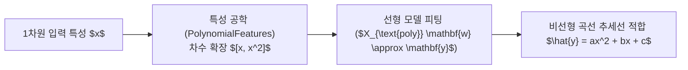

> [!abstract] 핵심 요약
> **회귀(Regression)**는 입력 특성 $x$에 대응하는 연속적인 타깃값 $y$를 예측하는 모델링 기법이다.
> K-NN 회귀는 가장 가까운 $K$개 이웃의 평균값을 반환하므로 훈련 범위를 벗어난 새로운 영역(외삽)에서는 항상 일정한 값을 예측하는 치명적 한계가 있다. 반면 **선형 및 다항 회귀**는 데이터의 내재된 수학적 추세를 파라미터 방정식($y = ax^2 + bx + c$)으로 학습하여 외삽 예측이 가능하며, **결정계수($R^2$)**를 통해 타깃 분산에 대한 모델의 설명력을 정량화한다.

---

## 1. 결정계수($R^2$) 및 다항 회귀 수식

### 1.1 결정계수 ($R^2$, Coefficient of Determination)

$$R^2 = 1 - \frac{\sum_{i=1}^n (y_i - \hat{y}_i)^2}{\sum_{i=1}^n (y_i - \bar{y})^2} = 1 - \frac{SS_{\text{res}}}{SS_{\text{tot}}}$$

- $R^2 = 1$: 모든 데이터를 완벽하게 예측 (오차 $SS_{\text{res}} = 0$).
- $R^2 = 0$: 단순히 타깃 평균값 $\bar{y}$으로만 예측한 수준.

### 1.2 2차 다항 회귀 모델

$$\hat{y} = w_2 x^2 + w_1 x + w_0$$



---

## 2. K-NN 회귀 vs 다항 회귀 비교

| 비교 항목 | K-NN 회귀 (K-NN Regressor) | 다항 선형 회귀 (Polynomial Regression) |
| :-- | :-- | :-- |
| **모델 유형** | 비모수적 인스턴스 기반 (파라미터 없음) | 모수적 선형 모델 (가중치 계수 $w_i$ 학습) |
| **외삽(Extrapolation) 능력** | **불가능 ❌ (훈련 범위 밖은 평탄한 상수선)** | **가능 ✅ (방정식 곡선을 따라 외삽 예측)** |
| **학습 및 추론 속도** | 학습 $O(1)$, 추론 시 데이터 검색 비용 $O(N)$ | 학습 시 최소제곱 최적화 필요, 추론 $O(1)$ 즉시 계산 |

---

## 3. 실시간 $R^2$ 결정계수 계산기

```html preview
<div style="font-family:system-ui,-apple-system,sans-serif;padding:20px;background:var(--card);color:var(--card-foreground);border:1px solid var(--border);border-radius:var(--radius)">
  <div style="font-size:16px;font-weight:700;margin-bottom:14px;color:var(--primary);display:flex;align-items:center;gap:8px">
    <span>📈 회귀 결정계수(R²) 설명력 계산기</span>
  </div>

  <div style="display:grid;grid-template-columns:1fr 1fr;gap:12px;margin-bottom:14px">
    <div>
      <label style="font-size:11px;color:var(--muted-foreground)">잔여 오차 제곱합 (SS_res):</label>
      <input id="inSsRes" type="number" value="30" step="5" min="0" style="width:100%;padding:4px;background:var(--background);color:var(--foreground);border:1px solid var(--border);border-radius:var(--radius);font-weight:700" />
    </div>
    <div>
      <label style="font-size:11px;color:var(--muted-foreground)">총 변동 제곱합 (SS_tot):</label>
      <input id="inSsTot" type="number" value="200" step="10" min="1" style="width:100%;padding:4px;background:var(--background);color:var(--foreground);border:1px solid var(--border);border-radius:var(--radius);font-weight:700" />
    </div>
  </div>

  <div style="padding:10px;background:var(--background);border:1px solid var(--border);border-radius:var(--radius);text-align:center">
    <div style="font-size:10px;color:var(--muted-foreground)">모델의 타깃 분산 설명력 (R²)</div>
    <div id="r2Out" style="font-family:monospace;font-size:18px;font-weight:800;color:var(--primary);margin-top:2px">0.8500 (85.0%)</div>
  </div>

  <script>
    function updateR2() {
      var res = parseFloat(document.getElementById('inSsRes').value) || 0;
      var tot = parseFloat(document.getElementById('inSsTot').value) || 1;

      var r2 = 1.0 - (res / tot);
      document.getElementById('r2Out').textContent = r2.toFixed(4) + " (" + (r2 * 100).toFixed(1) + "%)";
    }

    ['inSsRes', 'inSsTot'].forEach(function(id) {
      document.getElementById(id).addEventListener('input', updateR2);
    });
    updateR2();
  </script>
</div>
```
