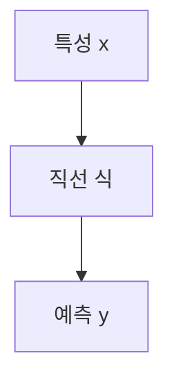

> [!abstract] 한 줄 요약
> 선형 회귀는 하나의 특성에서 직선을 학습하고, ==제곱 특성==을 더해 다항 관계를 표현할 수 있다.

## 이 노트의 지도



## 직선으로 시작하기

강의는 선형 회귀를 특성이 하나일 때 어떤 직선을 학습하는 알고리즘으로 소개한다. 모형은 계수와 절편으로 읽는다.

> [!important] 두 매개변수
> 강의의 선형식은 $y=a\times x+b$다. coef_는 계수 $a$, intercept_는 절편 $b$로 제시된다.

$$
y=a x+b
$$

<details>
<summary>R2를 읽는 단서</summary>

강의는 예측이 훈련 세트 평균에 가까우면 $R^2$가 0에 가까우며, 예측을 반대로 하면 음수가 될 수 있다고 설명한다.

</details>

<Tabs>
  <Tab label="직선 모형">하나의 특성으로 직선을 학습한다.</Tab>
  <Tab label="다항 확장">길이를 제곱한 항을 훈련 세트에 더해 2차 관계를 표현한다.</Tab>
</Tabs>

> [!tip] 식과 속성을 대응하기
> 모형의 $a$와 $b$를 각각 계수와 절편으로 읽으면 학습 뒤 확인하는 속성의 의미가 분명해진다.

## 직선 모형의 세 요소

```html preview
<div style="font-family:system-ui,sans-serif;padding:20px">
  <div id="cards" style="display:flex;gap:14px;flex-wrap:wrap"></div>
  <script>
    var stats = [
      ['입력 특성', '1', '직선 학습', 'var(--chart-2)'],
      ['계수', 'a', 'coef_', 'var(--chart-1)'],
      ['절편', 'b', 'intercept_', 'var(--chart-5)']
    ];
    document.getElementById('cards').innerHTML = stats.map(function (s) {
      return '<div style="flex:1;min-width:150px;padding:16px;background:var(--card);' +
        'color:var(--card-foreground);border:1px solid var(--border);' +
        'border-radius:var(--radius)">' +
        '<div style="font-size:13px;color:var(--muted-foreground)">' + s[0] + '</div>' +
        '<div style="font-size:26px;font-weight:700;margin-top:4px">' + s[1] + '</div>' +
        '<div style="font-size:12px;font-weight:600;margin-top:4px;color:' + s[3] + '">' +
        s[2] + '</div>' +
        '</div>';
    }).join('');
  </script>
</div>
```

$$
y=a x^2+b x+c
$$

<details>
<summary>다항 특성의 출발</summary>

강의는 2차 방정식 그래프를 그리려면 길이를 제곱한 항이 훈련 세트에 추가되어야 한다고 설명한다.

</details>

<details>
<summary>과소적합 사례</summary>

길이를 15에서 50까지 사용해 직선을 그린 결과를 과소적합 사례로 제시한다. 이 관찰이 다항 특성 추가의 맥락이 된다.

</details>

> [!question]- 스스로 점검
> **Q.** 직선 모형에 제곱 특성을 더하는 목적은 무엇인가?
>
> **A.** 2차 방정식의 그래프처럼 직선만으로 표현하기 어려운 관계를 다루기 위해서다.

## 작성 경계

> [!warning] 출처 경계
> 제공된 추출 텍스트의 선형식, R2 설명, 제곱 특성 사례만 사용했으며 원본 시각자료와 페이지 표기는 넣지 않았다.

---

## 원본 강의 흐름 인터랙티브

```html preview
<div style="font-family:system-ui,sans-serif;padding:20px;color:var(--foreground)">
  <label for="noteFlow529334" style="font-size:14px;font-weight:600">선형 회귀와 다항 특성 단계</label>
  <div id="noteFlow529334-out" style="font-size:26px;font-weight:700;color:var(--chart-1);margin:6px 0">선형 회귀와 다항 특성 핵심 개념</div>
  <input id="noteFlow529334" type="range" min="1" max="3" step="1" value="1" style="width:100%;accent-color:var(--primary)" />
  <p style="font-size:13px;color:var(--muted-foreground)">슬라이더를 움직이면 원본 PDF에서 정리한 이 노트의 흐름을 확인합니다.</p>
  <script>
    var noteFlow529334 = document.getElementById('noteFlow529334');
    var noteFlow529334Out = document.getElementById('noteFlow529334-out');
    var noteFlow529334Steps = ["선형 회귀와 다항 특성 핵심 개념","선형 회귀와 다항 특성 처리 절차","선형 회귀와 다항 특성 검증·응용"];
    noteFlow529334.addEventListener('input', function () { noteFlow529334Out.textContent = noteFlow529334Steps[Number(noteFlow529334.value) - 1]; });
  </script>
</div>
```
