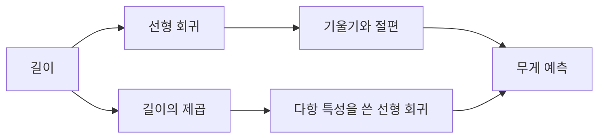

> [!abstract]
> 선형 회귀는 입력 특성 하나에서 타깃을 설명하는 직선을 학습한다. 관계가 휘어지면 제곱 항 같은 다항 특성을 추가해 같은 선형 모형으로 확장할 수 있다.

## 직선이 학습하는 것

단순 선형 회귀는 (y=ax+b) 형태로 예측을 만든다. 기울기와 절편은 데이터에 맞추어 정해지는 모형의 파라미터다. ==선형성은 입력을 어떻게 만들었는지에 대한 말이지, 결과 그래프가 반드시 직선이어야 한다는 뜻은 아니다.==

<Tabs>
<Tab title="기울기">
입력이 한 단위 변할 때 예측이 얼마나 바뀌는지 나타낸다.
</Tab>
<Tab title="절편">
입력이 기준점일 때 모형이 두는 예측 위치다.
</Tab>
<Tab title="점수">
평균만 예측하는 기준과 비교해 설명력을 읽되, 검증 데이터도 함께 살핀다.
</Tab>
</Tabs>



> [!important]
> 모델의 표현이 부족해 훈련 데이터에서도 패턴을 놓치면 과소적합을 의심한다. 직선 하나가 실제 곡선을 충분히 따라가지 못하는 상황이 그 예다.

```html preview h=165px
<div style="font-family:system-ui,sans-serif;padding:16px;border:1px solid var(--border);border-radius:12px;background:var(--card);color:var(--foreground)">
  <strong>입력 표현에 따른 모형</strong>
  <div style="display:grid;grid-template-columns:1fr auto 1fr;gap:12px;align-items:center;margin-top:14px">
    <span style="padding:12px;border:1px solid var(--border);border-radius:8px">길이</span><b>→</b>
    <span style="padding:12px;border:1px solid var(--border);border-radius:8px">직선 관계</span>
    <span style="padding:12px;border:1px solid var(--border);border-radius:8px">길이, 길이²</span><b>→</b>
    <span style="padding:12px;border:1px solid var(--border);border-radius:8px">굽은 관계</span>
  </div>
</div>
```

<details>
<summary>다항 회귀는 새 알고리즘인가?</summary>

제곱 항을 추가한 뒤에도 학습기는 선형 회귀다. 입력 열을 확장했기 때문에, 원래 입력 축에서 볼 때는 곡선처럼 보이는 예측을 만들 수 있다.
</details>

## 검증에서 읽는 과소적합

훈련 점수와 테스트 점수를 함께 보고, 단일 직선이 놓친 구조가 있는지 확인한다. 특성을 늘리는 일은 표현력을 높일 수 있지만, 검증을 생략하면 일반화 성능을 알 수 없다.

```html preview h=170px
<div style="font-family:system-ui,sans-serif;padding:16px;border:1px solid var(--border);border-radius:12px;background:var(--card);color:var(--foreground)">
  <div style="display:flex;gap:12px">
    <section style="flex:1;padding:12px;border-left:4px solid var(--chart-2)"><strong>단순 입력</strong><br>해석은 쉽지만 관계를 놓칠 수 있다.</section>
    <section style="flex:1;padding:12px;border-left:4px solid var(--chart-3)"><strong>확장 입력</strong><br>표현력은 늘지만 검증이 필요하다.</section>
  </div>
</div>
```

<details>
<summary>점수가 평균 예측보다 낮으면?</summary>

결정계수는 평균 예측을 기준으로 읽는다. 기준보다 더 나쁜 예측이면 값이 음수가 될 수 있으므로, 수치만 보지 말고 예측과 실제의 관계를 함께 확인한다.
</details>

> [!warning]
> 다항 항을 추가했다고 자동으로 좋은 모형이 되지는 않는다. 입력 범위, 훈련·테스트 성능 차이, 잔차의 패턴을 함께 점검한다.

**학습 흐름:** 기준 직선 → 과소적합 관찰 → 다항 특성 추가 → 검증 데이터 비교.

### 스스로 점검

- 기울기와 절편이 예측식에서 맡는 역할을 설명할 수 있는가?
- 곡선 관계를 표현하려고 어떤 입력 열을 추가했는가?
- 개선 여부를 훈련 점수만으로 판단하지 않았는가?
