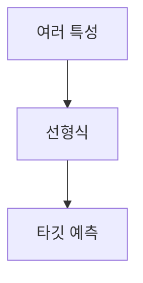

> [!abstract] 한 줄 요약
> 다중 회귀는 여러 특성을 쓰는 선형 회귀이며, ==특성 공학==은 기존 특성으로 새 특성을 만든다.

## 이 노트의 지도



## 특성이 늘어나면

강의는 특성이 하나면 직선을 학습하고, 특성이 둘이면 평면을 학습한다고 설명한다. 특성이 많다고 선형 회귀를 단순한 직선·평면으로만 생각하면 안 된다.

> [!important] 두 특성의 식
> 특성 두 개를 쓰면 타깃은 첫째 특성의 계수, 둘째 특성의 계수, 절편의 합으로 표현되며 이는 평면이 된다.

$$
y=a x_1+b x_2+c
$$

<details>
<summary>고차원이라는 뜻</summary>

특성이 3개가 되면 3차원 공간의 그림으로는 쉽게 상상할 수 없지만, 강의는 고차원에서 선형 회귀가 복잡한 모델을 표현할 수 있다고 설명한다.

</details>

## 특성 수와 모형의 표현

```html preview
<div style="font-family:system-ui,sans-serif;padding:20px;color:var(--foreground)">
  <h3 style="margin:0 0 14px;font-size:15px;font-weight:600">특성 수에 따른 강의의 표현</h3>
  <div id="bars" style="display:flex;align-items:flex-end;gap:14px;height:170px"></div>
  <script>
    var data = [['한 특성', 1], ['두 특성', 2], ['세 특성', 3]];
    var max = Math.max.apply(null, data.map(function (d) { return d[1]; }));
    document.getElementById('bars').innerHTML = data.map(function (d, i) {
      return '<div style="flex:1;display:flex;flex-direction:column;align-items:center;' +
        'gap:6px;height:100%;justify-content:flex-end">' +
        '<span style="font-size:12px;font-weight:600">' + d[1] + '</span>' +
        '<div style="width:100%;height:' + (d[1] / max * 100) + '%;' +
        'background:var(--chart-' + (i + 1) + ');' +
        'border-radius:var(--radius) var(--radius) 0 0"></div>' +
        '<span style="font-size:12px;color:var(--muted-foreground)">' + d[0] + '</span>' +
        '</div>';
    }).join('');
  </script>
</div>
```

<Tabs>
  <Tab label="원래 특성">강의 사례는 길이와 함께 높이·두께를 사용한다.</Tab>
  <Tab label="새 특성">각 특성의 제곱과 특성끼리의 곱을 더해 새 특성을 만든다.</Tab>
</Tabs>

> [!tip] 특성의 출처를 기록하기
> 새 특성은 새로 관측한 값이 아니라 ==기존 특성==으로부터 만든 값이다. 원래 열과 변환 열을 구분해 둔다.

$$
\phi(x_1,x_2)=(1,x_1,x_2,x_1^2,x_2^2,x_1x_2)
$$

<details>
<summary>특성 공학의 정의</summary>

강의는 기존 특성을 사용해 새로운 특성을 뽑아내는 작업을 특성 공학이라고 설명한다.

</details>

<details>
<summary>두 원소의 변환 예</summary>

강의는 $[2,3]$이 6개 특성을 가진 샘플로 바뀌는 예를 든다. 기본적으로 제곱항과 서로 곱한 항이 추가된다.

</details>

<details>
<summary>절편과 값 1</summary>

강의는 절편이 항상 1인 특성과 곱해지는 계수로 보일 수 있다고 설명하며, 선형 모델은 절편을 자동으로 추가한다고 덧붙인다.

</details>

> [!question]- 스스로 점검
> **Q.** $x_1x_2$는 어떤 종류의 특성인가?
>
> **A.** 기존 특성 둘을 서로 곱해 만든 상호작용 특성이다.

## 작성 경계

> [!warning] 출처 경계
> 제공된 추출 텍스트의 다중 회귀식과 특성 공학 사례만 사용했으며 원본 시각자료와 페이지 표기는 넣지 않았다.

---

## 원본 강의 흐름 인터랙티브

```html preview
<div style="font-family:system-ui,sans-serif;padding:20px;color:var(--foreground)">
  <label for="noteFlow522395" style="font-size:14px;font-weight:600">다중 회귀와 특성 공학 단계</label>
  <div id="noteFlow522395-out" style="font-size:26px;font-weight:700;color:var(--chart-1);margin:6px 0">다중 회귀와 특성 공학 핵심 개념</div>
  <input id="noteFlow522395" type="range" min="1" max="3" step="1" value="1" style="width:100%;accent-color:var(--primary)" />
  <p style="font-size:13px;color:var(--muted-foreground)">슬라이더를 움직이면 원본 PDF에서 정리한 이 노트의 흐름을 확인합니다.</p>
  <script>
    var noteFlow522395 = document.getElementById('noteFlow522395');
    var noteFlow522395Out = document.getElementById('noteFlow522395-out');
    var noteFlow522395Steps = ["다중 회귀와 특성 공학 핵심 개념","다중 회귀와 특성 공학 처리 절차","다중 회귀와 특성 공학 검증·응용"];
    noteFlow522395.addEventListener('input', function () { noteFlow522395Out.textContent = noteFlow522395Steps[Number(noteFlow522395.value) - 1]; });
  </script>
</div>
```
