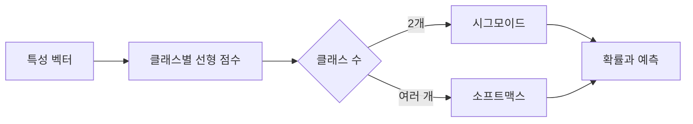

> [!abstract]
> 로지스틱 회귀는 입력의 선형 점수를 클래스 확률로 변환한다. 다중 분류에서는 클래스마다 점수를 만들고 소프트맥스로 확률 분포를 구성한다.

## 점수에서 확률로

이진 분류에서는 결정 점수를 시그모이드 함수에 통과시켜 양성 클래스의 확률로 읽는다. 여러 생선 종류처럼 클래스가 여럿이면 클래스별 점수를 계산한 뒤, 가장 큰 점수에 대응하는 클래스를 예측으로 선택한다.

<Tabs>
<Tab title="결정 점수">
특성과 계수의 결합으로 각 클래스에 대한 점수를 만든다.
</Tab>
<Tab title="이진 확률">
시그모이드는 한 점수를 0과 1 사이의 값으로 바꾼다.
</Tab>
<Tab title="다중 확률">
소프트맥스는 모든 클래스 점수를 함께 정규화해 합이 1인 확률 분포를 만든다.
</Tab>
</Tabs>



> [!important]
> 다중 분류의 확률은 각 클래스를 따로 읽는 값이 아니라, 같은 샘플의 모든 클래스 점수를 함께 정규화한 분포다. 따라서 확률의 합은 1이 된다.

```html preview h=170px
<div style="font-family:system-ui,sans-serif;padding:16px;border:1px solid var(--border);border-radius:12px;background:var(--card);color:var(--foreground)">
  <strong>다중 분류 확률 분포</strong>
  <div style="display:flex;gap:7px;margin-top:14px;height:32px">
    <span style="width:42%;background:var(--chart-1);border-radius:5px"></span>
    <span style="width:26%;background:var(--chart-2);border-radius:5px"></span>
    <span style="width:18%;background:var(--chart-3);border-radius:5px"></span>
    <span style="width:14%;background:var(--chart-4);border-radius:5px"></span>
  </div>
  <p style="margin:12px 0 0">가장 큰 구간의 클래스가 예측이지만, 전체 분포도 함께 확인한다.</p>
</div>
```

<details>
<summary>확률이 높다는 말은 무엇을 보장하지 않을까?</summary>

모형이 낸 확률은 학습한 데이터와 표현 방식에 기반한 출력이다. 확률의 신뢰도를 다루려면 검증 데이터에서 예측과 실제 결과의 관계도 점검해야 한다.
</details>

## 반복 학습과 규제

로지스틱 회귀는 반복적인 알고리즘으로 계수를 찾는다. 반복 횟수 상한은 학습이 충분히 진행되는지와 관련되고, L2 규제는 계수의 크기를 제어해 지나치게 복잡한 해를 억제한다.

```html preview h=170px
<div style="font-family:system-ui,sans-serif;padding:16px;border:1px solid var(--border);border-radius:12px;background:var(--card);color:var(--foreground)">
  <div style="display:grid;grid-template-columns:1fr 1fr;gap:12px">
    <section style="padding:12px;border:1px solid var(--border);border-radius:8px"><strong>반복 횟수</strong><br>계수 탐색의 종료 여유</section>
    <section style="padding:12px;border:1px solid var(--border);border-radius:8px"><strong>규제 강도</strong><br>계수 크기와 복잡도 제어</section>
  </div>
</div>
```

<details>
<summary>규제 파라미터는 어떻게 읽을까?</summary>

자료의 설정에서 C는 규제를 제어하며, 값이 작을수록 규제가 커지는 방향으로 설명된다. 값 하나를 당연한 답으로 두지 말고, 검증 성능과 계수 변화를 비교한다.
</details>

> [!warning]
> 정확도만으로 확률 모형의 품질을 모두 판단할 수는 없다. 클래스별 확률, 오분류 양상, 데이터 불균형을 함께 살핀다.

**핵심 연결:** 선형 점수는 분류 경계의 재료이고, 시그모이드·소프트맥스는 그 점수를 확률의 언어로 변환한다.

> [!tip]
> 학습 팁: 핵심 개념을 작은 입력 예시로 다시 설명하고, 검증 기준을 한 문장으로 적어 본다.

### 스스로 점검

- 이진 분류와 다중 분류의 확률 변환을 구분하는가?
- 소프트맥스 결과가 왜 합계 1인지 설명할 수 있는가?
- 규제와 반복 횟수를 검증 절차 안에서 조정했는가?
