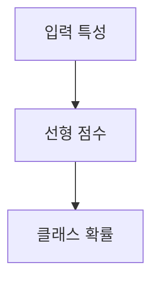

> [!abstract] 한 줄 요약
> 로지스틱 회귀는 선형식의 출력 $z$를 ==0과 1 사이==의 확률로 바꿔 분류에 쓴다.

## 이 노트의 지도



## 선형 점수에서 확률로

강의 목표는 크기와 무게 등이 주어진 물고기에 대해 7가지 종류의 확률을 출력하는 것이다. 길이·높이·두께·대각선 길이·무게를 입력으로 사용한다.

> [!important] 분류 모델
> 강의는 로지스틱 회귀를 분류 모델로 설명한다. 선형 회귀와 같은 선형 방정식을 학습하지만, 점수 $z$를 확률 범위로 바꾼다.

$$
z=a\,\text{무게}+b\,\text{길이}+c\,\text{대각선}+d\,\text{높이}+e\,\text{두께}+f
$$

<details>
<summary>확률 범위</summary>

강의는 $z$가 어떤 값이더라도 시그모이드 출력이 0과 1 사이를 벗어나지 않으며, $z=0$이면 0.5가 된다고 설명한다.

</details>

<Tabs>
  <Tab label="선형 점수">여러 특성의 가중합으로 어떤 값이든 낼 수 있다.</Tab>
  <Tab label="확률 출력">시그모이드가 점수를 0과 1 사이 값으로 옮긴다.</Tab>
</Tabs>

$$
\sigma(z)=\frac{1}{1+e^{-z}}
$$

> [!tip] 점수와 확률을 구분하기
> $z$는 선형식의 결과이고, ==시그모이드==를 거친 뒤의 값이 확률 범위에 놓인다.

## 일곱 종류 확률 과제

```html preview
<div style="font-family:system-ui,sans-serif;padding:20px;display:flex;align-items:center;gap:20px;color:var(--foreground)">
  <svg width="120" height="120" viewBox="0 0 120 120" role="img" aria-label="7가지 물고기 종류">
    <circle cx="60" cy="60" r="46" stroke-width="14" style="fill: none; stroke: var(--border)" />
    <circle cx="60" cy="60" r="46" stroke-width="14"
      stroke-linecap="round" stroke-dasharray="289" stroke-dashoffset="0"
      transform="rotate(-90 60 60)" style="fill: none; stroke: var(--chart-1)" />
    <text x="60" y="67" text-anchor="middle" font-size="22" font-weight="700"
      style="fill: var(--foreground)">7</text>
  </svg>
  <div>
    <div style="font-weight:600;font-size:15px">확률을 낼 물고기 종류</div>
    <div style="font-size:13px;color:var(--muted-foreground);margin-top:2px">강의가 가정한 7개 클래스</div>
  </div>
</div>
```

<details>
<summary>K-최근접 이웃과의 연결</summary>

강의는 먼저 K-최근접 이웃의 확률 계산을 다룬 뒤, 이상적인 방법으로 로지스틱 회귀를 제시한다.

</details>

<details>
<summary>입력 데이터 준비</summary>

강의는 선택한 필드를 NumPy 배열로 바꾸고, 7가지 물고기 이름을 타깃으로 저장하는 준비 과정을 제시한다.

</details>

> [!question]- 스스로 점검
> **Q.** $z$가 확률이 되려면 왜 변환이 필요한가?
>
> **A.** $z$는 어떤 값도 될 수 있지만, 확률은 0과 1 사이여야 하기 때문이다.

## 작성 경계

> [!warning] 출처 경계
> 제공된 추출 텍스트의 7개 클래스 목표, 입력 특성, 시그모이드 설명만 사용했으며 원본 시각자료와 페이지 표기는 넣지 않았다.

---

## 원본 강의 흐름 인터랙티브

```html preview
<div style="font-family:system-ui,sans-serif;padding:20px;color:var(--foreground)">
  <label for="noteFlow67296" style="font-size:14px;font-weight:600">로지스틱 회귀와 클래스 확률 단계</label>
  <div id="noteFlow67296-out" style="font-size:26px;font-weight:700;color:var(--chart-1);margin:6px 0">로지스틱 회귀와 클래스 확률 핵심 개념</div>
  <input id="noteFlow67296" type="range" min="1" max="3" step="1" value="1" style="width:100%;accent-color:var(--primary)" />
  <p style="font-size:13px;color:var(--muted-foreground)">슬라이더를 움직이면 원본 PDF에서 정리한 이 노트의 흐름을 확인합니다.</p>
  <script>
    var noteFlow67296 = document.getElementById('noteFlow67296');
    var noteFlow67296Out = document.getElementById('noteFlow67296-out');
    var noteFlow67296Steps = ["로지스틱 회귀와 클래스 확률 핵심 개념","로지스틱 회귀와 클래스 확률 처리 절차","로지스틱 회귀와 클래스 확률 검증·응용"];
    noteFlow67296.addEventListener('input', function () { noteFlow67296Out.textContent = noteFlow67296Steps[Number(noteFlow67296.value) - 1]; });
  </script>
</div>
```
