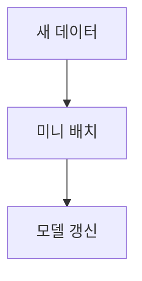

> [!abstract] 한 줄 요약
> 점진 학습은 제품화된 모델에 ==미니 배치==를 주입하며, 확률적 경사 하강법은 하나의 무작위 샘플로 경사를 찾는다.

## 이 노트의 지도



## 데이터가 계속 도착할 때

강의는 기존 데이터에 새 데이터를 계속 더해 학습하면 데이터 용량과 서버 자원 요구가 커진다고 설명한다. 반대로 이전 데이터를 버리면 중요한 데이터와 클래스 정보를 잃을 수 있다.

> [!important] 점진 학습
> 학습이 끝나 제품화된 모델에 작은 묶음의 데이터를 주입해 학습시키는 방법이다. 작은 미니 배치 덕분에 빠르고 비용이 적게 들어 데이터가 도착하는 대로 학습할 수 있다.

$$
\text{학습 단위}=\text{mini-batch}
$$

<details>
<summary>온라인과 오프라인</summary>

강의는 점진 학습을 온라인 학습이라고도 부르지만, 외부 메모리 학습처럼 오프라인으로도 시행된다고 설명한다.

</details>

<Tabs>
  <Tab label="전체 누적">이전 데이터와 새 데이터를 함께 보관하면 데이터셋 크기와 자원 요구가 계속 커진다.</Tab>
  <Tab label="점진 갱신">앞선 모델을 버리지 않고 새 데이터를 조금씩 학습해 이전 클래스를 유실하지 않도록 한다.</Tab>
</Tabs>

> [!tip] 환경을 먼저 판단하기
> 연속적으로 데이터를 받고 빠른 변화에 적응해야 하거나 자원이 제한된 환경이 점진 학습의 적용 맥락이다.

## 점진 학습의 세 단서

```html preview
<div style="font-family:system-ui,sans-serif;padding:20px">
  <div id="cards" style="display:flex;gap:14px;flex-wrap:wrap"></div>
  <script>
    var stats = [
      ['주입 단위', '미니 배치', '작은 묶음', 'var(--chart-2)'],
      ['갱신 시점', '도착 즉시', '연속 데이터', 'var(--chart-1)'],
      ['저장 공간', '절약', '학습한 샘플', 'var(--chart-5)']
    ];
    document.getElementById('cards').innerHTML = stats.map(function (s) {
      return '<div style="flex:1;min-width:150px;padding:16px;background:var(--card);' +
        'color:var(--card-foreground);border:1px solid var(--border);' +
        'border-radius:var(--radius)">' +
        '<div style="font-size:13px;color:var(--muted-foreground)">' + s[0] + '</div>' +
        '<div style="font-size:26px;font-weight:700;margin-top:4px">' + s[1] + '</div>' +
        '<div style="font-size:12px;font-weight:600;margin-top:4px;color:' + s[3] + '">' +
        s[2] + '</div>' +
        '</div>';
    }).join('');
  </script>
</div>
```

$$
\text{epoch}=\text{훈련 세트를 한 번 모두 사용하는 과정}
$$

<details>
<summary>확률적이라는 말</summary>

강의는 확률을 무작위 또는 랜덤의 기술적 표현으로 설명하며, 확률적 경사 하강법은 전체가 아니라 훈련 세트에서 무작위로 고른 하나의 샘플로 가장 가파른 경사를 찾는다고 말한다.

</details>

<details>
<summary>에포크의 의미</summary>

훈련 세트를 한 번 모두 사용하는 과정이 에포크다. 강의는 확률적 경사 하강법이 수십·수백 번 이상의 에포크를 수행한다고 설명한다.

</details>

> [!question]- 스스로 점검
> **Q.** 새 데이터만 학습하고 이전 데이터를 버리면 어떤 문제가 생길 수 있는가?
>
> **A.** 버린 데이터에 있던 중요한 정보와 클래스는 새 모델이 예측하지 못할 수 있다.

## 작성 경계

> [!warning] 출처 경계
> 제공된 추출 텍스트의 점진 학습·미니 배치·에포크 설명만 사용했으며 원본 시각자료와 페이지 표기는 넣지 않았다.
