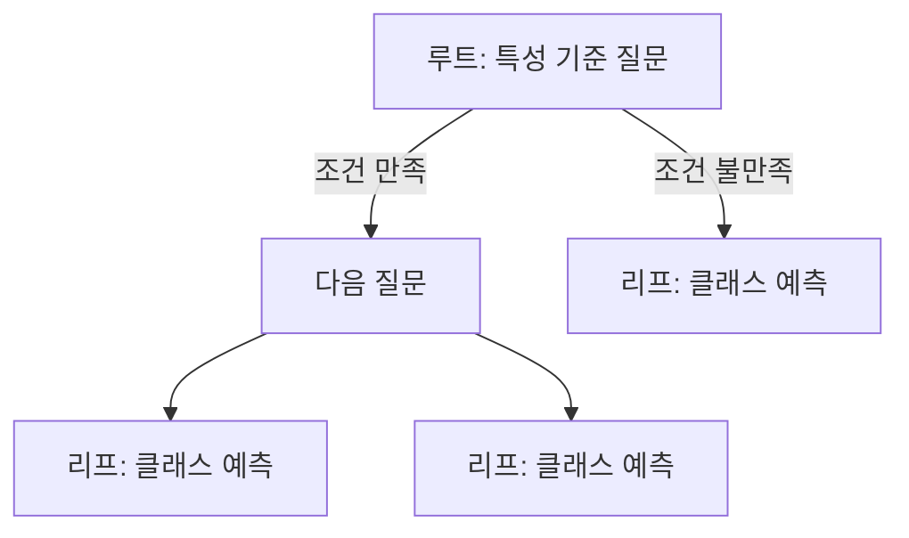

> [!abstract]
> 결정 트리는 특성에 대한 질문으로 데이터를 반복해서 나누고, 마지막 리프 노드의 다수 클래스로 예측한다. 가지치기는 트리가 훈련 데이터에만 과하게 맞는 것을 줄인다.

## 질문으로 만드는 분류기

와인처럼 두 클래스를 구분할 때 결정 트리는 “어떤 특성이 어떤 기준보다 큰가?”를 차례로 묻는다. 잘 나뉘는 질문을 선택할수록 노드는 더 순수해지고, 샘플은 한쪽 가지로 이동한다.

<Tabs>
<Tab title="루트">
첫 번째 질문이 놓이는 시작 노드다.
</Tab>
<Tab title="내부 노드">
조건에 따라 샘플을 두 방향 이상으로 나누는 질문 노드다.
</Tab>
<Tab title="리프">
더 묻지 않고, 노드에서 가장 많은 클래스를 예측으로 내는 끝 노드다.
</Tab>
</Tabs>



> [!important]
> 결정 트리는 특성값의 크기 순서로 분할하기 때문에, 자료에서는 표준화 전처리가 필수적이지 않다는 장점으로 소개된다. 다만 입력의 의미와 결측 처리 문제는 별도로 설계해야 한다.

```html preview h=170px
<div style="font-family:system-ui,sans-serif;padding:16px;border:1px solid var(--border);border-radius:12px;background:var(--card);color:var(--foreground)">
  <strong>한 번의 분할</strong>
  <div style="display:grid;grid-template-columns:1fr 1fr;gap:12px;margin-top:14px">
    <span style="padding:12px;border:1px solid var(--border);border-radius:8px">당도 ≤ 기준</span>
    <span style="padding:12px;border:1px solid var(--border);border-radius:8px">당도 &gt; 기준</span>
  </div>
  <p style="margin:12px 0 0">각 가지에서 다음 질문 또는 리프 예측이 이어진다.</p>
</div>
```

<details>
<summary>지니 불순도는 무엇을 읽을까?</summary>

노드 안의 클래스가 섞인 정도를 나타내는 기준이다. 분할 후보는 자식 노드의 불순도를 줄이는 방향으로 비교하며, 정보 이득은 이런 감소와 연결된다.
</details>

## 성장 제한과 특성 중요도

제한 없이 자란 트리는 훈련 데이터에는 잘 맞지만 테스트 성능이 떨어질 수 있다. 최대 깊이를 지정하는 가지치기는 이 과대적합을 줄이는 대표적 방법이다. 자료는 분할에 기여한 정도를 합산한 특성 중요도도 함께 소개한다.

```html preview h=175px
<div style="font-family:system-ui,sans-serif;padding:16px;border:1px solid var(--border);border-radius:12px;background:var(--card);color:var(--foreground)">
  <div style="display:flex;gap:12px">
    <section style="flex:1;padding:12px;border-left:4px solid var(--chart-4)"><strong>깊은 트리</strong><br>훈련 구조를 세밀하게 외울 위험</section>
    <section style="flex:1;padding:12px;border-left:4px solid var(--chart-2)"><strong>제한한 트리</strong><br>검증 성능을 기준으로 복잡도 제어</section>
  </div>
</div>
```

<details>
<summary>특성 중요도를 원인으로 읽어도 될까?</summary>

중요도는 이 트리의 분할에서 활용된 정도를 요약한다. 그 특성이 결과의 원인임을 증명하거나, 다른 특성보다 항상 유용하다는 결론을 뜻하지는 않는다.
</details>

> [!warning]
> max_depth 하나만 고정해 두지 말고, 검증 세트나 교차 검증에서 여러 깊이와 다른 하이퍼파라미터를 비교한다.

**핵심 연결:** 분할 질문은 설명 가능성을 주고, 가지치기는 일반화 성능을 지키며, 특성 중요도는 모형 내부의 사용 패턴을 요약한다.

> [!tip]
> 학습 팁: 핵심 개념을 작은 입력 예시로 다시 설명하고, 검증 기준을 한 문장으로 적어 본다.

### 스스로 점검

- 루트·내부·리프 노드의 역할을 구분하는가?
- 지니 불순도와 정보 이득을 혼동하지 않는가?
- 깊이 제한을 훈련 점수만으로 선택하지 않는가?
