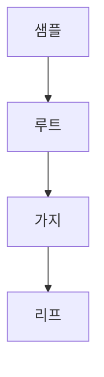

> [!abstract] 한 줄 요약
> 결정 트리는 질문에 따라 노드를 나누고, ==최대 깊이==로 성장을 제한해 가지치기한다.

## 이 노트의 지도



## 노드에서 분할하기

강의는 레드 와인을 0, 화이트 와인을 1로 둔 분류 사례를 사용한다. 결정 트리는 특성값의 스케일에 영향을 받지 않으므로 표준화 전처리가 필요 없다는 장점을 갖는다.

> [!important] 분할의 목표
> 결정 트리는 부모와 자식 노드의 불순도 차이가 가능한 크도록 성장하며, 지니 불순도를 사용해 정보 이득이 최대가 되도록 나눈다고 설명한다.

$$
\Delta I=I_{\text{parent}}-I_{\text{child}}
$$

<details>
<summary>리프에서의 예측</summary>

강의는 새로운 샘플이 노드의 질문을 따라 이동한 뒤, 리프 노드에서 가장 많은 클래스로 예측된다고 설명한다.

</details>

<Tabs>
  <Tab label="지니 불순도">criterion 매개변수에서 노드 분할 기준으로 쓰는 불순도다.</Tab>
  <Tab label="엔트로피 불순도">criterion에 entropy를 지정해 사용할 수 있으며, 강의 사례에서는 지니 불순도를 유지한다.</Tab>
</Tabs>

> [!tip] 트리를 읽는 순서
> 루트에서 시작해 질문에 맞는 가지를 따라가고, ==리프 노드==의 다수 클래스를 최종 예측으로 읽는다.

## 분류 트리의 세 단서

```html preview
<div style="font-family:system-ui,sans-serif;padding:20px">
  <div id="cards" style="display:flex;gap:14px;flex-wrap:wrap"></div>
  <script>
    var stats = [
      ['두 클래스', '0·1', '레드·화이트', 'var(--chart-2)'],
      ['분할 기준', 'Gini', '불순도', 'var(--chart-1)'],
      ['예측 위치', '리프', '다수 클래스', 'var(--chart-5)']
    ];
    document.getElementById('cards').innerHTML = stats.map(function (s) {
      return '<div style="flex:1;min-width:150px;padding:16px;background:var(--card);' +
        'color:var(--card-foreground);border:1px solid var(--border);' +
        'border-radius:var(--radius)">' +
        '<div style="font-size:13px;color:var(--muted-foreground)">' + s[0] + '</div>' +
        '<div style="font-size:26px;font-weight:700;margin-top:4px">' + s[1] + '</div>' +
        '<div style="font-size:12px;font-weight:600;margin-top:4px;color:' + s[3] + '">' +
        s[2] + '</div>' +
        '</div>';
    }).join('');
  </script>
</div>
```

$$
\hat y=\operatorname{mode}(\text{리프의 클래스})
$$

<details>
<summary>가지치기가 필요한 이유</summary>

강의는 제한 없이 자라는 트리가 생성될 수 있으므로 가지치기가 필요하다고 설명한다. 해결책으로 자랄 수 있는 트리의 최대 깊이를 지정한다.

</details>

<details>
<summary>출력에서 보는 깊이</summary>

트리 출력에서 max_depth는 출력 노드 깊이를 뜻하고, filled는 클래스에 맞게 노드 색을 채우는 매개변수로 제시된다.

</details>

<details>
<summary>특성 중요도</summary>

결정 트리는 어떤 특성이 유용한지 나타내는 특성 중요도를 제공하며, 강의는 이를 특성 선택에 활용할 수 있다고 설명한다.

</details>

> [!question]- 스스로 점검
> **Q.** 최대 깊이를 지정하는 목적은 무엇인가?
>
> **A.** 트리가 제한 없이 자라는 것을 막아 가지치기하기 위해서다.

## 작성 경계

> [!warning] source warning
> 제공된 추출 텍스트에는 DecisionTreeClassfier라는 표기가 있으며, 이 노트는 이를 별도의 API 사실로 정정하거나 확대하지 않았다. 또한 원본 시각자료와 페이지 표기는 넣지 않았다.
