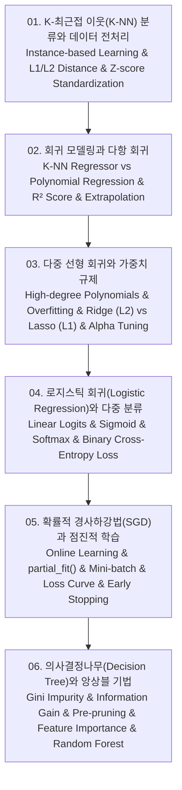

# 📚 머신러닝 프로젝트 실습 (Machine Learning Project Engineering) 전체 강의 로드맵

수학적 모델링부터 실전 데이터 사이언스 파이프라인까지, K-최근접 이웃(K-NN) 분류와 Z-score 데이터 표준화, K-NN 회귀 및 다항 회귀(Polynomial Regression), 다중 선형 회귀와 릿지(Ridge L2)·라쏘(Lasso L1) 가중치 규제 최적화, 로지스틱 회귀(Logistic Regression) 시그모이드 및 다중 분류 소프트맥스, 확률적 경사하강법(SGD) 기반 점진적 학습(Incremental Learning)과 조기 종료(Early Stopping), 그리고 의사결정나무(Decision Tree)의 지니 불순도(Gini Impurity)와 가지치기(Pruning)까지 머신러닝 핵심 알고리즘을 깊이 있게 다룹니다.

---

## 🗺️ 강의 목차 (Curriculum Overview)

---

## 📑 개별 정리 문서 목록

1. [01. K-최근접 이웃(K-NN) 분류와 데이터 전처리 - 거리 척도(유클리드·맨해튼), 표준점수(Z-score)와 스케일링](file:///Users/um-yunsang/work/edu/ComputerScience/03_ai-ml-data/ml-projects/notes/01.%20K-%EC%B5%9C%EA%B7%BC%EC%A0%91%20%EC%9D%B4%EC%9B%83(K-NN)%20%EB%B6%84%EB%A5%98%EC%99%80%20%EB%8D%B0%EC%9D%B4%ED%84%B0%20%EC%A0%84%EC%B2%98%EB%A6%AC%20-%20%EA%B1%B0%EB%A6%AC%20%EC%B2%99%EB%8F%84(%EC%9C%A0%ED%81%B4%EB%A6%AC%EB%93%9C%C2%B7%EB%A7%A8%ED%95%B4%ED%8A%BC),%20%ED%91%9C%EC%A4%80%EC%A0%90%EC%88%98(Z-score)%EC%99%80%20%EC%8A%A4%EC%BC%80%EC%9D%BC%EB%A7%81.md)
   - L1/L2 거리 척도, 스케일 왜곡 극복을 위한 표준화 공식, 대화형 Z-score 변환기
2. [02. 회귀 모델링과 다항 회귀 - K-NN 회귀, 결정계수(R²), 다항 특성 공학(Polynomial Features)과 잔차 분석](file:///Users/um-yunsang/work/edu/ComputerScience/03_ai-ml-data/ml-projects/notes/02.%20%ED%9A%8C%EA%B7%80%20%EB%AA%A8%EB%8D%B8%EB%A7%81%EA%B3%BC%20%EB%8B%A4%ED%95%AD%20%ED%9A%8C%EA%B7%80%20-%20K-NN%20%ED%9A%8C%EA%B7%80,%20%EA%B2%B0%EC%A0%95%EA%B3%84%EC%88%98(R%C2%B2),%20%EB%8B%A4%ED%95%AD%20%ED%8A%B9%EC%84%B1%20%EA%B3%B5%ED%95%99(Polynomial%20Features)%EA%B3%BC%20%EC%9E%94%EC%B0%A8%20%EB%B6%84%EC%84%9D.md)
   - K-NN 회귀의 외삽 한계, 2차 다항 회귀 수식, 대화형 R² 결정계수 계산기
3. [03. 다중 선형 회귀와 가중치 규제 - 최소제곱 정규방정식, 릿지(Ridge L2) 및 라쏘(Lasso L1) 규제 계수 하이퍼파라미터 튜닝](file:///Users/um-yunsang/work/edu/ComputerScience/03_ai-ml-data/ml-projects/notes/03.%20%EB%8B%A4%EC%A4%91%20%EC%84%A0%ED%98%95%20%ED%9A%8C%EA%B7%80%EC%99%80%20%EA%B0%80%EC%A4%91%EC%B9%98%20%EA%B7%9C%EC%A0%9C%20-%20%EC%B5%9C%EC%86%8C%EC%A0%9C%EA%B3%B1%20%EC%A0%95%EA%B7%9C%EB%B0%A9%EC%A0%95%EC%8B%9D,%20%EB%A6%BF%EC%A7%80(Ridge%20L2)%20%EB%B0%8F%20%EB%9D%BC%EC%87%84(Lasso%20L1)%20%EA%B7%9C%EC%A0%9C%20%EA%B3%84%EC%88%98%20%ED%95%98%EC%9D%B4%ED%8D%BC%ED%8C%8C%EB%9D%BC%EB%AF%B8%ED%84%B0%20%ED%8A%9C%EB%8B%9D.md)
   - 다항 특성 과대적합, Ridge vs Lasso 정규화 목적 함수, 대화형 alpha 규제 강도 시뮬레이터
4. [04. 로지스틱 회귀(Logistic Regression)와 다중 분류 - 시그모이드(Sigmoid), 소프트맥스(Softmax) 및 교차 엔트로피 손실](file:///Users/um-yunsang/work/edu/ComputerScience/03_ai-ml-data/ml-projects/notes/04.%20%EB%A1%9C%EC%A7%80%EC%8A%A4%ED%8B%B1%20%ED%9A%8C%EA%B7%80(Logistic%20Regression)%EC%99%80%20%EB%8B%A4%EC%A4%91%20%EB%B6%84%EB%A5%98%20-%20%EC%8B%9C%EA%B7%B8%EB%AA%A8%EC%9D%B4%EB%93%9C(Sigmoid),%20%EC%86%8F%ED%8A%B8%EB%A7%A5%EC%8A%A4(Softmax)%20%EB%B0%8F%20%EA%B5%90%EC%B0%A8%20%EC%97%94%ED%8A%B8%EB%A1%9C%ED%48%C2%B0%20%EC%86%90%EC%8B%A4.md)
   - Sigmoid 및 Softmax 수식, BCE 손실 함수, 대화형 로지스틱 확률 변환기
5. [05. 확률적 경사하강법(SGD)과 점진적 학습 - 온라인 학습(Incremental Learning), 미니배치 SGD, 조기 종료(Early Stopping)](file:///Users/um-yunsang/work/edu/ComputerScience/03_ai-ml-data/ml-projects/notes/05.%20%ED%99%95%EB%A5%A0%EC%A0%81%20%EA%B2%BD%EC%82%AC%ED%95%98%EA%B0%95%EB%B2%95(SGD)%EA%B3%BC%20%EC%A0%90%EC%A7%84%EC%A0%81%20%ED%95%99%EC%8A%B5%20-%20%EC%98%A8%EB%9D%BC%EC%9D%B8%20%ED%95%99%EC%8A%B5(Incremental%20Learning),%20%EB%AF%B8%EB%8B%88%EB%B0%B0%EC%B9%98%20SGD,%20%EC%A1%B0%EA%B8%B0%20%EC%A2%85%EB%A3%8C(Early%20Stopping).md)
   - 점진적 학습 원리, 배치 vs SGD vs 미니배치 비교, 대화형 에포크별 손실 시뮬레이터
6. [06. 의사결정나무(Decision Tree)와 앙상블 기법 - 지니 불순도(Gini), 정보 이득(Information Gain), 가지치기(Pruning)와 특성 중요도](file:///Users/um-yunsang/work/edu/ComputerScience/03_ai-ml-data/ml-projects/notes/06.%20%EC%9D%98%EC%82%AC%EA%B2%B0%EC%A0%95%EB%82%98%EB%AC%B4(Decision%20Tree)%EC%99%80%20%EC%95%99%EC%83%81%EB%B8%94%20%EA%B8%B0%EB%B2%95%20-%20%EC%A7%80%EB%8B%88%20%EB%B6%88%EC%88%9C%EB%8F%84(Gini),%20%EC%A0%95%EB%B3%B4%20%EC%9D%B4%EB%93%9D(Information%20Gain),%20%EA%B0%80%EC%A7%80%EC%B9%98%EA%B8%B0(Pruning)%EC%99%80%20%ED%8A%B9%EC%84%B1%20%EC%A4%91%EC%9A%94%EB%8F%84.md)
   - 지니 불순도 및 정보 이득 수식, 사전 가지치기, 대화형 지니 불순도 계산기
