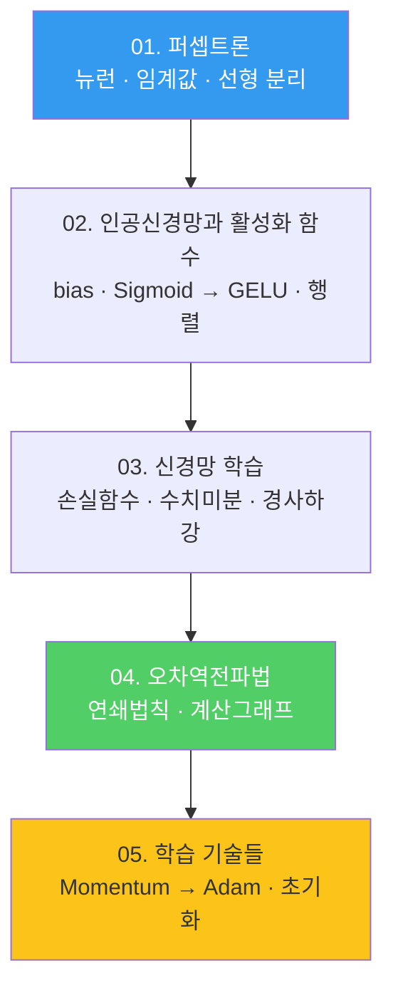

---
aliases:
  - 신경망 인덱스
  - Neural Networks MOC
  - AIE309
course: neural-networks
created: '2026-08-28'
date: '2026-08-28'
semester: '3-1'
source: ''
status: evergreen
tags:
  - type/index
  - cs/ml
  - cs/deep-learning
title: 00. 신경망 인덱스
type: index
updated: '2026-08-28'
---

domain:: [[ComputerScience/03_ai-ml-data/AI ML 데이터 인터페이스|AI ML 데이터 인터페이스]]
schema:: [[docs/knowledge-schema|지식 스키마]]
layout:: [[docs/course-layout|과목 폴더 표준]]

# 00. 신경망 인덱스

> [!abstract] 이 과목 한 줄
> 뉴런 하나(**퍼셉트론**)에서 출발해 층을 쌓고(**신경망**),
> 오차를 정의하고(**손실함수**), 미분으로 되돌리고(**역전파**),
> 실제로 학습이 되게 만드는 기술(**옵티마이저·초기화**)까지 한 학기에 훑는다.

## 학습 경로

## 하나의 문제, 다섯 개의 답

과목 전체는 결국 **"$w$ 를 어떻게 정할 것인가"** 하나를 파고든다.

$$
\min_{w} \; J(w)
\qquad\text{where}\qquad
J(w) = -\sum_k t_k \log y_k(w)
$$

| # | 노트 | 이 노트가 답하는 질문 |
|:--:|:--|:--|
| 01 | [[01. 퍼셉트론]] | 뉴런 하나는 무엇을 계산하는가 |
| 02 | [[02. 인공신경망과 활성화 함수]] | 층을 쌓으려면 무엇이 더 필요한가 |
| 03 | [[03. 신경망 학습]] | 틀렸다는 것을 어떻게 수치화하는가 |
| 04 | [[04. 오차역전파법]] | 그 오차를 어떻게 $w$ 까지 되돌리는가 |
| 05 | [[05. 학습 기술들]] | 왜 잘 안 되고, 무엇으로 고치는가 |

## 근거 원본

| 노트 | `pdf/` 원본 | 페이지 |
|:--|:--|--:|
| [[01. 퍼셉트론]] | `2장_퍼셉트론.pdf` | 7 |
| [[02. 인공신경망과 활성화 함수]] | `3장_인공신경망.pdf` | 30 |
| [[03. 신경망 학습]] | `AIE309_4장_신경망학습.pdf` | 30 |
| [[04. 오차역전파법]] | `AIE309_5장_오차역전파.pdf` | 34 |
| [[05. 학습 기술들]] | `AIE309_6장_학습기술들.pdf` | 51 |

> [!note] 과제·보고서
> `pdf/AIE309_HW1.pdf` — sigmoid · affine layer 의 역전파를 손으로 유도하는 과제.
> `pdf/R E P O R T Sigmoid.pdf` — 시그모이드 관련 보고서.
> 두 문서는 강의자료가 아니라 **산출물**이므로 정리문서를 따로 두지 않는다.

> [!tip] 교재
> 강의 전반이 **『밑바닥부터 시작하는 딥러닝』**(사이토 고키, 한빛미디어)의 구성을 따른다.
