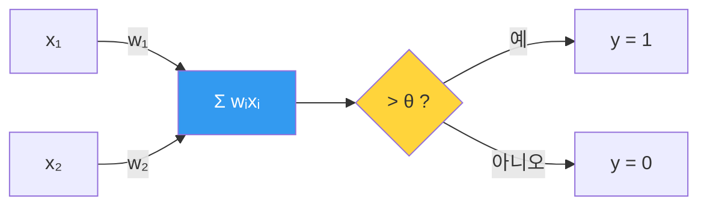

---
aliases:
  - 퍼셉트론
  - Perceptron
authority: primary
course: neural-networks
created: '2026-08-28'
date: '2026-08-28'
review_state: active
semester: '3-1'
source: pdf/2장_퍼셉트론.pdf
source_pages: 7
source_type: lecture-slides
status: seedling
tags:
  - type/lecture
  - cs/ml
  - cs/deep-learning
title: 01. 퍼셉트론
type: lecture
updated: '2026-08-28'
---

domain:: [[ComputerScience/03_ai-ml-data/AI ML 데이터 인터페이스|AI ML 데이터 인터페이스]]
source:: [[2장_퍼셉트론.pdf]]
next:: [[02. 인공신경망과 활성화 함수]]

# 01. 퍼셉트론

> [!abstract] 한 줄 요약
> 생물학적 뉴런의 **"입력을 모아 임계값을 넘으면 발화한다"** 는 구조를
> 그대로 수식 하나로 옮긴 것이 퍼셉트론이다. 딥러닝의 최소 단위다.

## 뉴런에서 퍼셉트론으로

| 생물학적 뉴런 | 퍼셉트론 |
|:--|:--|
| Dendrites (수상돌기) | 입력 $x_1, x_2, \dots$ |
| 시냅스 강도 | 가중치 $w_1, w_2, \dots$ |
| Cell body — 신호 합산 | $\sum w_i x_i$ |
| 발화 임계값 | 임계값 $\theta$ |
| Axon terminals — 출력 | $y$ |

## 정의

$$
y =
\begin{cases}
0, & w_1 x_1 + w_2 x_2 \le \theta \\
1, & w_1 x_1 + w_2 x_2 > \theta
\end{cases}
$$

> [!note] 편향(bias)으로 옮겨 쓰기
> 임계값을 좌변으로 넘기면 $b = -\theta$ 인 **편향**이 되고, 식이 훨씬 다루기 쉬워진다.
> $$y = \begin{cases} 0, & w_1x_1 + w_2x_2 + b \le 0 \\ 1, & w_1x_1 + w_2x_2 + b > 0 \end{cases}$$
> 이 변형이 [[02. 인공신경망과 활성화 함수|다음 노트]]의 출발점이다.

## 퍼셉트론이 할 수 있는 것과 없는 것

가중치와 편향을 고르면 AND · OR · NAND 를 전부 만들 수 있다.
그러나 결정 경계가 **직선 하나**이므로 XOR 는 만들지 못한다.

| 게이트 | 단층 퍼셉트론 | 이유 |
|:--:|:--:|:--|
| AND · OR · NAND | 가능 | 직선 하나로 분리 가능 |
| **XOR** | **불가능** | 같은 클래스가 대각선으로 마주 봄 |

> [!warning] 이 한계가 곧 다음 장의 동기
> XOR 를 풀려면 **층을 쌓아야** 한다. NAND · OR 를 조합해 2층으로 만들면 XOR 가 표현된다.
> "층을 쌓는다"는 발상이 인공신경망으로 이어진다.

## 출처

- 원본: `pdf/2장_퍼셉트론.pdf` (7p)
- 교재: 『밑바닥부터 시작하는 딥러닝』(사이토 고키, 한빛미디어)
