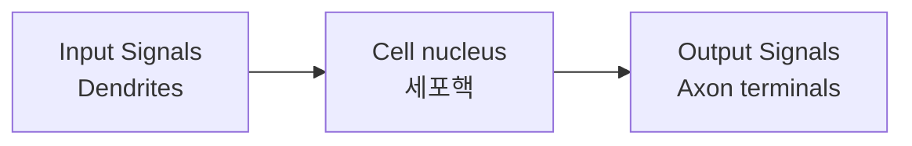
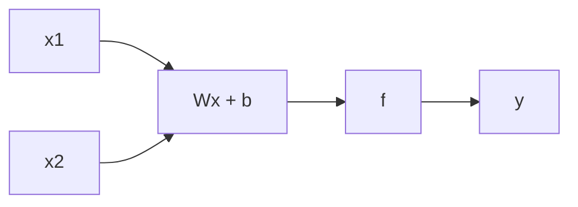

> [!abstract] 한 줄 요약
> 퍼셉트론은 입력에 가중치를 곱해 더한 값이 문턱을 넘는지로 0과 1을 가른다.
> 그 판별식이 곧 **직선 하나**이고, 거기서 한계가 온다.

## 뉴런에서 출발한다

> [!quote] 슬라이드 근거
> `pdf/2장_퍼셉트론.pdf` p.2

생물학적 뉴런은 가지돌기(Dendrites)로 신호를 받아 세포체에서 처리하고, 축삭말단(Axon terminals)으로 내보낸다.



퍼셉트론은 이 구조를 **수식 하나로** 옮긴 것이다.

## 퍼셉트론의 판별식

> [!quote] 슬라이드 근거
> `pdf/2장_퍼셉트론.pdf` p.3

입력 $x_1, x_2$ 에 가중치를 곱해 더하고, 문턱값 $\Theta$ 와 비교한다.

$$
y =
\begin{cases}
0, & w_1 x_1 + w_2 x_2 \le \Theta \\[4pt]
1, & w_1 x_1 + w_2 x_2 > \Theta
\end{cases}
$$



> [!important] 여기에 이미 한계가 들어 있다
> $w_1 x_1 + w_2 x_2 = \Theta$ 는 평면 위의 ==직선 하나== 다.
> 퍼셉트론이 할 수 있는 분류는 그 직선으로 갈리는 것이 전부다.

## 논리 게이트 구현

> [!quote] 슬라이드 근거
> `pdf/2장_퍼셉트론.pdf` p.4

슬라이드는 AND · NAND · OR 세 게이트를 스위치 회로로 보여준다. 가중치와 문턱값을 고르면 퍼셉트론 하나로 각각을 만들 수 있다.

<details>
<summary>세 게이트의 진리표</summary>

| $x_1$ | $x_2$ | AND | NAND | OR |
| :--: | :--: | :--: | :--: | :--: |
| 0 | 0 | 0 | 1 | 0 |
| 0 | 1 | 0 | 1 | 1 |
| 1 | 0 | 0 | 1 | 1 |
| 1 | 1 | 1 | 0 | 1 |

세 경우 모두 결과가 1인 점들과 0인 점들 사이에 **직선을 그을 수 있다** — 그래서 퍼셉트론 하나로 표현된다.

</details>

## 한계 — XOR

> [!quote] 슬라이드 근거
> `pdf/2장_퍼셉트론.pdf` p.5

슬라이드의 `Limitation` 페이지는 좌표평면에 네 점을 찍고 **여러 각도의 직선을 겹쳐 그린다.** 어느 것도 두 부류를 가르지 못한다는 것을 보이기 위해서다.

```html preview
<div style="font-family:system-ui,sans-serif;padding:20px;color:var(--foreground)">
  <div style="display:flex;gap:24px;align-items:center;flex-wrap:wrap">
    <div>
      <svg viewBox="0 0 220 200" style="width:220px;height:200px">
        <line x1="20" y1="150" x2="200" y2="150" stroke-width="1.2" style="stroke: var(--border)" />
        <line x1="60" y1="185" x2="60" y2="20" stroke-width="1.2" style="stroke: var(--border)" />
        <line x1="15" y1="40" x2="205" y2="175" stroke-width="2" style="stroke: var(--chart-1); opacity:.55" />
        <line x1="15" y1="90" x2="205" y2="215" stroke-width="2" style="stroke: var(--chart-5); opacity:.55" />
        <line x1="15" y1="175" x2="205" y2="35" stroke-width="2" style="stroke: var(--chart-4); opacity:.55" />
        <line x1="25" y1="200" x2="215" y2="55" stroke-width="2" style="stroke: var(--chart-3); opacity:.55" />
        <line x1="15" y1="105" x2="205" y2="105" stroke-width="2" style="stroke: var(--chart-2); opacity:.55" />
        <circle cx="60" cy="150" r="7" style="fill: none; stroke: var(--foreground); stroke-width:2" />
        <circle cx="140" cy="70" r="7" style="fill: none; stroke: var(--foreground); stroke-width:2" />
        <polygon points="60,63 66,75 54,75" style="fill: var(--foreground)" />
        <polygon points="140,143 146,155 134,155" style="fill: var(--foreground)" />
        <text x="188" y="166" font-size="12" style="fill: var(--muted-foreground)">x1</text>
        <text x="44" y="28" font-size="12" style="fill: var(--muted-foreground)">x2</text>
        <text x="44" y="166" font-size="11" style="fill: var(--muted-foreground)">0</text>
        <text x="136" y="166" font-size="11" style="fill: var(--muted-foreground)">1</text>
        <text x="44" y="74" font-size="11" style="fill: var(--muted-foreground)">1</text>
      </svg>
    </div>
    <div style="flex:1;min-width:210px;padding:16px;background:var(--card);
      color:var(--card-foreground);border:1px solid var(--border);border-radius:var(--radius)">
      <div style="font-size:14px;font-weight:600;margin-bottom:8px">직선 다섯 개를 겹쳐 그어도</div>
      <div style="font-size:13px;line-height:1.7;color:var(--muted-foreground)">
        원(○) 두 점과 삼각형(△) 두 점이 <b style="color:var(--foreground)">대각선으로 마주본다</b>.<br />
        어느 방향의 직선을 그어도 한쪽에 두 부류가 섞인다.<br />
        각도를 바꾸는 것으로는 해결되지 않는다.
      </div>
    </div>
  </div>
</div>
```

> [!warning] 왜 각도를 바꿔도 안 되는가
> 퍼셉트론의 판별식이 **일차식**이기 때문이다. 일차식이 만드는 경계는 항상 직선이고,
> XOR의 네 점은 어떤 직선으로도 갈리지 않는 배치다.

그렇다면 무엇을 바꿔야 하는가.

> [!tip] 다음 노트로 이어지는 길
> 해법은 두 가지다 — 층을 쌓아 **비선형 경계**를 만들거나(다층 퍼셉트론), 데이터를 **다른 공간**으로 옮기거나.
> 이 과목은 앞의 길을 간다.

## 핵심 정리

| 개념 | 정의 | 왜 중요한가 |
| :-- | :-- | :-- |
| 퍼셉트론 | 가중합이 문턱을 넘는지로 0/1을 내는 단위 | 신경망의 최소 구성 요소 |
| 가중치 $w$ | 각 입력의 중요도 | 학습으로 조정되는 대상 |
| 문턱값 $\Theta$ | 출력이 1로 바뀌는 기준 | 편향(bias)의 다른 이름 |
| 선형 분리 가능 | 직선 하나로 갈리는 상태 | AND·NAND·OR이 되는 이유 |
| XOR 한계 | 직선으로 갈 수 없는 배치 | 다층 구조가 필요해지는 출발점 |

## 관련 개념

- **applies-to** — [02. 인공신경망과 활성화 함수](<./02. 인공신경망과 활성화 함수.md>) : 계단함수를 매끄러운 함수로 바꾸면 학습이 가능해진다
- **contrasts** — [04. Quantum Feature Space](<../quantum-ml/04. Quantum Feature Space.md>) : 같은 XOR 한계를 층이 아니라 공간 확장으로 푸는 접근
- **generalizes** — [00. 신경망 인덱스](<./00. 신경망 인덱스.md>) : 이 과목 전체의 진입점

> [!question]- 스스로 점검
> **Q1.** AND는 되는데 XOR은 안 되는 이유를 한 문장으로 말하면?
>
> **A1.** AND의 출력 1인 점은 한 귀퉁이에 몰려 있어 직선으로 잘리지만, XOR의 1인 점들은 대각선으로 떨어져 있어 직선이 지나갈 자리가 없다.
>
> **Q2.** 문턱값 $\Theta$ 와 편향 $b$ 는 어떤 관계인가?
>
> **A2.** 부호를 옮긴 같은 값이다. $w_1x_1 + w_2x_2 > \Theta$ 는 $w_1x_1 + w_2x_2 - \Theta > 0$ 이고, $b = -\Theta$ 로 두면 익숙한 $Wx + b$ 형태가 된다.

## 출처

- `pdf/2장_퍼셉트론.pdf` (7p)
- 강의 인용 출처: 『밑바닥부터 시작하는 딥러닝』(사이토 고키, 한빛미디어)
