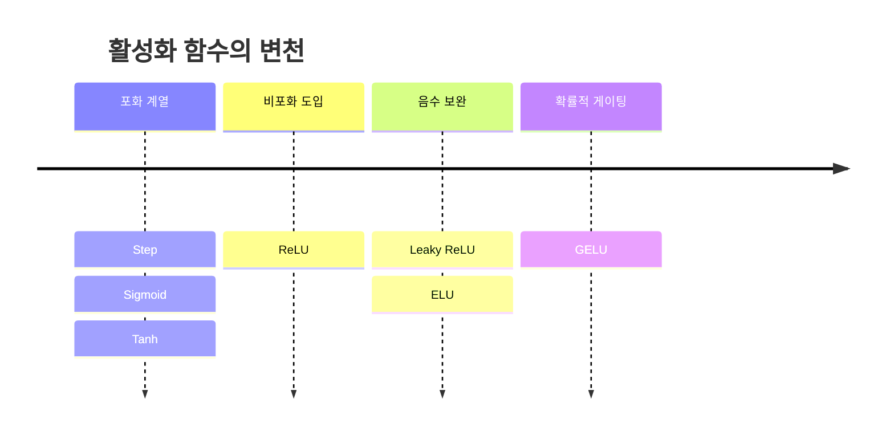

---
aliases:
  - 인공신경망
  - 활성화 함수
  - Activation Function
authority: primary
course: neural-networks
created: '2026-08-28'
date: '2026-08-28'
review_state: active
semester: '3-1'
source: pdf/3장_인공신경망.pdf
source_pages: 30
source_type: lecture-slides
status: draft
tags:
  - type/lecture
  - cs/ml
  - cs/deep-learning
title: 02. 인공신경망과 활성화 함수
type: lecture
updated: '2026-08-28'
---

domain:: [AI ML 데이터 인터페이스](<../AI ML 데이터 인터페이스.md>)
source:: [3장_인공신경망.pdf](<pdf/3장_인공신경망.pdf>)
prerequisites:: [01. 퍼셉트론](<01. 퍼셉트론.md>)
next:: [03. 신경망 학습](<03. 신경망 학습.md>)

> [!abstract] 한 줄 요약
> 퍼셉트론의 계단 함수를 **미분 가능한 함수**로 바꾸는 순간 신경망이 된다.
> 이 교체 하나가 뒤의 모든 학습([경사하강](<03. 신경망 학습.md>)·[역전파](<04. 오차역전파법.md>))을 가능하게 만든다.

## 퍼셉트론에서 신경망으로

편향을 명시하면 층을 일반화해 쓸 수 있다.

$$
y = h(w_1 x_1 + w_2 x_2 + b),
\qquad
h(x) = \begin{cases} 0, & x \le 0 \\ 1, & x > 0 \end{cases}
$$

여기서 $h$ 를 **활성화 함수**라 부른다. 계단 함수를 쓰면 퍼셉트론, 다른 함수를 쓰면 신경망이다.

> [!important] 왜 계단 함수를 버리는가
> 계단 함수는 **미분이 거의 모든 곳에서 0**이다. 기울기가 0이면 학습 신호가 전달되지 않는다.
> 그래서 "모양은 비슷하되 미분 가능한" 함수로 갈아탄다.

## 활성화 함수 계보

| 함수 | 식 | 특징 |
| :-- | :-- | :-- |
| **Sigmoid** | $\dfrac{1}{1+e^{-x}}$ | 출력 $(0,1)$. 양끝에서 **기울기 소실** |
| **Tanh** | $\dfrac{e^x - e^{-x}}{e^x + e^{-x}}$ | 출력 $(-1,1)$, 0 중심. 여전히 포화 |
| **ReLU** | $\max(0, x)$ | 양수 구간 기울기 1 — 소실 완화. 음수는 **죽음** |
| **Leaky ReLU** | $x$ if $x \ge 0$, else $\alpha x$ | 음수에도 작은 기울기 |
| **ELU** | $x$ if $x \ge 0$, else $\alpha(e^x - 1)$ | 음수 구간이 부드럽고 평균 0에 가까움 |
| **GELU** | $x \cdot \Phi(x)$ | 표준정규 CDF로 가중. Transformer 계열 표준 |

> [!warning] Sigmoid의 기울기 소실
> $\sigma'(x) = \sigma(x)(1-\sigma(x))$ 의 최댓값은 $x=0$ 에서 $0.25$ 다.
> 층을 $n$ 개 지나면 기울기가 최대 $0.25^n$ 로 줄어든다.
> 층이 깊어질수록 앞쪽 층이 학습되지 않는 이유이며, [초기화 기법](<05. 학습 기술들.md>)이 필요한 배경이다.

## 행렬로 쓰는 순전파

층 하나의 계산은 행렬 곱 하나로 압축된다.

$$
\mathbf{Y} = h(\mathbf{X}\mathbf{W} + \mathbf{B})
$$

| 연산 | 정의 | 신경망에서의 쓰임 |
| :-- | :-- | :-- |
| 합 | $A + B = (a_{ij} + b_{ij})$ | 편향 더하기 |
| 곱 | $c_{ij} = \sum_{k=1}^{p} a_{ik} b_{kj}$ | 층 사이 가중 연결 |
| 전치 | $A^T = (a_{ji})$, $(A^T)^T = A$ | 역전파에서 기울기 방향 정렬 |

> [!tip] 왜 행렬로 쓰는가
> 뉴런 단위 반복문을 행렬 한 번의 곱으로 바꾸면 GPU 병렬화가 그대로 적용된다.
> 그리고 [역전파](<04. 오차역전파법.md>)의 Affine 계층이 정확히 이 식의 미분이다.

## 출처

- 원본: `pdf/3장_인공신경망.pdf` (30p)
- 교재: 『밑바닥부터 시작하는 딥러닝』(사이토 고키, 한빛미디어)
