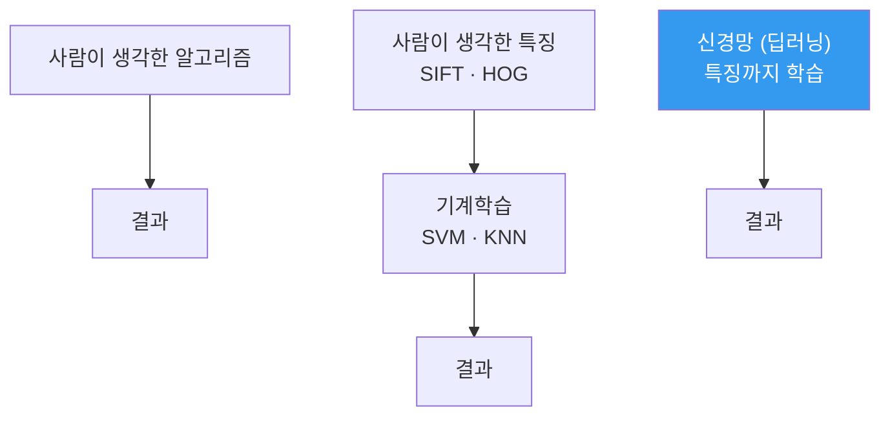

---
aliases:
  - 신경망 학습
  - 손실함수
  - 경사하강법
authority: primary
course: neural-networks
created: '2026-08-28'
date: '2026-08-28'
review_state: active
semester: '3-1'
source: pdf/AIE309_4장_신경망학습.pdf
source_pages: 30
source_type: lecture-slides
status: seedling
tags:
  - type/lecture
  - cs/ml
  - cs/deep-learning
title: 03. 신경망 학습
type: lecture
updated: '2026-08-28'
---

domain:: [[ComputerScience/03_ai-ml-data/AI ML 데이터 인터페이스|AI ML 데이터 인터페이스]]
source:: [[AIE309_4장_신경망학습.pdf]]
prerequisites:: [[02. 인공신경망과 활성화 함수]]
next:: [[04. 오차역전파법]]

# 03. 신경망 학습

> [!abstract] 한 줄 요약
> **인공신경망 학습 = 손실함수를 낮추는 과정.**
> 틀린 정도를 수로 정의하고($J(w)$), 그 수를 줄이는 방향($-\nabla J$)으로 가중치를 옮긴다.

## 무엇이 달라졌는가

특징 설계까지 학습이 떠맡는다. 대신 **무엇이 좋은지 알려 줄 기준**이 필요해진다 — 손실함수다.

## 손실함수

정답 레이블은 **One-hot encoding** 으로 바꾼다. 예: $0 \to (1,0,\dots,0)$, $5 \to (0,0,0,0,0,1,0,0,0,0)$.

| 손실함수 | 식 | 쓰임 |
|:--|:--|:--|
| **평균제곱오차(MSE)** | $E = \dfrac{1}{2}\sum_k (y_k - t_k)^2$ | 회귀 |
| **교차엔트로피(CEE)** | $E = -\sum_k t_k \log y_k$ | 분류 |

> [!note] 교차엔트로피의 의미
> 정보이론에서 **두 확률분포 사이의 거리**다.
> $t_k$ 가 one-hot이므로 실제로는 **정답 클래스의 예측 확률 하나**만 남는다.
> $$E = -\log y_{\text{정답}}$$
> 정답을 0.9로 맞히면 $-\log 0.9 \approx 0.105$, 0.1로 틀리면 $-\log 0.1 \approx 2.303$.

## 미분 — 어느 방향으로 갈 것인가

수치미분은 전방차분보다 **중앙차분**이 정확하다.

$$
\frac{dy}{dx} \approx \frac{f(x+h) - f(x)}{h}
\qquad\text{vs}\qquad
\frac{dy}{dx} \approx \frac{f(x+h) - f(x-h)}{2h}
$$

다변수에서는 축별 편미분을 모아 **기울기 벡터**를 만든다.

$$
\nabla f = \left( \frac{\partial f}{\partial x_1}, \frac{\partial f}{\partial x_2}, \dots, \frac{\partial f}{\partial x_n} \right)
$$

방향미분 $D_v f(\mathbf{x}) = \nabla f(\mathbf{x}) \cdot \mathbf{v} = \lVert \nabla f \rVert \cos\theta$ 는
$\theta = 0$ 일 때 최대다.

> [!important] 결론
> **기울기 방향이 가장 가파른 오르막**이므로, 내려가려면 그 반대로 간다.
> $$\mathbf{x}_{n+1} = \mathbf{x}_n - \eta \cdot \nabla f(\mathbf{x}_n)$$
> $\eta$ 가 학습률(learning rate)이다.

## 학습되는 변수는 몇 개인가

$784 \to 50 \to 10$ 구조의 변수 개수를 세어 보면 규모가 실감난다.

$$
784 \times 50 + 50 + 50 \times 10 + 10 = 39{,}760
$$

> [!warning] 수치미분으로는 못 푼다
> 변수 39,760개 각각에 대해 $f(x+h)$, $f(x-h)$ 를 계산하면
> 한 번의 기울기에 **약 8만 번의 순전파**가 필요하다.
> 이 비용을 없애는 것이 [[04. 오차역전파법|역전파]]다.

## 출처

- 원본: `pdf/AIE309_4장_신경망학습.pdf` (30p)
- 교재: 『밑바닥부터 시작하는 딥러닝』(사이토 고키, 한빛미디어)
