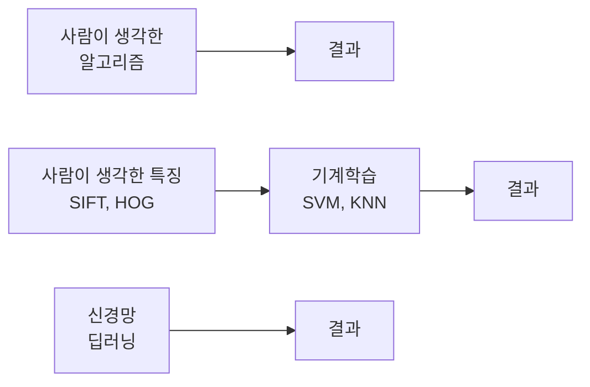

> [!abstract] 한 줄 요약
> 학습이란 **손실함수를 낮추는 과정**이다.
> 방향은 기울기가 알려주는데, 그 기울기를 수치미분으로 구하면 **3억 9천만 번** 계산해야 한다.

## 무엇이 달라졌는가

> [!quote] 슬라이드 근거
> `pdf/AIE309_4장_신경망학습.pdf` p.2–3



사람이 개입하는 단계가 점점 줄어든다. 신경망은 특징 설계까지 기계가 맡는다.

## 손실함수

> [!quote] 슬라이드 근거
> `pdf/AIE309_4장_신경망학습.pdf` p.4–7

슬라이드는 학습을 한 줄로 정의하면서 시작한다.

> [!important] 학습의 정의
> 인공신경망 학습 = ==손실함수 $J(w)$ 를 낮추는 과정==

라벨을 먼저 비교 가능한 형태로 바꿜다.

<details>
<summary>One-hot encoding — 숫자를 10차원 벡터로</summary>

```text
0 = 1,0,0,0,0,0,0,0,0,0        5 = 0,0,0,0,0,1,0,0,0,0
1 = 0,1,0,0,0,0,0,0,0,0        6 = 0,0,0,0,0,0,1,0,0,0
2 = 0,0,1,0,0,0,0,0,0,0        7 = 0,0,0,0,0,0,0,1,0,0
3 = 0,0,0,1,0,0,0,0,0,0        8 = 0,0,0,0,0,0,0,0,1,0
4 = 0,0,0,0,1,0,0,0,0,0        9 = 0,0,0,0,0,0,0,0,0,1
```

신경망의 출력이 확률벡터이므로, 라벨도 같은 모양으로 맞춰야 거리를 재을 수 있다.

</details>

<Tabs>
  <Tab label="평균제곱오차">

신경망 결과 확률벡터와 라벨 벡터의 **거리**다.

$$
E = \frac{1}{2}\sum_k (y_k - t_k)^2
$$

| 기호 | 의미 |
| :--: | :-- |
| $y_k$ | 신경망이 $k$ 라고 예측한 확률 |
| $t_k$ | 라벨을 원핫 인코딩한 뒤 $k$ 번째 좌표 |

데이터셋 전체의 오차는 각 데이터 오차의 **평균**이다.

  </Tab>
  <Tab label="교차 엔트로피 오차">

정보이론에서 말하는 **확률분포 사이의 거리**다.

$$
E = -\sum_k t_k \log y_k
$$

라벨이 $k_0$ 하나이면 $t$ 가 그 자리에서만 1이므로 식이 한 항으로 줄어든다.

$$
E = -\log y_{k_0}
$$

> [!tip] 이 형태가 뜻하는 것
> 정답 클래스에 부여한 확률이 1에 가까우면 손실이 0에 가깝고, 0에 가까우면 손실이 무한대로 발산한다.

  </Tab>
</Tabs>

## 기울기를 구하는 법

> [!quote] 슬라이드 근거
> `pdf/AIE309_4장_신경망학습.pdf` p.10–16

### 수치미분

$$
\frac{dy}{dx} = \lim_{h \to 0} \frac{f(x+h) - f(x)}{h}
= \lim_{h \to 0} \frac{f(x+h) - f(x-h)}{2h}
$$

> [!note] 왜 중앙차분을 쓰는가
> 슬라이드는 오른쪽 형태 $\frac{f(x+h) - f(x-h)}{2h}$ 를 밑줄 친다.
> 양쪽을 같이 보면 유한한 $h$ 에서 오차가 작아진다.

### 방향미분과 편미분

변수가 여럿이면 "어느 방향으로"를 명시해야 한다.

$$
D_{\mathbf{v}} f(\mathbf{x}) = \lim_{h \to 0} \frac{f(\mathbf{x} + h\mathbf{v}) - f(\mathbf{x})}{h}
$$

방향을 각 축으로 잡으면 편미분 $\dfrac{\partial f}{\partial x_i}$ 가 된다. 이를 모으면 ==기울기 벡터== 다.

$$
\nabla f = \left( \frac{\partial f}{\partial x_1}, \frac{\partial f}{\partial x_2}, \dots, \frac{\partial f}{\partial x_n} \right)
\qquad
D_{\mathbf{v}} f(\mathbf{x}) = \nabla f(\mathbf{x}) \cdot \mathbf{v}
$$

### 기울기가 가리키는 방향

단위벡터 $\mathbf{v}$ 에 대해 $D_{\mathbf{v}} f = \lVert \nabla f \rVert \cos\theta$ 이므로, $\theta$ 에 따라 세 경우로 갈린다.

| 방향 | 결과 |
| :-- | :-- |
| 기울기와 같은 방향 ($\theta = 0$) | 방향미분이 **최대** — 가장 가파르게 오른다 |
| 기울기 반대 방향 ($\theta = \pi$) | 방향미분이 **최소** — 가장 가파르게 내려간다 |
| 기울기와 수직 ($\theta = \pi/2$) | 방향미분이 **0** — 높이가 변하지 않는다 |

> [!important] 이것이 경사하강법의 근거다
> 손실을 가장 빨리 줄이려면 **기울기의 반대 방향**으로 가면 된다.
> 또 세 번째 줄 때문에 등위선(level curve)과 기울기는 항상 수직이다.

## 경사하강법

> [!quote] 슬라이드 근거
> `pdf/AIE309_4장_신경망학습.pdf` p.21–25

$$
\mathbf{x}_{n+1} = \mathbf{x}_n - \eta \cdot \nabla f
$$

슬라이드가 쓴 예제 함수는 $f(x_0, x_1) = x_0^2 + x_1^2$ 다.

> [!warning] 두 가지 함정
>
> - **Local minimum 또는 saddle point** 에 걸릴 수 있다 — 그래서 초기 위치가 중요하다.
> - **Learning rate** $\eta$ 가 너무 크면 발산하고, 너무 작으면 수렴이 느리다.

## 데이터로 보기 — 수치미분이 불가능한 이유

> [!quote] 슬라이드 근거
> `pdf/AIE309_4장_신경망학습.pdf` p.20, p.26, p.28

2층 신경망(784 → 50 → 10)의 변수 개수를 세어 보면 이렇다.

$$
784 \times 50 + 50 + 50 \times 10 + 10 = 39{,}760
$$

```html preview
<div style="font-family:system-ui,sans-serif;padding:20px;color:var(--foreground)">
  <div id="cards" style="display:flex;gap:14px;flex-wrap:wrap"></div>
  <p style="margin:16px 0 0;font-size:13px;color:var(--muted-foreground)">
    학습률 0.1, epoch 10,000회 기준. 수치미분은 변수 하나마다 함수를 다시 계산해야 한다.
  </p>
  <script>
    var s = [
      ['가중치 W(1)', '39,200', '784 × 50', 'var(--chart-1)'],
      ['편향 b(1)', '50', '은닉층 뉴런 수', 'var(--chart-2)'],
      ['가중치 W(2)', '500', '50 × 10', 'var(--chart-3)'],
      ['편향 b(2)', '10', '출력 클래스 수', 'var(--chart-4)'],
      ['총 변수', '39,760', '모두 합치면', 'var(--chart-5)']
    ];
    document.getElementById('cards').innerHTML = s.map(function (x) {
      return '<div style="flex:1;min-width:135px;padding:14px;background:var(--card);' +
        'color:var(--card-foreground);border:1px solid var(--border);' +
        'border-radius:var(--radius)">' +
        '<div style="font-size:12px;color:var(--muted-foreground)">' + x[0] + '</div>' +
        '<div style="font-size:22px;font-weight:700;margin-top:4px;color:' + x[3] + '">' +
        x[1] + '</div>' +
        '<div style="font-size:12px;color:var(--muted-foreground);margin-top:2px">' +
        x[2] + '</div></div>';
    }).join('');
  </script>
</div>
```

> [!failure] 여기서 수치미분은 무너진다
> 슬라이드 p.28의 계산이다.
>
> $$39{,}760 \times 10{,}000 = 397{,}600{,}000$$
>
> 약 **3억 9천 760만 번**의 수치미분이 필요하다. 게다가 매번 계산하는 함수는
> affine · sigmoid · softmax · 교차 엔트로피를 전부 합성한 것이다. **Computation cost 과다.**

그래서 다른 길이 필요해진다.

> [!success] 해법 — Backpropagation
> affine층 · sigmoid층 · softmax층 · 손실함수층에서 **해석적 미분(analytic derivative)** 과
> **연쇄법칙(chain rule)** 을 써서 전체 미분을 구한다.
> 그러면 컴퓨터가 가장 빨리 할 수 있는 **덧셈과 곱셈**만으로 미분값이 나온다.

## 핵심 정리

| 개념 | 정의 | 왜 중요한가 |
| :-- | :-- | :-- |
| 손실함수 | 예측과 정답의 거리 | 학습의 목적함수 |
| 교차 엔트로피 | $E = -\sum_k t_k \log y_k$ | 분류 문제의 표준 손실 |
| 기울기 $\nabla f$ | 편미분을 모은 벡터 | 가장 가파른 방향을 가리킨다 |
| 경사하강법 | $\mathbf{x}_{n+1} = \mathbf{x}_n - \eta \nabla f$ | 학습의 갱신 규칙 |
| 39,760 × 10,000 | 수치미분의 필요 연산 횟수 | 역전파가 필요해진 이유 |

## 관련 개념

- **prerequisite** — [02. 인공신경망과 활성화 함수](<./02. 인공신경망과 활성화 함수.md>) : 순전파 구조가 있어야 손실을 정의할 수 있다
- **applies-to** — [04. 오차역전파법](<./04. 오차역전파법.md>) : 이 노트가 제기한 계산량 문제의 해답편이다
- **applies-to** — [05. 학습 기술들](<./05. 학습 기술들.md>) : 학습률과 초기값 문제를 본격적으로 다룬다
- **uses** — [01. 퍼셉트론](<./01. 퍼셉트론.md>) : 가중치와 편향이 학습 대상이라는 구도가 여기서 온다

> [!question]- 스스로 점검
> **Q1.** 입력 $x$ 는 왜 미분 대상이 아닌가?
>
> **A1.** 슬라이드 p.19가 구분한다 — weight와 bias가 **변수(variables)** 이고, 입력은 **계수(coefficients)** 다. 데이터는 주어지는 값이므로 바꿀 대상이 아니다.
>
> **Q2.** 등위선과 기울기가 수직인 것이 왜 유용한가?
>
> **A2.** 등위선을 따라 움직이면 손실이 변하지 않는다는 뜻이다. 즉 손실을 줄이려면 등위선을 **가로질러** 움직여야 하고, 그 방향이 기울기다.

## 출처

- `pdf/AIE309_4장_신경망학습.pdf` (30p)
- 강의 인용 출처: 『밑바닥부터 시작하는 딥러닝』(사이토 고키, 한빛미디어)
