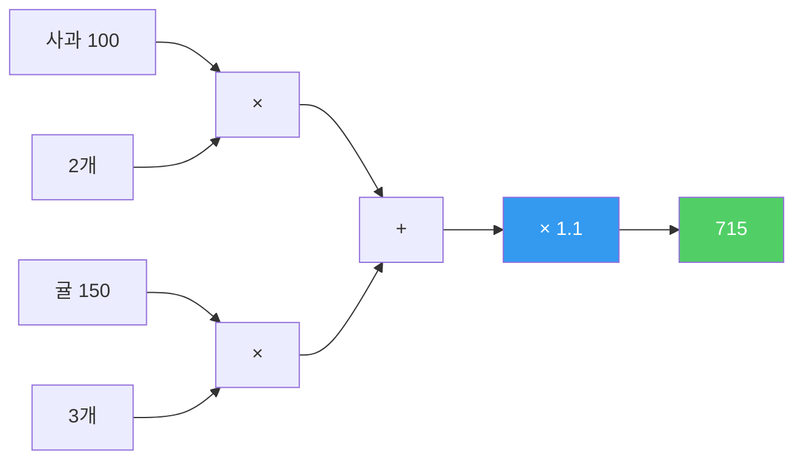
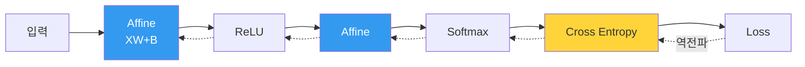

---
aliases:
  - 오차역전파법
  - Backpropagation
  - 계산 그래프
authority: primary
course: neural-networks
created: '2026-08-28'
date: '2026-08-28'
review_state: active
semester: '3-1'
source: pdf/AIE309_5장_오차역전파.pdf
source_pages: 34
source_type: lecture-slides
status: seedling
tags:
  - type/lecture
  - cs/ml
  - cs/deep-learning
title: 04. 오차역전파법
type: lecture
updated: '2026-08-28'
---

domain:: [[ComputerScience/03_ai-ml-data/AI ML 데이터 인터페이스|AI ML 데이터 인터페이스]]
source:: [[AIE309_5장_오차역전파.pdf]]
prerequisites:: [[03. 신경망 학습]]
next:: [[05. 학습 기술들]]

# 04. 오차역전파법

> [!abstract] 한 줄 요약
> [[03. 신경망 학습|수치미분]]은 옳지만 느리다.
> **연쇄법칙**을 계산 그래프에 적용하면 **한 번의 역방향 순회**로 모든 기울기를 얻는다.

## 사과 가격 예제 — 순전파

강의는 신경망 대신 **장보기**로 시작한다.

> 사과 100원/개 × 2개 × 소비세 1.1 = **220원**

여기에 귤을 더하면 덧셈 노드가 생긴다.

> (사과 100×2 + 귤 150×3) × 1.1 = **715원**

## 역전파 — 노드별 규칙

각 노드는 상류에서 온 미분 $\frac{\partial L}{\partial y}$ 에 **자기 국소 미분**을 곱해 하류로 보낸다.

$$
\frac{\partial L}{\partial x} = \frac{\partial L}{\partial y} \cdot \frac{\partial y}{\partial x}
$$

| 노드 | 순전파 | 역전파 |
|:--|:--|:--|
| **덧셈** | $y = x_1 + x_2$ | 그대로 흘려보냄 |
| **곱셈** | $y = x_1 x_2$ | **반대편 값을 곱함** |
| **역수** | $y = 1/x$ | $\dfrac{\partial L}{\partial y} \cdot (-y^2)$ |
| **지수** | $y = e^x$ | $\dfrac{\partial L}{\partial y} \cdot y$ |
| **로그** | $y = \log x$ | $\dfrac{\partial L}{\partial y} \cdot \dfrac{1}{x}$ |

> [!note] 곱셈 노드가 "반대편 값"인 이유
> $y = x_1 x_2$ 이면 $\dfrac{\partial y}{\partial x_1} = x_2$ 다.
> 그래서 순전파 때의 **입력값을 기억해 둬야** 역전파를 할 수 있다.

## 계층으로 조립하기

실제 신경망은 이 노드들을 계층 단위로 묶는다.

> [!important] Softmax + Cross Entropy 의 역전파가 아름다운 이유
> 두 계층을 묶으면 역전파가 **$y_k - t_k$** 라는 놀랍도록 단순한 형태가 된다.
> $$\frac{\partial L}{\partial a_k} = y_k - t_k$$
> 예측과 정답의 **차이 그 자체**가 그대로 기울기가 된다.

## 왜 이것이 필요한가

| 방식 | 39,760개 변수의 기울기 1회 | 정확도 |
|:--|:--|:--|
| 수치미분 | 약 **8만 번**의 순전파 | 근사 |
| **역전파** | 순전파 1회 + **역전파 1회** | 해석적 정확값 |

> [!tip] 기울기 확인(gradient check)
> 역전파는 구현 실수를 내기 쉬우므로, 수치미분과 값을 비교해 검증한다.
> 느린 방법이 **정답지** 역할을 하는 셈이다.

## 출처

- 원본: `pdf/AIE309_5장_오차역전파.pdf` (34p)
- 교재: 『밑바닥부터 시작하는 딥러닝』(사이토 고키, 한빛미디어)
