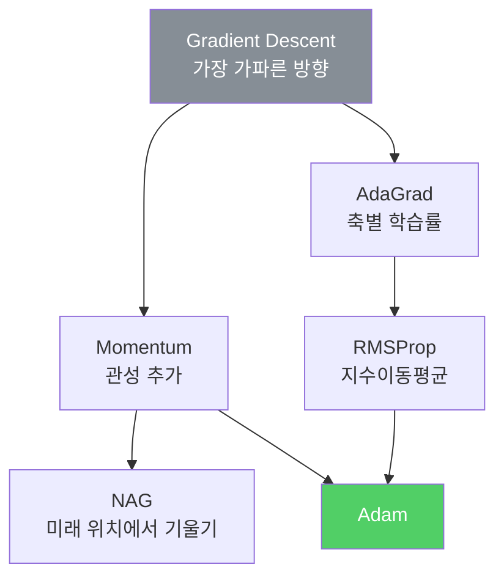

---
aliases:
  - 학습 기술들
  - 옵티마이저
  - Optimizer
  - 가중치 초기화
authority: primary
course: neural-networks
created: '2026-08-28'
date: '2026-08-28'
review_state: active
semester: '3-1'
source: pdf/AIE309_6장_학습기술들.pdf
source_pages: 51
source_type: lecture-slides
status: draft
tags:
  - type/lecture
  - cs/ml
  - cs/deep-learning
title: 05. 학습 기술들
type: lecture
updated: '2026-08-28'
---

domain:: [AI ML 데이터 인터페이스](<../AI ML 데이터 인터페이스.md>)
source:: [AIE309_6장_학습기술들.pdf](<pdf/AIE309_6장_학습기술들.pdf>)
prerequisites:: [04. 오차역전파법](<04. 오차역전파법.md>)

> [!abstract] 한 줄 요약
> 기울기를 구할 줄 안다고 학습이 되는 것은 아니다.
> **어떻게 내려갈지(옵티마이저)** 와 **어디서 출발할지(초기화)** 가 결과를 가른다.

## 기본 경사하강법의 한계

$$
\mathbf{x}_{n+1} = \mathbf{x}_n - \eta \cdot \nabla f(\mathbf{x}_n)
$$

| 문제 | 설명 |
| :-- | :-- |
| **Local minimum · Saddle point** | 기울기 0인 지점이 최적점이 아닐 수 있다 |
| **초기 위치 의존** | 어디서 출발하느냐가 도착지를 바꾼다 |
| **방향 불일치** | 기울기는 **등고선에 수직**이라, 최적점 방향과 크게 어긋날 수 있다 |

> [!warning] 지그재그 문제
> $f(x,y) = x^2 + 4y^2$ 처럼 축마다 곡률이 다르면
> 기울기가 골짜기를 가로질러 **왔다갔다** 하며 느리게 수렴한다.

## 옵티마이저 계보

| 옵티마이저 | 핵심 아이디어 | 갱신식 |
| :-- | :-- | :-- |
| **Momentum** | 이전 이동을 관성으로 누적 | $v_n = \alpha v_{n-1} - \eta\nabla f(\mathbf{x}_n)$, $\mathbf{x}_{n+1} = \mathbf{x}_n + v_n$ |
| **NAG** | 관성으로 **미리 가 본 지점**에서 기울기 계산 | $v_n = \alpha v_{n-1} - \eta\nabla f(\mathbf{x}_n + \alpha v_{n-1})$ |
| **AdaGrad** | 축별·스텝별 학습률, 많이 변한 축은 작게 | $h_n = h_{n-1} + \nabla f \odot \nabla f$, $\eta / \sqrt{h_n}$ |
| **RMSProp** | AdaGrad의 누적을 **가중평균**으로 — 최근 기울기 반영 | $h_n = \gamma h_{n-1} + (1-\gamma)\nabla f \odot \nabla f$ |
| **Adam** | Momentum + RMSProp | 1차·2차 모멘트를 $\beta_1, \beta_2$ 로 추정 후 편향 보정 |

> [!note] AdaGrad가 멈추는 이유
> $h_n$ 이 **단조 증가**하므로 $\eta/\sqrt{h_n}$ 이 계속 줄어든다.
> 학습 후반에 사실상 이동이 멈추는데, RMSProp의 **forgetting factor $\gamma$** 가 이를 푼다.
>
> [!important] 실무 기본값
> **Adam이 가장 널리 쓰인다.** 다만 만능은 아니며,
> 문제에 따라 SGD+Momentum이 더 나은 일반화를 보이기도 한다.

## 가중치 초기화

초기값을 잘못 잡으면 학습 자체가 시작되지 않는다.

| 초기화 | 결과 |
| :-- | :-- |
| $W \sim N(0, 1^2)$ — 너무 큼 | 활성값이 0/1로 포화 → **기울기 소실** |
| $W \sim N(0, 0.01^2)$ — 너무 작음 | 활성값이 한 점에 몰림 → **표현력 제한** |

> [!tip] 층 크기에 맞춘 분산
> $$\text{LeCun: } W \sim N\left(0, \frac{1}{n_{\text{in}}}\right)
> \qquad
> \text{Xavier: } W \sim N\left(0, \frac{2}{n_{\text{in}} + n_{\text{out}}}\right)$$
> 입력이 많을수록 분산을 줄여 **활성값 분포를 층마다 일정하게** 유지한다.
> ReLU 계열에는 분자를 2로 키운 He 초기화를 주로 쓴다.

## 이 과목을 관통하는 한 문장

> [!abstract] 정리
> [뉴런](<01. 퍼셉트론.md>)을 정의하고 → [미분 가능하게](<02. 인공신경망과 활성화 함수.md>) 만들고 →
> [틀린 정도를 수치화](<03. 신경망 학습.md>)하고 → [효율적으로 되돌리고](<04. 오차역전파법.md>) →
> **여기서 실제로 수렴하게 만든다.**

## 출처

- 원본: `pdf/AIE309_6장_학습기술들.pdf` (51p)
- 교재: 『밑바닥부터 시작하는 딥러닝』(사이토 고키, 한빛미디어)
