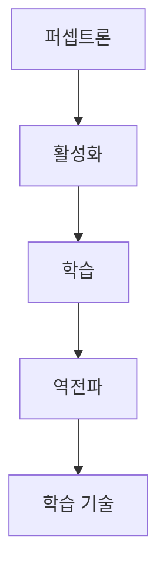

> [!abstract] 한 줄 요약
> 이 과정은 ==판별==에서 시작해 활성화·학습·역전파·학습 기술로 신경망의 학습 흐름을 연결한다.

## 강의 흐름 지도

[00. neural-networks 강의 흐름 지도](<./notes/00. neural-networks 강의 흐름 지도.md>)

## 학습 경로



## 노트 목록

| # | 노트 | 다루는 것 |
| :-- | :-- | :-- |
| 01 | [퍼셉트론](./notes/01.%20퍼셉트론.md) | 가중합, 임계값, 논리 게이트 |
| 02 | [인공신경망과 활성화 함수](./notes/02.%20인공신경망과%20활성화%20함수.md) | 활성화 함수, 행렬, 순전파 |
| 03 | [신경망 학습](./notes/03.%20신경망%20학습.md) | 손실, 기울기, 경사하강 |
| 04 | [오차역전파법](./notes/04.%20오차역전파법.md) | 계산 그래프, 연쇄법칙 |
| 05 | [학습 기술들](./notes/05.%20학습%20기술들.md) | 옵티마이저, 정규화, 검증 |

<details>
<summary>읽는 순서</summary>

각 노트는 앞 단계의 용어를 다음 단계의 입력으로 사용한다. 퍼셉트론의 판별식에서 시작해, 활성화 함수·행렬 연산, 손실과 기울기, 역전파, 학습 안정화 기법 순으로 읽는다.

</details>

<Tabs>
  <Tab label="기초">
    [01. 퍼셉트론](./notes/01.%20퍼셉트론.md)과 [02. 인공신경망과 활성화 함수](./notes/02.%20인공신경망과%20활성화%20함수.md)에서 단위 계산과 층 연산을 다룬다.
  </Tab>
  <Tab label="학습">
    [03. 신경망 학습](./notes/03.%20신경망%20학습.md)과 [04. 오차역전파법](./notes/04.%20오차역전파법.md)에서 손실의 미분과 전달을 다룬다.
  </Tab>
  <Tab label="운영">
    [05. 학습 기술들](./notes/05.%20학습%20기술들.md)에서 갱신·초기화·정규화·검증을 다룬다.
  </Tab>
</Tabs>

```html preview
<div style="font-family:system-ui,sans-serif;padding:20px">
  <div id="cards" style="display:flex;gap:14px;flex-wrap:wrap"></div>
  <script>
    var stats = [
      ['강의 노트', '5편', '현재 인덱스의 실제 노트', 'var(--chart-2)'],
      ['학습 단계', '5단계', '판별에서 학습 기술까지', 'var(--chart-1)'],
      ['읽기 방향', '1개', '앞 노트에서 다음 노트로', 'var(--chart-5)']
    ];
    document.getElementById('cards').innerHTML = stats.map(function (s) {
      return '<div style="flex:1;min-width:150px;padding:16px;background:var(--card);' +
        'color:var(--card-foreground);border:1px solid var(--border);' +
        'border-radius:var(--radius)">' +
        '<div style="font-size:13px;color:var(--muted-foreground)">' + s[0] + '</div>' +
        '<div style="font-size:26px;font-weight:700;margin-top:4px">' + s[1] + '</div>' +
        '<div style="font-size:12px;font-weight:600;margin-top:4px;color:' + s[3] + '">' +
        s[2] + '</div>' +
        '</div>';
    }).join('');
  </script>
</div>
```

> [!tip] 사용 방법
> 표의 노트를 순서대로 읽고, 각 노트의 “스스로 점검”에서 식과 역할을 다시 확인한다.

<details>
<summary>공개 노트의 근거 경계</summary>

각 강의 노트는 현재 로컬 추출문을 바탕으로 재작성했다. 원본 PDF 링크, 쪽수 표기, 원본 슬라이드 이미지와 assets 임베드는 포함하지 않는다.

</details>

> [!warning] 소스 경고
> 현재 추출문의 PDF 메타데이터 title은 수업 주제와 일치하지 않는 경우가 있어, 각 노트에서 그 경고와 사용 범위를 명시한다.

<details>
<summary>스스로 점검</summary>

**Q.** 학습 기술들은 어느 단계 다음에 읽는가?

**A.** 이 인덱스의 경로에서는 오차역전파 다음 단계다.

</details>
