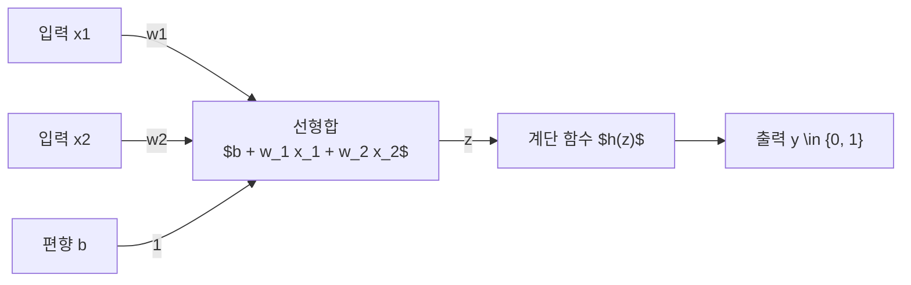
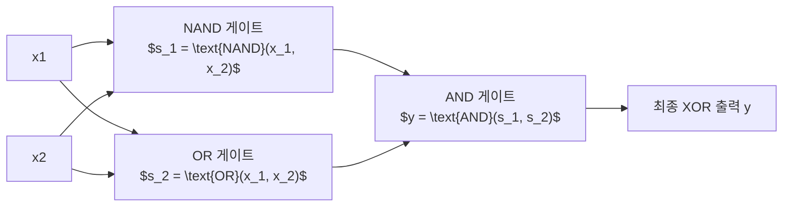

> [!abstract] 핵심 요약
> **퍼셉트론(Perceptron)**은 다수의 입력 신호에 가중치를 곱하고 편향(Bias)을 더하여 총합이 임계값(0)을 초과할 때 1을, 그렇지 않을 때 0을 출력하는 신경망의 가장 기초적인 분기 단위이다.
> AND, NAND, OR 게이트는 2차원 평면에서 단 하나의 직선으로 분리 가능한 **선형 분리 가능(Linearly Separable)** 문제인 반면, 곡선 형태의 영역 분리가 필요한 **XOR 게이트**는 단층 퍼셉트론으로 구현이 불가능하여 NAND와 OR를 조합한 **다층 퍼셉트론(MLP)**으로 층을 쌓아 해결해야 한다.

---

## 1. 퍼셉트론의 수식과 편향(Bias)의 물리적 의미

$$y = \begin{cases} 0 & (b + w_1 x_1 + w_2 x_2 \le 0) \\ 1 & (b + w_1 x_1 + w_2 x_2 > 0) \end{cases}$$

- **가중치 ($w_1, w_2$)**: 각 입력 신호($x_1, x_2$)가 결과 출력에 미치는 **영향력과 중요도**를 조절하는 매개변수.
- **편향 ($b$)**: 뉴런이 얼마나 쉽게 **발화(Fire / 1 출력)**하는지를 결정하는 활성화 민감도 기준값.



---

## 2. XOR 게이트의 다층 퍼셉트론 조합 아키텍처



---

## 3. 실시간 퍼셉트론 논리 게이트 진리표 & 비선형 XOR 시뮬레이터

```html preview
<div style="font-family:system-ui,-apple-system,sans-serif;padding:20px;background:var(--card);color:var(--card-foreground);border:1px solid var(--border);border-radius:var(--radius)">
  <div style="font-size:16px;font-weight:700;margin-bottom:14px;color:var(--primary);display:flex;align-items:center;gap:8px">
    <span>💡 퍼셉트론 논리 회로(AND, NAND, OR, XOR) 진리표 연산기</span>
  </div>

  <div style="display:flex;gap:10px;align-items:center;margin-bottom:14px">
    <label style="font-size:12px;font-weight:700">게이트 선택:</label>
    <select id="nnGateSelect" style="padding:4px 8px;background:var(--background);color:var(--foreground);border:1px solid var(--border);border-radius:var(--radius);font-weight:700">
      <option value="AND">AND (단층 퍼셉트론)</option>
      <option value="NAND">NAND (단층 퍼셉트론)</option>
      <option value="OR">OR (단층 퍼셉트론)</option>
      <option value="XOR">XOR (다층 퍼셉트론 2-Layer 조합)</option>
    </select>
  </div>

  <div style="display:grid;grid-template-columns:repeat(4, 1fr);gap:8px;margin-bottom:12px">
    <div style="padding:8px;background:var(--background);border:1px solid var(--border);border-radius:var(--radius);text-align:center">
      <div style="font-size:10px;color:var(--muted-foreground)">Input (0, 0)</div>
      <div id="out00" style="font-family:monospace;font-size:15px;font-weight:800;color:var(--primary);margin-top:2px">0</div>
    </div>
    <div style="padding:8px;background:var(--background);border:1px solid var(--border);border-radius:var(--radius);text-align:center">
      <div style="font-size:10px;color:var(--muted-foreground)">Input (1, 0)</div>
      <div id="out10" style="font-family:monospace;font-size:15px;font-weight:800;color:var(--primary);margin-top:2px">0</div>
    </div>
    <div style="padding:8px;background:var(--background);border:1px solid var(--border);border-radius:var(--radius);text-align:center">
      <div style="font-size:10px;color:var(--muted-foreground)">Input (0, 1)</div>
      <div id="out01" style="font-family:monospace;font-size:15px;font-weight:800;color:var(--primary);margin-top:2px">0</div>
    </div>
    <div style="padding:8px;background:var(--background);border:1px solid var(--border);border-radius:var(--radius);text-align:center">
      <div style="font-size:10px;color:var(--muted-foreground)">Input (1, 1)</div>
      <div id="out11" style="font-family:monospace;font-size:15px;font-weight:800;color:var(--primary);margin-top:2px">1</div>
    </div>
  </div>

  <div id="nnGateDesc" style="padding:10px;background:var(--background);border:1px solid var(--border);border-radius:var(--radius);font-size:11px">
    AND 게이트: w1=0.5, w2=0.5, b=-0.7의 단일 선형 결정 경계로 두 입력이 모두 1일 때만 1을 출력합니다.
  </div>

  <script>
    document.getElementById('nnGateSelect').onchange = function() {
      var g = this.value;
      var o00 = document.getElementById('out00');
      var o10 = document.getElementById('out10');
      var o01 = document.getElementById('out01');
      var o11 = document.getElementById('out11');
      var d = document.getElementById('nnGateDesc');

      if (g === 'AND') {
        o00.textContent = '0'; o10.textContent = '0'; o01.textContent = '0'; o11.textContent = '1';
        d.textContent = 'AND 게이트: w1=0.5, w2=0.5, b=-0.7 (단일 선형 분리)';
      } else if (g === 'NAND') {
        o00.textContent = '1'; o10.textContent = '1'; o01.textContent = '1'; o11.textContent = '0';
        d.textContent = 'NAND 게이트: w1=-0.5, w2=-0.5, b=0.7 (AND의 반전)';
      } else if (g === 'OR') {
        o00.textContent = '0'; o10.textContent = '1'; o01.textContent = '1'; o11.textContent = '1';
        d.textContent = 'OR 게이트: w1=0.5, w2=0.5, b=-0.2 (단일 선형 분리)';
      } else {
        o00.textContent = '0'; o10.textContent = '1'; o01.textContent = '1'; o11.textContent = '0';
        d.innerHTML = '✨ <b>[XOR 다층 퍼셉트론]</b> s1 = NAND(x1, x2), s2 = OR(x1, x2), y = AND(s1, s2)의 2단계 조합으로 비선형 분리를 완성합니다.';
      }
    };
  </script>
</div>
```
