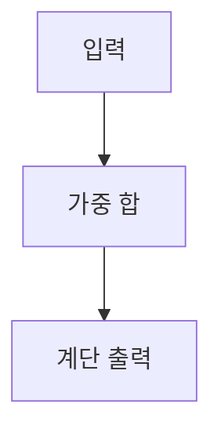

> [!abstract] 한 줄 요약
> 퍼셉트론은 입력의 ==가중합==을 임계값과 비교해 이진 출력을 만드는 가장 단순한 신경망 단위다.

## 이 노트의 지도



## 1. 퍼셉트론의 판별

입력 $x_1$, $x_2$는 가중치와 결합되고, 편향 $b$를 더한 뒤 계단 함수가 출력을 결정한다. 강의는 이를 두 입력의 이진 판별식으로 제시한다.

$$
y =
\begin{cases}
0, & w_1x_1+w_2x_2 \le \Theta \\
1, & w_1x_1+w_2x_2 > \Theta
\end{cases}
$$

<details>
<summary>편향을 포함한 같은 관점</summary>

강의의 다음 전개에서는 판별 기준을 $w_1x_1+w_2x_2+b$로 쓰고, $0$을 기준으로 출력을 나눈다. 편향은 입력과 별도로 더해지는 기준 이동 항으로 제시된다.

$$
y =
\begin{cases}
0, & w_1x_1+w_2x_2+b \le 0 \\
1, & w_1x_1+w_2x_2+b > 0
\end{cases}
$$

</details>

> [!important] 읽는 기준
> 퍼셉트론에서 핵심은 개별 입력값이 아니라, 가중치를 반영한 합이 ==판별 경계==의 어느 쪽에 놓이는가이다.

<Tabs>
  <Tab label="입력">
    $x_1$, $x_2$는 퍼셉트론에 들어오는 입력으로 제시된다.
  </Tab>
  <Tab label="출력">
    $y$는 계단 함수의 결과이며, 강의의 식에서는 $0$ 또는 $1$이다.
  </Tab>
</Tabs>

## 2. 논리 게이트와 한계

강의는 퍼셉트론의 적용 대상으로 AND, NAND, OR 게이트를 함께 제시한다. 이는 이진 입력과 이진 출력이라는 구조를 확인하는 예시다.

```html preview
<div style="font-family:system-ui,sans-serif;padding:20px">
  <div id="cards" style="display:flex;gap:14px;flex-wrap:wrap"></div>
  <script>
    var stats = [
      ['입력', '2개', 'x1, x2', 'var(--chart-2)'],
      ['출력', '1개', '계단 함수 y', 'var(--chart-1)'],
      ['제시 게이트', '3종', 'AND, NAND, OR', 'var(--chart-5)']
    ];
    document.getElementById('cards').innerHTML = stats.map(function (s) {
      return '<div style="flex:1;min-width:150px;padding:16px;background:var(--card);' +
        'color:var(--card-foreground);border:1px solid var(--border);' +
        'border-radius:var(--radius)">' +
        '<div style="font-size:13px;color:var(--muted-foreground)">' + s[0] + '</div>' +
        '<div style="font-size:26px;font-weight:700;margin-top:4px">' + s[1] + '</div>' +
        '<div style="font-size:12px;font-weight:600;margin-top:4px;color:' + s[3] + '">' +
        s[2] + '</div>' +
        '</div>';
    }).join('');
  </script>
</div>
```

<details>
<summary>강의가 남긴 한계 표지</summary>

강의는 논리 게이트 다음에 “Limitation”을 별도 항목으로 둔다. 이 노트는 그 표지를 단층 퍼셉트론의 한계를 더 살펴봐야 한다는 학습 경계로만 기록하며, 추출문에 없는 세부 사례는 덧붙이지 않는다.

</details>

> [!tip] 학습 순서
> 논리 게이트의 판별식을 먼저 읽고, 다음 노트에서 활성화 함수와 층을 쌓는 방식으로 확장한다.

## 핵심 정리

| 개념 | 강의에서의 역할 | 확인할 점 |
| :-- | :-- | :-- |
| 입력 | $x_1$, $x_2$ | 가중합의 재료 |
| 가중치 | $w_1$, $w_2$ | 입력의 반영 정도 |
| 편향 | $b$ | 판별 기준의 이동 |
| 계단 함수 | 이진 출력 결정 | $0$과 $1$의 분기 |
| 논리 게이트 | 적용 예시 | AND, NAND, OR |

> [!warning] 소스 경고
> 현재 추출문의 PDF 메타데이터 title은 이 수업 주제와 일치하지 않는다. 오류를 보정하지 않고, 추출문에서 명시적으로 확인되는 퍼셉트론 내용만 사용했다.

<details>
<summary>스스로 점검</summary>

**Q.** 판별식에서 편향 $b$를 더하면 무엇이 달라지는가?

**A.** 강의의 표기에서는 비교 기준이 $w_1x_1+w_2x_2$에서 $w_1x_1+w_2x_2+b$로 바뀐다.

</details>

## 출처와 한계

- 근거: 현재 로컬 “2장 퍼셉트론” 추출문.
- 원본 PDF 링크, 쪽수 표기, 원본 슬라이드 이미지와 assets 임베드는 이 공개 노트에서 제외했다.

---

## 원본 강의 흐름 인터랙티브

```html preview
<div style="font-family:system-ui,sans-serif;padding:20px;color:var(--foreground)">
  <label for="noteFlow143170" style="font-size:14px;font-weight:600">퍼셉트론 단계</label>
  <div id="noteFlow143170-out" style="font-size:26px;font-weight:700;color:var(--chart-1);margin:6px 0">퍼셉트론 핵심 개념</div>
  <input id="noteFlow143170" type="range" min="1" max="3" step="1" value="1" style="width:100%;accent-color:var(--primary)" />
  <p style="font-size:13px;color:var(--muted-foreground)">슬라이더를 움직이면 원본 PDF에서 정리한 이 노트의 흐름을 확인합니다.</p>
  <script>
    var noteFlow143170 = document.getElementById('noteFlow143170');
    var noteFlow143170Out = document.getElementById('noteFlow143170-out');
    var noteFlow143170Steps = ["퍼셉트론 핵심 개념","퍼셉트론 처리 절차","퍼셉트론 검증·응용"];
    noteFlow143170.addEventListener('input', function () { noteFlow143170Out.textContent = noteFlow143170Steps[Number(noteFlow143170.value) - 1]; });
  </script>
</div>
```
