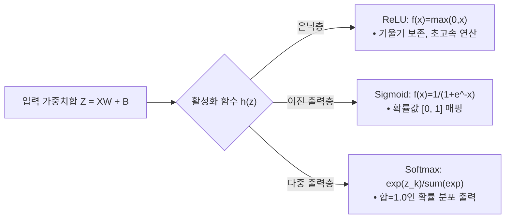

> [!abstract] 핵심 요약
> **인공신경망(ANN)**은 다층 퍼셉트론의 계단 함수 대신 연속적이고 미분 가능한 **비선형 활성화 함수(Activation Function)**를 도입하여 복잡한 함수를 매끄럽게 학습할 수 있도록 확장한 모델이다.
> 선형 함수($h(x) = cx$)를 은닉층에 사용하면 $h(h(h(x))) = c^3 x$가 되어 층을 깊게 쌓는 의미가 소멸하므로 **반드시 비선형 활성화 함수**를 사용해야 하며, 출력층의 소프트맥스 연산 시 큰 로짓에 의한 컴퓨터 오버플로(Overflow)를 방지하기 위해 최대값 차감($z_i - \max(z)$) 테크닉을 적용한다.

---

## 1. 3대 핵심 활성화 함수 수식 및 비교

### 1) 시그모이드 (Sigmoid)
$$h(x) = \frac{1}{1 + e^{-x}}, \quad h'(x) = h(x)(1 - h(x)) \in (0, 0.25]$$

### 2) ReLU (Rectified Linear Unit)
$$h(x) = \max(0, x), \quad h'(x) = \begin{cases} 1 & (x > 0) \\ 0 & (x \le 0) \end{cases}$$

### 3) 안정적 소프트맥스 (Stable Softmax with Overflow Prevention)
$$y_k = \frac{\exp(a_k - C')}{\sum_{i=1}^n \exp(a_i - C')} \quad (\text{단, } C' = \max(a_1, \dots, a_n))$$



---

## 2. 실시간 활성화 함수(Sigmoid vs ReLU vs Softmax) 인터랙티브 시뮬레이터

```html preview
<div style="font-family:system-ui,-apple-system,sans-serif;padding:20px;background:var(--card);color:var(--card-foreground);border:1px solid var(--border);border-radius:var(--radius)">
  <div style="font-size:16px;font-weight:700;margin-bottom:14px;color:var(--primary);display:flex;align-items:center;gap:8px">
    <span>📈 활성화 함수(Activation Function) 입출력 및 미분값 실시간 계산기</span>
  </div>

  <div style="display:grid;grid-template-columns:1fr 1fr;gap:12px;margin-bottom:14px">
    <div>
      <label style="font-size:11px;color:var(--muted-foreground)">활성화 함수:</label>
      <select id="annActSelect" style="width:100%;padding:4px 8px;background:var(--background);color:var(--foreground);border:1px solid var(--border);border-radius:var(--radius);font-weight:700">
        <option value="sigmoid">Sigmoid: 1 / (1 + exp(-x))</option>
        <option value="relu">ReLU: max(0, x)</option>
        <option value="step">Step: 1 if x > 0 else 0</option>
      </select>
    </div>
    <div>
      <label style="font-size:11px;color:var(--muted-foreground)">입력 신호 (x):</label>
      <input id="inAnnX" type="number" value="2.0" step="0.5" style="width:100%;padding:4px 8px;background:var(--background);color:var(--foreground);border:1px solid var(--border);border-radius:var(--radius);font-weight:700" />
    </div>
  </div>

  <div style="display:grid;grid-template-columns:1fr 1fr;gap:12px;margin-bottom:12px">
    <div style="padding:10px;background:var(--background);border:1px solid var(--border);border-radius:var(--radius);text-align:center">
      <div style="font-size:10px;color:var(--muted-foreground)">출력값 h(x)</div>
      <div id="annOutH" style="font-family:monospace;font-size:16px;font-weight:800;color:var(--primary);margin-top:2px">0.8808</div>
    </div>
    <div style="padding:10px;background:var(--background);border:1px solid var(--border);border-radius:var(--radius);text-align:center">
      <div style="font-size:10px;color:var(--muted-foreground)">도함수 미분값 h'(x)</div>
      <div id="annOutGrad" style="font-family:monospace;font-size:16px;font-weight:800;color:var(--chart-1);margin-top:2px">0.1050</div>
    </div>
  </div>

  <script>
    function updateAnnAct() {
      var act = document.getElementById('annActSelect').value;
      var x = parseFloat(document.getElementById('inAnnX').value) || 0;
      var h = 0, grad = 0;

      if (act === 'sigmoid') {
        h = 1.0 / (1.0 + Math.exp(-x));
        grad = h * (1.0 - h);
      } else if (act === 'relu') {
        h = Math.max(0, x);
        grad = (x > 0) ? 1.0 : 0.0;
      } else {
        h = (x > 0) ? 1.0 : 0.0;
        grad = (x === 0) ? Infinity : 0.0;
      }

      document.getElementById('annOutH').textContent = h.toFixed(4);
      document.getElementById('annOutGrad').textContent = grad.toFixed(4);
    }

    ['annActSelect', 'inAnnX'].forEach(function(id) {
      document.getElementById(id).addEventListener('input', updateAnnAct);
    });
    updateAnnAct();
  </script>
</div>
```
