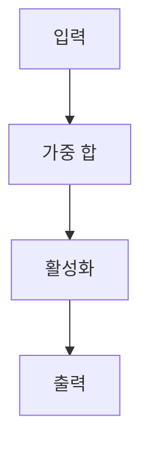

> [!abstract] 한 줄 요약
> 인공신경망은 ==가중합과 편향==을 활성화 함수로 변환하고, 이를 행렬 연산으로 층마다 이어 순전파한다.

## 이 노트의 지도



## 1. 활성화 함수

강의는 계단 함수에서 시작해 Sigmoid, Tanh, ReLU, Leaky ReLU, ELU, Swish, GELU를 제시한다. 각 함수는 가중합을 다음 층으로 전달할 값으로 바꾼다.

$$
h(x) =
\begin{cases}
0, & x \le 0 \\
1, & x > 0
\end{cases}
\qquad
\operatorname{sigmoid}(x)=\frac{1}{1+e^{-x}}
$$

<details>
<summary>강의에 제시된 함수식</summary>

- ReLU: $f(x)=\max(0,x)$
- Leaky ReLU: $f(x)=x$ for $x\ge0$, $f(x)=\alpha x$ for $x<0$
- ELU: $f(x)=x$ for $x\ge0$, $f(x)=\alpha(e^x-1)$ for $x<0$
- Swish: $f(x)=x\cdot\operatorname{sigmoid}(x)$
- GELU: $f(x)=x\cdot\Phi(x)$

</details>

> [!important] 비교 기준
> 함수 이름을 외우기보다, 같은 입력 $x$를 어떤 출력으로 바꾸는지가 ==활성화 함수==의 비교 대상이다.

<Tabs>
  <Tab label="계단 함수">
    입력이 기준 이하인지 초과인지에 따라 $0$ 또는 $1$을 출력한다.
  </Tab>
  <Tab label="연속 함수">
    강의는 Sigmoid, Tanh, ReLU 계열과 Swish·GELU를 연속적인 변환의 예로 제시한다.
  </Tab>
</Tabs>

## 2. 행렬로 보는 층 연산

강의는 행렬의 덧셈·뺄셈·스칼라곱·곱셈·전치를 정리한 뒤, 층의 가중치와 편향을 행렬과 벡터로 표현한다.

$$
A\in\mathbb{R}^{m\times p},\ B\in\mathbb{R}^{p\times n}
\quad\Rightarrow\quad
AB=C\in\mathbb{R}^{m\times n},
\qquad
c_{ij}=\sum_{k=1}^{p}a_{ik}b_{kj}
$$

<details>
<summary>곱셈과 전치에서 확인할 점</summary>

행렬곱은 안쪽 차원이 맞아야 하며, 강의는 $AB\ne BA$를 명시한다. 전치는 $A^T=(a_{ji})$로 정의하고 $(AB)^T=B^TA^T$를 제시한다.

</details>

> [!tip] 순전파를 읽는 법
> 각 층의 계산은 “가중치 행렬과 입력의 곱, 편향의 합, 활성화”라는 순서로 읽으면 된다.

## 3. 출력과 데이터 예시

강의는 Softmax를 확률 벡터로 제시하며, 각 성분이 음수가 아니고 합이 $1$인 조건을 둔다. 또한 MNIST를 0부터 9까지의 손글씨 이미지 자료로 소개한다.

$$
p_i\ge0,
\qquad
\sum_i p_i=1
$$

```html preview
<div style="font-family:system-ui,sans-serif;padding:20px;color:var(--foreground)">
  <h3 style="margin:0 0 14px;font-size:15px;font-weight:600">MNIST 데이터 분할</h3>
  <div id="bars" style="display:flex;align-items:flex-end;gap:14px;height:170px"></div>
  <script>
    var data = [['훈련', 60000], ['테스트', 10000]];
    var max = Math.max.apply(null, data.map(function (d) { return d[1]; }));
    document.getElementById('bars').innerHTML = data.map(function (d, i) {
      return '<div style="flex:1;display:flex;flex-direction:column;align-items:center;' +
        'gap:6px;height:100%;justify-content:flex-end">' +
        '<span style="font-size:12px;font-weight:600">' + d[1] + '</span>' +
        '<div style="width:100%;height:' + (d[1] / max * 100) + '%;' +
        'background:var(--chart-' + (i + 1) + ');' +
        'border-radius:var(--radius) var(--radius) 0 0"></div>' +
        '<span style="font-size:12px;color:var(--muted-foreground)">' + d[0] + '</span>' +
        '</div>';
    }).join('');
  </script>
</div>
```

| 항목 | 강의에서 제시한 내용 | 의미 |
| :-- | :-- | :-- |
| 데이터 | 0부터 9까지의 손글씨 | 분류 입력 |
| 훈련 자료 | 60,000장 | 학습에 사용 |
| 테스트 자료 | 10,000장 | 평가에 사용 |
| 이미지 | $28\times28$ 흑백 | 픽셀 입력 |
| 밝기 | 0부터 255 | 픽셀 값 |

> [!warning] 소스 경고
> 현재 추출문의 PDF 메타데이터 title은 이 수업 주제와 일치하지 않는다. 또한 3층 신경망 일부 수식 텍스트에는 훼손된 문자가 있어, 이 노트에서는 추출문에서 명확히 확인되는 표기만 사용했다.

> [!question]- 스스로 점검
> **Q.** 행렬곱에서 $AB$와 $BA$를 같은 것으로 볼 수 있는가?
> **A.** 강의는 $AB\ne BA$를 명시한다.

## 출처와 한계

- 근거: 현재 로컬 “3장 인공신경망” 추출문.
- 원본 PDF 링크, 쪽수 표기, 원본 슬라이드 이미지와 assets 임베드는 이 공개 노트에서 제외했다.
