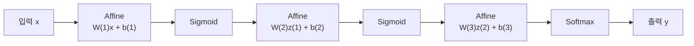

> [!abstract] 한 줄 요약
> 퍼셉트론의 **계단함수를 매끄러운 함수로 바꾸는 것** — 그것이 신경망의 출발이다.
> 그리고 층을 쌓으면 계산은 전부 **행렬 곱**이 된다.

## 퍼셉트론에서 신경망으로


먼저 문턱값 $\Theta$ 를 좌변으로 옮겨 편향 $b$ 로 바꾼다.

$$
y =
\begin{cases}
0, & w_1x_1 + w_2x_2 + b \le 0 \\[3pt]
1, & w_1x_1 + w_2x_2 + b > 0
\end{cases}
$$

이 판정을 함수 하나로 떼어내면 ==활성화 함수== 가 된다.

$$
a = w_1x_1 + w_2x_2 + b, \qquad y = h(a)
$$

$$
h(x) =
\begin{cases}
0, & x \le 0 \\[3pt]
1, & x > 0
\end{cases}
$$

> [!important] 왜 이 분리가 중요한가
> $h$ 를 갈아 끼울 수 있게 되기 때문이다. 계단함수는 미분이 거의 모든 곳에서 0이라 학습에 쓸 수 없다.
> 이후 등장하는 함수들은 전부 **미분 가능한 대체품**이다.

## 활성화 함수 여덟 가지


```html preview
<div style="font-family:system-ui,sans-serif;padding:20px;color:var(--foreground)">
  <div id="acts" style="display:grid;grid-template-columns:repeat(auto-fit,minmax(160px,1fr));gap:12px"></div>
  <script>
    function sig(x) { return 1 / (1 + Math.exp(-x)); }
    var fns = [
      ['Step', function (x) { return x > 0 ? 1 : 0; }, 1],
      ['Sigmoid', sig, 2],
      ['Tanh', function (x) { return Math.tanh(x); }, 3],
      ['ReLU', function (x) { return Math.max(0, x); }, 4],
      ['Leaky ReLU', function (x) { return x >= 0 ? x : 0.1 * x; }, 5],
      ['ELU', function (x) { return x >= 0 ? x : 1 * (Math.exp(x) - 1); }, 1],
      ['Swish', function (x) { return x * sig(x); }, 2],
      ['GELU', function (x) { return 0.5 * x * (1 + Math.tanh(0.7978845608 * (x + 0.044715 * x * x * x))); }, 3]
    ];
    var W = 150, H = 110, XR = 4, YR = 2.2;
    document.getElementById('acts').innerHTML = fns.map(function (f) {
      var pts = [];
      for (var i = 0; i <= 120; i++) {
        var x = -XR + (2 * XR) * i / 120;
        var y = f[1](x);
        if (y > YR) y = YR;
        if (y < -YR) y = -YR;
        pts.push((W / 2 + x / XR * (W / 2 - 6)).toFixed(1) + ',' +
                 (H / 2 - y / YR * (H / 2 - 6)).toFixed(1));
      }
      return '<div style="padding:10px;background:var(--card);color:var(--card-foreground);' +
        'border:1px solid var(--border);border-radius:var(--radius)">' +
        '<div style="font-size:13px;font-weight:600;margin-bottom:4px">' + f[0] + '</div>' +
        '<svg viewBox="0 0 ' + W + ' ' + H + '" style="width:100%;height:auto">' +
        '<line x1="0" y1="' + (H / 2) + '" x2="' + W + '" y2="' + (H / 2) +
        '" stroke-width="1" style="stroke: var(--border)" />' +
        '<line x1="' + (W / 2) + '" y1="0" x2="' + (W / 2) + '" y2="' + H +
        '" stroke-width="1" style="stroke: var(--border)" />' +
        '<polyline points="' + pts.join(' ') + '" fill="none" stroke-width="2.2" ' +
        'style="stroke: var(--chart-' + f[2] + ')" />' +
        '</svg></div>';
    }).join('');
  </script>
</div>
```

| 함수 | 정의 | 특징 |
| :-- | :-- | :-- |
| 계단 | $h(x) = 0\;(x \le 0),\; 1\;(x > 0)$ | 미분이 0이라 학습 불가 |
| Sigmoid | $f(x) = \dfrac{1}{1 + e^{-x}}$ | 출력이 $(0,1)$ — 확률처럼 읽힌다 |
| Tanh | $f(x) = \dfrac{e^{x} - e^{-x}}{e^{x} + e^{-x}}$ | 출력이 $(-1,1)$ — 0 중심 |
| ReLU | $f(x) = \max(0, x)$ | 양수 구간에서 기울기가 1로 일정 |
| Leaky ReLU | $f(x) = x\;(x \ge 0),\; \alpha x\;(x < 0)$ | 음수 구간에서도 기울기를 남긴다 |
| ELU | $f(x) = x\;(x \ge 0),\; \alpha(e^{x} - 1)\;(x < 0)$ | 음수 쪽이 매끄럽게 포화 |
| Swish | $f(x) = x \cdot \text{sigmoid}(x)$ | 0 근처에서 살짝 아래로 휜다 |
| GELU | $f(x) = x \cdot \Phi(x)$ | $\Phi$ 는 표준정규 누적분포함수 |

<details>
<summary>Tanh 와 Sigmoid 의 관계</summary>

슬라이드 p.6은 둘이 같은 함수의 변형임을 보인다.

$$
\text{sigmoid}(x) = \frac{1}{2}\left(1 + \tanh\left(\frac{x}{2}\right)\right)
$$

모양이 같고 출력 범위와 중심만 다르다.

</details>

## 행렬 연산 복습


층을 쌓으면 계산이 행렬로 정리되므로, 슬라이드는 여기서 행렬을 짚고 넘어간다.

<Tabs>
  <Tab label="덧셈·스칼라곱">

$$
\begin{pmatrix} 1 & 2 \\ 3 & 4 \end{pmatrix} +
\begin{pmatrix} 5 & 6 \\ 7 & 8 \end{pmatrix} =
\begin{pmatrix} 6 & 8 \\ 10 & 12 \end{pmatrix}
\qquad
2\begin{pmatrix} 1 & 2 \\ 3 & 4 \end{pmatrix} =
\begin{pmatrix} 2 & 4 \\ 6 & 8 \end{pmatrix}
$$

성분별로 그대로 더하거나 곱한다.

  </Tab>
  <Tab label="곱셈">

$A$ 가 $m \times p$, $B$ 가 $p \times n$ 이면 $AB$ 는 $m \times n$ 이다.

$$
c_{ij} = \sum_{k=1}^{p} a_{ik} b_{kj}
$$

> [!warning] 교환법칙이 성립하지 않는다
> $AB \ne BA$ — 슬라이드가 p.19에서 명시한다. 층의 순서를 바꿀 수 없는 이유이기도 하다.

  </Tab>
  <Tab label="전치">

$$
A^{T} = (a_{ji})
\qquad
(A^{T})^{T} = A
\qquad
(AB)^{T} = B^{T}A^{T}
$$

곱의 전치는 **순서가 뒤집힌다** — 역전파에서 자주 쓰인다.

  </Tab>
</Tabs>

## 3층 신경망의 순전파


각 층의 계산은 같은 모양이다 — **가중치를 곱하고 편향을 더한 뒤 활성화 함수를 통과**시킨다.

$$
a^{(k)}_i = \sum_j w^{(k)}_{ij} x_j + b^{(k)}_i
\qquad\Longleftrightarrow\qquad
\mathbf{a}^{(k)} = W^{(k)}\mathbf{x} + \mathbf{b}^{(k)}
$$

1층을 풀어 쓰면 슬라이드 p.22의 형태가 된다.

$$
\begin{pmatrix} a^{(1)}_1 \\ a^{(1)}_2 \\ a^{(1)}_3 \end{pmatrix}
=
\begin{pmatrix}
w^{(1)}_{11} & w^{(1)}_{12} \\
w^{(1)}_{21} & w^{(1)}_{22} \\
w^{(1)}_{31} & w^{(1)}_{32}
\end{pmatrix}
\begin{pmatrix} x_1 \\ x_2 \end{pmatrix}
+
\begin{pmatrix} b^{(1)}_1 \\ b^{(1)}_2 \\ b^{(1)}_3 \end{pmatrix}
$$

전체 흐름은 이렇게 이어진다.



> [!note] 슬라이드가 적어둔 한 줄
> `Affine → Sigmoid → Affine → Sigmoid → Affine → Softmax`
> 은닉층에는 Sigmoid, 출력층에는 Softmax 를 쓰는 구성이다.

## 출력층 — Softmax


출력을 **확률벡터**로 바꾼다.

$$
p_i = \frac{e^{a_i}}{\sum_j e^{a_j}}
\qquad
p_i \ge 0, \quad \sum_i p_i = 1
$$

> [!tip] 오버플로를 막는 성질
> 슬라이드 p.26이 짚는 항등식이다.
>
> $$\text{softmax}(a_1, \dots, a_n) = \text{softmax}(a_1 + c, \dots, a_n + c)$$
>
> 모든 입력에서 같은 상수를 빼도 결과가 같다. 보통 최댓값을 빼서 $e^{a}$ 가 폭주하는 것을 막는다.

## 실습 데이터 — MNIST


| 항목 | 값 |
| :-- | :-- |
| 내용 | 0부터 9까지의 손글씨 이미지 |
| 훈련 데이터 | 6만 장 |
| 테스트 데이터 | 1만 장 |
| 구성 | 이미지 + 라벨 |
| 해상도 | 28 × 28 흑백 |
| 픽셀값 | 0 ~ 255 밝기 |

입력이 $28 \times 28 = 784$ 차원이고 출력이 10개 클래스이므로, Softmax 출력층의 크기가 10이 된다.

## 핵심 정리

| 개념 | 정의 | 왜 중요한가 |
| :-- | :-- | :-- |
| 활성화 함수 | 가중합을 비선형으로 변환하는 함수 | 이것이 없으면 층을 쌓아도 선형 하나와 같다 |
| 계단함수의 문제 | 미분이 거의 모든 곳에서 0 | 학습이 불가능해 대체품이 필요했다 |
| Affine 계층 | $W\mathbf{x} + \mathbf{b}$ | 층 하나의 계산 = 행렬 곱 하나 |
| $AB \ne BA$ | 행렬곱의 비가환성 | 층 순서를 바꿀 수 없는 근거 |
| Softmax | 출력을 확률벡터로 | 분류 문제의 표준 출력층 |

## 관련 개념

- **prerequisite** — [01. 퍼셉트론](<./01. 퍼셉트론.md>) : 계단함수와 XOR 한계에서 이 노트가 출발한다
- **applies** — [03. 신경망 학습](<./03. 신경망 학습.md>) : 여기 세운 순전파에 손실함수와 경사하강법을 붙인다
- **applies** — [04. 오차역전파법](<./04. 오차역전파법.md>) : $(AB)^{T} = B^{T}A^{T}$ 가 역전파 유도에서 쓰인다

> [!question]- 스스로 점검
> **Q1.** 활성화 함수를 쓰지 않고 Affine 계층만 여러 개 쌓으면 어떻게 되는가?
>
> **A1.** 선형변환의 합성은 다시 선형변환이므로, 층을 아무리 쌓아도 단층과 표현력이 같다. 비선형성이 층을 의미 있게 만든다.
>
> **Q2.** ReLU 계열이 Sigmoid 를 대체한 이유는?
>
> **A2.** Sigmoid 는 입력이 크거나 작으면 기울기가 0에 가까워져 학습 신호가 사라진다. ReLU 는 양수 구간에서 기울기가 1로 유지된다.

## 출처


- 강의 인용 출처: 『밑바닥부터 시작하는 딥러닝』(사이토 고키, 한빛미디어)
