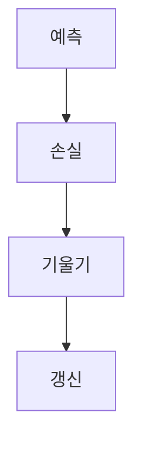

> [!abstract] 한 줄 요약
> 신경망 학습은 ==손실 함수==를 낮추는 방향을 찾아 가중치와 편향을 갱신하는 과정이다.

## 이 노트의 지도



## 1. 손실을 수치로 만들기

강의는 인공신경망 학습을 손실 함수 $J(w)$를 낮추는 과정으로 정의한다. 분류 라벨은 원-핫 인코딩으로 바꾸고, 출력 확률 벡터와 라벨 벡터의 차이를 손실로 계산한다.

$$
E=\frac{1}{2}\sum_k(y_k-t_k)^2
$$

$$
E=-\sum_k t_k\log y_k
$$

<details>
<summary>원-핫 인코딩의 역할</summary>

강의의 예시에서 숫자 0부터 9까지의 라벨은 길이 10의 벡터로 바뀌며, 해당 위치만 $1$이고 나머지는 $0$이다. 이 표현이 평균제곱오차와 교차 엔트로피 오차의 $t_k$가 된다.

</details>

> [!important] 비교 기준
> 평균제곱오차는 출력 확률 벡터와 라벨 벡터의 거리를, 교차 엔트로피 오차는 확률분포 사이의 거리를 다룬다고 강의는 설명한다.

<Tabs>
  <Tab label="평균제곱오차">
    각 좌표의 차이를 제곱해 합산하는 손실로 제시된다.
  </Tab>
  <Tab label="교차 엔트로피">
    라벨이 특정 좌표일 때 그 좌표의 예측 확률과 연결되는 손실로 제시된다.
  </Tab>
</Tabs>

## 2. 미분과 기울기

수치 미분은 $h$를 매우 작게 두고 함수값의 변화를 계산한다. 강의는 전진 차분과 양쪽 차분을 함께 제시하고, 다변수 함수에서는 방향 미분·편미분·기울기 벡터로 확장한다.

$$
f'(x)\approx\frac{f(x+h)-f(x-h)}{2h}
$$

$$
\nabla f=
\left(
\frac{\partial f}{\partial x_1},
\frac{\partial f}{\partial x_2},
\ldots,
\frac{\partial f}{\partial x_n}
\right)
$$

<details>
<summary>기울기가 말하는 방향</summary>

강의는 방향 미분 $D_vf(x)=\nabla f(x)\cdot v$를 제시한다. 방향 미분이 가장 큰 방향은 기울기 방향이고, 가장 작은 방향은 그 반대이며, 등위선과 기울기는 수직이라고 설명한다.

</details>

> [!tip] 변수와 계수 구분
> 강의의 신경망 예시에서는 weight와 bias를 변수로, input을 계수로 둔다.

## 3. 경사하강과 계산 비용

경사하강법은 현재 위치에서 기울기를 빼는 갱신으로 제시된다.

$$
x_{n+1}=x_n-\eta\nabla f
$$

```html preview
<div style="font-family:system-ui,sans-serif;padding:20px">
  <div id="cards" style="display:flex;gap:14px;flex-wrap:wrap"></div>
  <script>
    var stats = [
      ['변수', '39,760개', '784-50-10 예시', 'var(--chart-2)'],
      ['학습률', '0.1', '강의 예시', 'var(--chart-1)'],
      ['에폭', '10,000회', '반복 갱신', 'var(--chart-5)']
    ];
    document.getElementById('cards').innerHTML = stats.map(function (s) {
      return '<div style="flex:1;min-width:150px;padding:16px;background:var(--card);' +
        'color:var(--card-foreground);border:1px solid var(--border);' +
        'border-radius:var(--radius)">' +
        '<div style="font-size:13px;color:var(--muted-foreground)">' + s[0] + '</div>' +
        '<div style="font-size:26px;font-weight:700;margin-top:4px">' + s[1] + '</div>' +
        '<div style="font-size:12px;font-weight:600;margin-top:4px;color:' + s[3] + '">' +
        s[2] + '</div>' +
        '</div>';
    }).join('');
  </script>
</div>
```

<details>
<summary>왜 수치 미분만으로는 부담이 되는가</summary>

강의의 2층 신경망 예시는 입력 784개, 은닉 뉴런 50개, 출력 10개이며 손실 함수의 변수 수가 39,760개다. 학습률 0.1과 10,000회 반복을 예로 들고, 수치 미분은 $39{,}760\times10{,}000$번의 계산이 필요하다고 제시한다. 그래서 뒤의 주제인 역전파는 층별 해석 미분과 연쇄법칙으로 전체 미분을 구한다.

</details>

> [!warning] 소스 경고
> 현재 추출문의 PDF 메타데이터 title은 이 수업 주제와 일치하지 않는다. 일부 수식 주변에는 훼손된 문자가 있으므로, 이 노트는 명확히 확인되는 식과 수치만 기록했다.

<details>
<summary>스스로 점검</summary>

**Q.** 경사하강법에서 $\eta$는 어떤 항과 함께 쓰이는가?

**A.** 강의의 갱신식에서는 기울기 $\nabla f$에 곱해져 현재 위치에서 뺀다.

</details>

## 출처와 한계

- 근거: 현재 로컬 “AIE309 4장 신경망 학습” 추출문.
- 원본 PDF 링크, 쪽수 표기, 원본 슬라이드 이미지와 assets 임베드는 이 공개 노트에서 제외했다.

---

## 원본 강의 흐름 인터랙티브

```html preview
<div style="font-family:system-ui,sans-serif;padding:20px;color:var(--foreground)">
  <label for="noteFlow516842" style="font-size:14px;font-weight:600">신경망 학습 단계</label>
  <div id="noteFlow516842-out" style="font-size:26px;font-weight:700;color:var(--chart-1);margin:6px 0">신경망 학습 핵심 개념</div>
  <input id="noteFlow516842" type="range" min="1" max="3" step="1" value="1" style="width:100%;accent-color:var(--primary)" />
  <p style="font-size:13px;color:var(--muted-foreground)">슬라이더를 움직이면 원본 PDF에서 정리한 이 노트의 흐름을 확인합니다.</p>
  <script>
    var noteFlow516842 = document.getElementById('noteFlow516842');
    var noteFlow516842Out = document.getElementById('noteFlow516842-out');
    var noteFlow516842Steps = ["신경망 학습 핵심 개념","신경망 학습 처리 절차","신경망 학습 검증·응용"];
    noteFlow516842.addEventListener('input', function () { noteFlow516842Out.textContent = noteFlow516842Steps[Number(noteFlow516842.value) - 1]; });
  </script>
</div>
```
