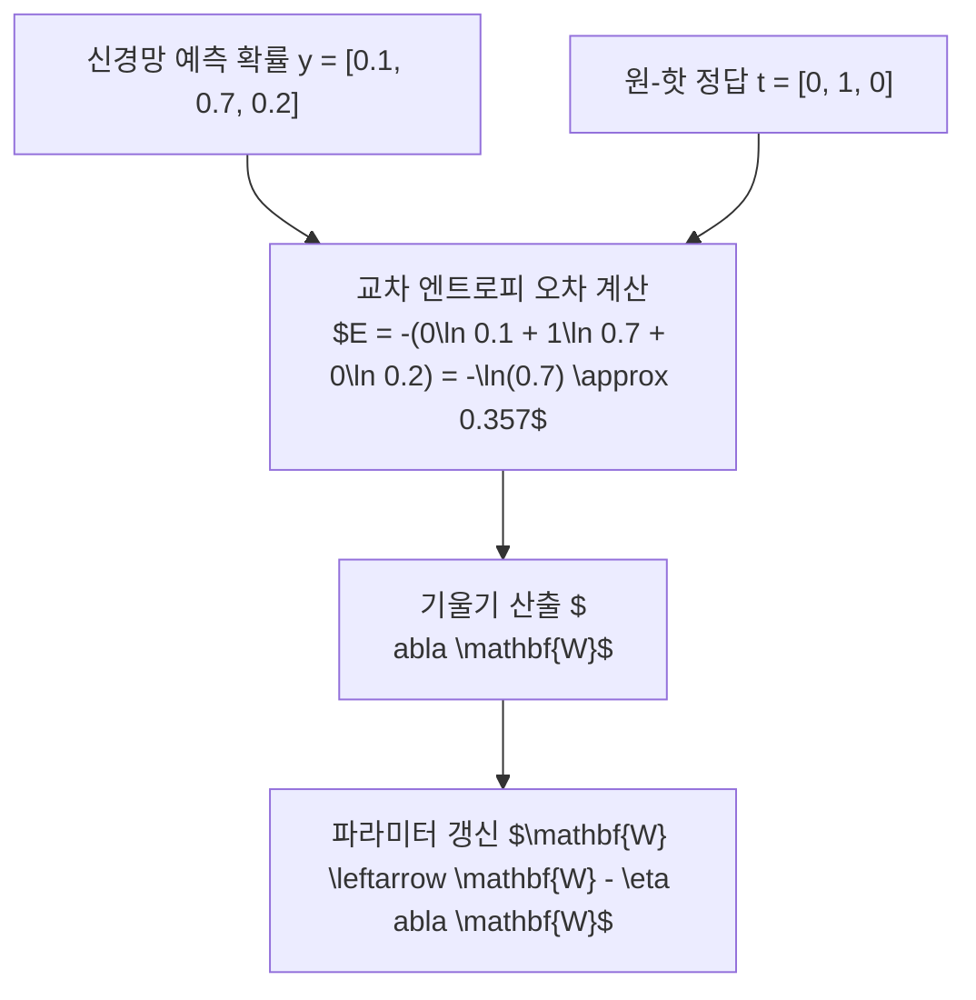

> [!abstract] 핵심 요약
> **신경망 학습(Learning)**이란 훈련 데이터의 오차를 최소화하도록 가중치와 편향 매개변수를 최적화하는 과정이다.
> 회귀에는 **평균 제곱 오차(MSE)**를, 분류에는 정답 라벨의 예측 확률에 패널티를 부여하는 **교차 엔트로피 오차(CEE)**를 손실 함수로 사용하며, 정확도(Accuracy) 대신 손실 함수를 지표로 삼는 이유는 미분계수가 매끄럽게 연속적으로 존재해야 경사하강법으로 미세한 파라미터 갱신이 가능하기 때문이다.

---

## 1. 손실 함수 2대 수학적 정의

### 1) 평균 제곱 오차 (MSE - Mean Squared Error)
$$E = \frac{1}{2} \sum_k (y_k - t_k)^2$$

### 2) 교차 엔트로피 오차 (CEE - Cross Entropy Error)
$$E = -\sum_k t_k \ln(y_k + \delta) \quad (\delta = 10^{-7} \text{은 } \ln(0) = -\infty \text{ 방지 미소값})$$



---

## 2. 수치 미분(Numerical Diff) vs 해석적 미분

| 구분 | 수치 미분 (Numerical Differentiation) | 해석적 미분 (오차역전파법 Backprop) |
| :-- | :-- | :-- |
| **계산 공식** | $\frac{\partial f}{\partial x} \approx \frac{f(x+h) - f(x-h)}{2h}$ (중앙 차분) | 연쇄 법칙(Chain Rule)에 의한 수학적 도함수 수식 |
| **계산 속도** | 파라미터 수 $N$개마다 순전파 2회 필요 ($O(N)$ 매우 느림) | **단 1회의 역전파로 모든 파라미터 미분 산출 ($O(1)$ 초고속)** |
| **용도** | **기울기 검증 (Gradient Check / 구현 검증용)** | **실제 심층 신경망 대규모 학습용** |

---

## 3. 실시간 교차 엔트로피 오차(CEE) & 손실 계산기

```html preview
<div style="font-family:system-ui,-apple-system,sans-serif;padding:20px;background:var(--card);color:var(--card-foreground);border:1px solid var(--border);border-radius:var(--radius)">
  <div style="font-size:16px;font-weight:700;margin-bottom:14px;color:var(--primary);display:flex;align-items:center;gap:8px">
    <span>🎯 교차 엔트로피 오차(Cross Entropy Error) 실시간 연산기</span>
  </div>

  <div style="margin-bottom:14px">
    <div style="display:flex;justify-content:space-between;font-size:11px;color:var(--muted-foreground);margin-bottom:4px">
      <span>정답 클래스(t=1)에 대한 신경망 예측 확률 (y_k):</span>
      <span id="ceeProbOut" style="font-weight:700;color:var(--primary)">0.70 (70%)</span>
    </div>
    <input id="inCeeY" type="range" min="0.01" max="0.99" step="0.01" value="0.70" style="width:100%" />
  </div>

  <div style="display:grid;grid-template-columns:1fr 1fr;gap:12px;margin-bottom:12px">
    <div style="padding:10px;background:var(--background);border:1px solid var(--border);border-radius:var(--radius);text-align:center">
      <div style="font-size:10px;color:var(--muted-foreground)">산출된 CEE 손실 E = -ln(y_k)</div>
      <div id="ceeLossOut" style="font-family:monospace;font-size:16px;font-weight:800;color:var(--destructive,#ef4444);margin-top:2px">0.357</div>
    </div>
    <div style="padding:10px;background:var(--background);border:1px solid var(--border);border-radius:var(--radius);text-align:center">
      <div style="font-size:10px;color:var(--muted-foreground)">손실 평가 상태</div>
      <div id="ceeStatusOut" style="font-size:12px;font-weight:800;color:var(--primary);margin-top:4px">✅ 낮은 오차 (안정적)</div>
    </div>
  </div>

  <script>
    document.getElementById('inCeeY').oninput = function() {
      var y = parseFloat(this.value);
      document.getElementById('ceeProbOut').textContent = y.toFixed(2) + " (" + (y*100).toFixed(0) + "%)";

      var loss = -Math.log(y);
      document.getElementById('ceeLossOut').textContent = loss.toFixed(3);

      if (y > 0.8) {
        document.getElementById('ceeStatusOut').innerHTML = "<span style='color:var(--primary);font-weight:700'>✨ [매우 우수] 높은 확신도 정답</span>";
      } else if (y < 0.2) {
        document.getElementById('ceeStatusOut').innerHTML = "<span style='color:var(--destructive,#ef4444);font-weight:700'>❌ [치명적 오차] 큰 그래디언트 발생</span>";
      } else {
        document.getElementById('ceeStatusOut').innerHTML = "<span style='color:var(--chart-2);font-weight:700'>⚠️ [학습 진행 중] 적정 손실 유지</span>";
      }
    };
  </script>
</div>
```
