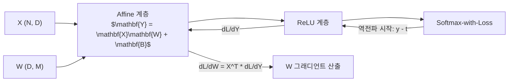

> [!abstract] 핵심 요약
> **오차역전파법(Backpropagation)**은 복잡한 다층 신경망의 미분 계산을 단순한 국소적 미분(Local Gradient)들의 연쇄 곱으로 분해하는 **계산 그래프(Computational Graph)** 기반의 고속 그래디언트 산출 알고리즘이다.
> 덧셈 노드는 상류에서 전파된 미분을 그대로 흘려보내며, 곱셈 노드는 순전파 시의 상대방 입력값을 곱하여 역전파하고, 행렬 곱을 수행하는 **Affine 계층**과 **Softmax-with-Loss 계층($y_k - t_k$)**의 대칭적 역전파 수식을 완전히 체득해야 한다.

---

## 1. 주요 계층별 역전파 수식 총정리

| 계층 (Layer) | 순전파 (Forward) | 역전파 (Backward) 미분 전달 |
| :-- | :-- | :-- |
| **덧셈 노드 (+)** | $z = x + y$ | $\frac{\partial L}{\partial x} = \frac{\partial L}{\partial z}, \quad \frac{\partial L}{\partial y} = \frac{\partial L}{\partial z}$ |
| **곱셈 노드 ($\times$)** | $z = x \cdot y$ | $\frac{\partial L}{\partial x} = \frac{\partial L}{\partial z} \cdot y, \quad \frac{\partial L}{\partial y} = \frac{\partial L}{\partial z} \cdot x$ |
| **ReLU 계층** | $y = \max(0, x)$ | $\frac{\partial L}{\partial x} = \frac{\partial L}{\partial y} \cdot \mathbb{I}(x > 0)$ |
| **Affine 계층** | $\mathbf{Y} = \mathbf{X}\mathbf{W} + \mathbf{B}$ | $\frac{\partial L}{\partial \mathbf{X}} = \frac{\partial L}{\partial \mathbf{Y}} \mathbf{W}^T, \quad \frac{\partial L}{\partial \mathbf{W}} = \mathbf{X}^T \frac{\partial L}{\partial \mathbf{Y}}, \quad \frac{\partial L}{\partial \mathbf{B}} = \sum \frac{\partial L}{\partial \mathbf{Y}}$ |
| **Softmax-with-Loss** | $y = \text{Softmax}(a), L = \text{CEE}(y, t)$ | **$\frac{\partial L}{\partial a_k} = y_k - t_k$ (예측 오차 그 자체!)** |



---

## 2. 실시간 계산 그래프 곱셈 노드 역전파 시뮬레이터 (사과 쇼핑)

```html preview
<div style="font-family:system-ui,-apple-system,sans-serif;padding:20px;background:var(--card);color:var(--card-foreground);border:1px solid var(--border);border-radius:var(--radius)">
  <div style="font-size:16px;font-weight:700;margin-bottom:14px;color:var(--primary);display:flex;align-items:center;gap:8px">
    <span>🍎 계산 그래프 역전파 시뮬레이터 (사과 100원 x 2개 x 소비세 1.1배)</span>
  </div>

  <div style="display:grid;grid-template-columns:repeat(3, 1fr);gap:10px;margin-bottom:14px">
    <div>
      <label style="font-size:10px;color:var(--muted-foreground)">사과 단가 (x):</label>
      <input id="inApplePrice" type="number" value="100" style="width:100%;padding:4px;background:var(--background);color:var(--foreground);border:1px solid var(--border);border-radius:var(--radius);font-weight:700" />
    </div>
    <div>
      <label style="font-size:10px;color:var(--muted-foreground)">사과 개수 (y):</label>
      <input id="inAppleNum" type="number" value="2" style="width:100%;padding:4px;background:var(--background);color:var(--foreground);border:1px solid var(--border);border-radius:var(--radius);font-weight:700" />
    </div>
    <div>
      <label style="font-size:10px;color:var(--muted-foreground)">소비세율 (tax):</label>
      <input id="inAppleTax" type="number" value="1.1" step="0.1" style="width:100%;padding:4px;background:var(--background);color:var(--foreground);border:1px solid var(--border);border-radius:var(--radius);font-weight:700" />
    </div>
  </div>

  <div style="display:grid;grid-template-columns:1fr 1fr;gap:12px;margin-bottom:12px">
    <div style="padding:10px;background:var(--background);border:1px solid var(--border);border-radius:var(--radius);text-align:center">
      <div style="font-size:10px;color:var(--muted-foreground)">최종 금액 L (순전파)</div>
      <div id="appleTotalOut" style="font-family:monospace;font-size:16px;font-weight:800;color:var(--primary);margin-top:2px">220 원</div>
    </div>
    <div style="padding:10px;background:var(--background);border:1px solid var(--border);border-radius:var(--radius);text-align:center">
      <div style="font-size:10px;color:var(--muted-foreground)">사과 가격에 대한 미분 dL/dx (역전파)</div>
      <div id="appleGradOut" style="font-family:monospace;font-size:16px;font-weight:800;color:var(--chart-1);margin-top:2px">2.2</div>
    </div>
  </div>

  <div id="appleDesc" style="padding:10px;background:var(--background);border:1px solid var(--border);border-radius:var(--radius);font-size:11px">
    사과 가격이 1원 오르면 최종 금액은 2.2원 증가합니다 (개수 2개 x 소비세 1.1 = 2.2).
  </div>

  <script>
    function updateAppleGraph() {
      var price = parseFloat(document.getElementById('inApplePrice').value) || 100;
      var num = parseFloat(document.getElementById('inAppleNum').value) || 2;
      var tax = parseFloat(document.getElementById('inAppleTax').value) || 1.1;

      var total = price * num * tax;
      var dL_dPrice = num * tax;

      document.getElementById('appleTotalOut').textContent = total.toFixed(0) + " 원";
      document.getElementById('appleGradOut').textContent = dL_dPrice.toFixed(2);
      document.getElementById('appleDesc').innerHTML = "역전파 연쇄 법칙: <code>dL/dPrice = 1.0 × " + tax.toFixed(1) + " × " + num + " = <b>" + dL_dPrice.toFixed(2) + "</b></code>";
    }

    ['inApplePrice', 'inAppleNum', 'inAppleTax'].forEach(function(id) {
      document.getElementById(id).addEventListener('input', updateAppleGraph);
    });
    updateAppleGraph();
  </script>
</div>
```
