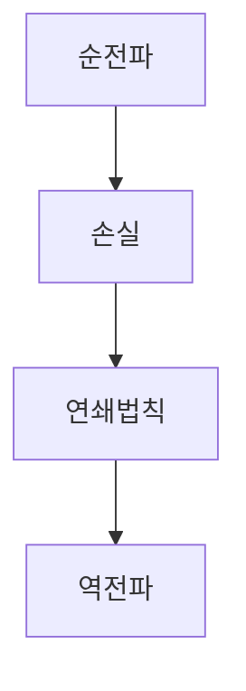

> [!abstract] 한 줄 요약
> 오차역전파는 ==연쇄법칙==을 계산 그래프의 각 노드에 적용해, 손실의 미분을 입력 쪽으로 전달하는 방법이다.

## 이 노트의 지도



## 1. 계산 그래프로 시작하기

강의는 사과 가격 100원, 사과 수 2개, 소비세 10%의 예시를 순전파로 계산한다. 총금액은 곱셈 노드를 거쳐 계산된다.

$$
100\times2\times1.1=220
$$

```html preview
<div style="font-family:system-ui,sans-serif;padding:20px">
  <div id="cards" style="display:flex;gap:14px;flex-wrap:wrap"></div>
  <script>
    var stats = [
      ['사과 가격', '100원', '개당 가격', 'var(--chart-2)'],
      ['사과 수', '2개', '입력 수량', 'var(--chart-1)'],
      ['소비세', '10%', '곱셈 계수', 'var(--chart-5)']
    ];
    document.getElementById('cards').innerHTML = stats.map(function (s) {
      return '<div style="flex:1;min-width:150px;padding:16px;background:var(--card);' +
        'color:var(--card-foreground);border:1px solid var(--border);' +
        'border-radius:var(--radius)">' +
        '<div style="font-size:13px;color:var(--muted-foreground)">' + s[0] + '</div>' +
        '<div style="font-size:26px;font-weight:700;margin-top:4px">' + s[1] + '</div>' +
        '<div style="font-size:12px;font-weight:600;margin-top:4px;color:' + s[3] + '">' +
        s[2] + '</div>' +
        '</div>';
    }).join('');
  </script>
</div>
```

<details>
<summary>두 상품으로 확장한 순전파</summary>

강의는 귤 가격 150원, 귤 수 3개를 더해 $(100\times2+150\times3)\times1.1=715$인 예시도 제시한다. 계산 그래프는 이처럼 중간 계산을 노드로 분해해 기록한다.

</details>

> [!important] 앞방향과 뒷방향
> 순전파는 값을 계산하고, 역전파는 손실에 대한 미분을 반대 방향으로 전달한다.

## 2. 연쇄법칙과 기본 노드

합성 함수 $L(y)=L(f(x))$에 대해 강의는 다음 연쇄법칙을 제시한다.

$$
\frac{\partial L}{\partial x}
=
\frac{\partial L}{\partial y}
\cdot
\frac{\partial y}{\partial x}
$$

<Tabs>
  <Tab label="덧셈 노드">
    역전파 값은 유지된다고 강의가 제시한다.
  </Tab>
  <Tab label="곱셈 노드">
    역전파에서는 반대편 값을 곱한다고 강의가 제시한다.
  </Tab>
</Tabs>

<details>
<summary>함수 노드의 예</summary>

강의는 역수 $y=1/x$, 지수 $y=e^x$, 로그 $y=\log x$를 계산 그래프 노드로 다룬다. 예를 들어 지수 노드에서는 $dy/dx=e^x=y$이므로, 입력 쪽 미분은 출력 쪽 미분에 $y$를 곱한 형태가 된다.

</details>

> [!tip] 그래프를 읽는 순서
> 먼저 노드가 만든 값을 순전파로 계산하고, 그 다음에 각 노드의 국소 미분을 곱하며 뒤로 전달한다.

## 3. 계층으로 이어지는 역전파

강의는 ReLU·Sigmoid와 vanishing gradient, Affine·Affine batch, Softmax-with-Loss를 순서대로 다룬다. 마지막 구조 표기는 Affine → Relu → Affine → Softmax → Cross Entropy다.

$$
\frac{\partial L}{\partial x}
=
\frac{\partial L}{\partial y}
\cdot
\frac{1}{x}
\qquad
\text{for } y=\log x
$$

| 구성 | 강의에서의 역할 | 역전파 관점 |
| :-- | :-- | :-- |
| 덧셈 | 값을 합침 | 미분값 유지 |
| 곱셈 | 값을 곱함 | 반대편 값을 곱함 |
| Affine | 가중합 계층 | 배치 표현도 제시 |
| ReLU·Sigmoid | 활성화 | vanishing gradient와 함께 다룸 |
| Softmax-with-Loss | 출력·손실 | 마지막 계층으로 제시 |

> [!warning] 소스 경고
> 현재 추출문의 PDF 메타데이터 title은 이 수업 주제와 일치하지 않는다. 일부 계산 그래프 도식은 텍스트 추출 결과가 비어 있으므로, 이 노트는 명시적으로 남은 식과 설명만 기록했다.

> [!question]- 스스로 점검
> **Q.** 곱셈 노드에서 역전파 값은 어떻게 정해지는가?
> **A.** 강의는 반대편 값을 곱한다고 제시한다.

## 출처와 한계

- 근거: 현재 로컬 “AIE309 5장 오차역전파” 추출문.
- 원본 PDF 링크, 쪽수 표기, 원본 슬라이드 이미지와 assets 임베드는 이 공개 노트에서 제외했다.
