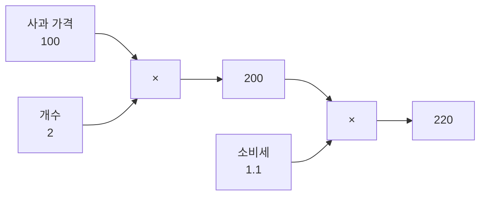
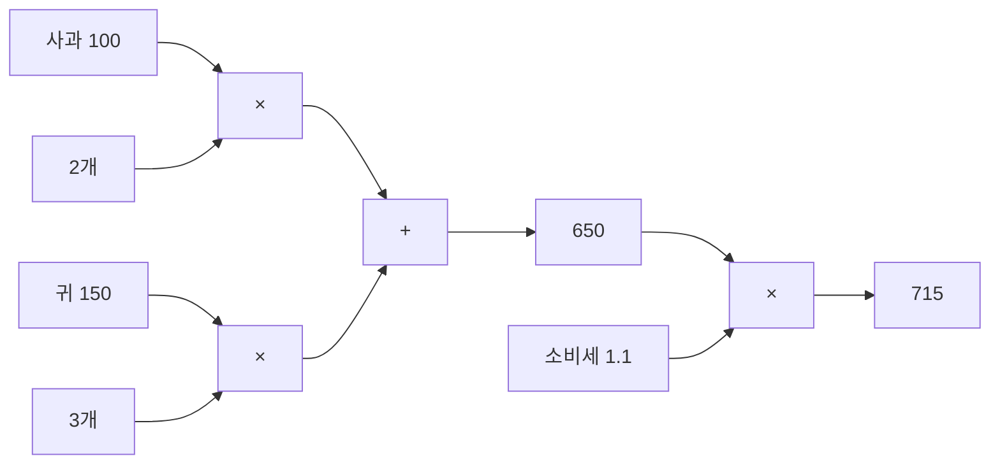
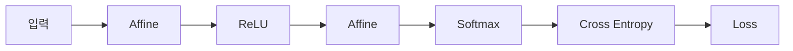

> [!abstract] 한 줄 요약
> 미분을 **다시 계산하지 않고** 구하는 법.
> 계산을 그래프로 그리면, 연쇄법칙이 그것을 덧셈과 곱셈으로 바꿔준다.

## 순전파 — 사과와 귀


슬라이드는 물건값 계산으로 계산 그래프를 도입한다.

<Tabs>
  <Tab label="사과만">

사과 100원/개, 2개, 소비세 10%.

$$
100 \times 2 \times 1.1 = 220
$$



  </Tab>
  <Tab label="사과 + 귀">

사과 100원 × 2개, 귀 150원 × 3개, 소비세 10%.

$$
(100 \times 2 + 150 \times 3) \times 1.1 = 715
$$



  </Tab>
</Tabs>

## 연쇄법칙


노드 하나를 $y = f(x)$ 라 하면, 손실 $L$ 에 대한 미분은 이렇게 분해된다.

$$
\frac{\partial L}{\partial x} = \frac{\partial L}{\partial y} \cdot \frac{\partial y}{\partial x}
$$

> [!important] 역전파의 구조
> 뒤에서 내려온 $\dfrac{\partial L}{\partial y}$ 에 **자기 노드의 국소 미분** $\dfrac{\partial y}{\partial x}$ 를 곱해 앞으로 넘긴다.
> 각 노드는 자기 미분만 알면 된다 — 전체 함수를 몰라도 된다.

## 노드별 역전파 규칙


| 노드 | 순전파 | 역전파 |
| :-- | :-- | :-- |
| 곱셈 | $y = x_1 x_2$ | **반대편 값을 곱한다** |
| 덧셈 | $y = x_1 + x_2$ | **그대로 유지한다** |
| 역수 | $y = 1/x$ | $\dfrac{\partial L}{\partial x} = -\dfrac{\partial L}{\partial y} \cdot y^{2}$ |
| 지수 | $y = e^{x}$ | $\dfrac{\partial L}{\partial x} = \dfrac{\partial L}{\partial y} \cdot y$ |
| 로그 | $y = \log x$ | $\dfrac{\partial L}{\partial x} = \dfrac{\partial L}{\partial y} \cdot \dfrac{1}{x}$ |

<details>
<summary>세 가지 유도 확인</summary>

**역수** — $\dfrac{dy}{dx} = -x^{-2} = -y^{2}$ 이므로 연쇄법칙을 적용하면 부호가 붙은 $-y^2$ 이 곱해진다.

**지수** — $\dfrac{dy}{dx} = e^{x} = y$ 다. 자기 출력값을 그대로 쓰면 되므로 구현이 가장 쉬운 노드다.

**로그** — $\dfrac{dy}{dx} = \dfrac{1}{x}$ 이므로 입력값이 필요하다.

</details>

### 사과 예제에 규칙을 적용하면

> [!note] 원본 슬라이드는 빈칸이다
> p.9·p.10·p.14는 숫자를 비워둔 연습 페이지다. 아래는 p.7·p.8의 규칙을 그대로 적용해 채운 값이다.

출발은 $\dfrac{\partial L}{\partial L} = 1$ 이다.

| 구하려는 미분 | 계산 | 값 |
| :-- | :-- | --: |
| 소비세에 대해 | $1 \times 200$ | 200 |
| 사과 총액에 대해 | $1 \times 1.1$ | 1.1 |
| 사과 가격에 대해 | $1.1 \times 2$ | **2.2** |
| 사과 개수에 대해 | $1.1 \times 100$ | **110** |

> [!tip] 이 숫자가 뜻하는 것
> 사과 가격이 1원 오르면 총액은 2.2원 오른다. 개수가 1개 늘면 110원 오른다.
> 신경망에서는 이 숫자가 곳 **가중치를 얼마나 움직여야 하는가**가 된다.

## 활성화 계층의 역전파


슬라이드는 ReLU 와 Sigmoid 를 나란히 놓고 **Vanishing Gradient** 를 짚는다.

```html preview
<div style="font-family:system-ui,sans-serif;padding:20px;color:var(--foreground)">
  <h3 style="margin:0 0 4px;font-size:15px;font-weight:600">역전파를 거칠 때 기울기가 얼마나 남는가</h3>
  <p style="margin:0 0 16px;font-size:13px;color:var(--muted-foreground)">
    Sigmoid 미분의 최댓값은 0.25다. 층을 거칠때마다 그만큼씩 곱해진다.
  </p>
  <div id="vg"></div>
  <div style="display:flex;gap:16px;margin-top:12px;font-size:12px;color:var(--muted-foreground)">
    <span><span style="display:inline-block;width:10px;height:10px;border-radius:2px;background:var(--chart-5)"></span> Sigmoid (×0.25)</span>
    <span><span style="display:inline-block;width:10px;height:10px;border-radius:2px;background:var(--chart-2)"></span> ReLU (×1)</span>
  </div>
  <script>
    var rows = [];
    for (var L = 1; L <= 5; L++) {
      rows.push([L + '층', Math.pow(0.25, L), 1]);
    }
    document.getElementById('vg').innerHTML = rows.map(function (r) {
      var pct = r[1] * 100;
      return '<div style="display:flex;align-items:center;gap:10px;margin-bottom:8px">' +
        '<span style="width:36px;font-size:13px;text-align:right">' + r[0] + '</span>' +
        '<div style="flex:1;position:relative;height:22px;background:var(--border);' +
        'border-radius:var(--radius);overflow:hidden">' +
        '<div style="position:absolute;left:0;top:0;height:100%;width:100%;' +
        'background:var(--chart-2);opacity:.35"></div>' +
        '<div style="position:absolute;left:0;top:0;height:100%;width:' +
        Math.max(pct, 0.4) + '%;background:var(--chart-5)"></div>' +
        '</div>' +
        '<span style="width:88px;font-size:12px;color:var(--muted-foreground)">' +
        (pct < 1 ? pct.toFixed(2) : pct.toFixed(1)) + '%</span></div>';
    }).join('');
  </script>
</div>
```

> [!warning] Vanishing Gradient
> Sigmoid 를 쌓을수록 앞쪽 층으로 가는 기울기가 **사라진다.** 5층이면 0.1% 도 남지 않는다.
> ReLU 는 양수 구간의 미분이 1이라 기울기가 그대로 통과한다.

## 계층으로 쌓는 전체 구조




각 계층은 순전파와 역전파를 **짝으로** 가진다. 슬라이드는 Affine 을 배치(batch) 버전까지 따로 다루며, Softmax 와 손실을 묶은 **Softmax-with-Loss** 를 하나의 계층으로 둔다.

> [!tip] 왜 묶어서 다루는가
> Softmax 와 교차 엔트로피를 합쳐 미분하면 식이 $y - t$ 로 깔끔하게 떨어진다.
> 따로 미분하는 것보다 구현도 쉽고 수치적으로도 안정적이다.

## 핵심 정리

| 개념 | 정의 | 왜 중요한가 |
| :-- | :-- | :-- |
| 계산 그래프 | 연산을 노드와 간선으로 그린 것 | 국소 계산만으로 전체 미분을 구하게 해준다 |
| 연쇄법칙 | $\dfrac{\partial L}{\partial x} = \dfrac{\partial L}{\partial y}\dfrac{\partial y}{\partial x}$ | 역전파 전체의 유일한 원리 |
| 곱셈 노드 | 반대편 값을 곱함 | 순전파 값을 기억해야 하는 이유 |
| 덧셈 노드 | 그대로 유지 | 가장 싸게 지나가는 노드 |
| Vanishing Gradient | 기울기가 앞층으로 갈수록 사라짐 | ReLU 가 표준이 된 이유 |

## 관련 개념

- **prerequisite** — [03. 신경망 학습](<./03. 신경망 학습.md>) : 수치미분의 계산량 문제가 이 노트의 출발점이다
- **applies** — [02. 인공신경망과 활성화 함수](<./02. 인공신경망과 활성화 함수.md>) : $(AB)^{T} = B^{T}A^{T}$ 와 활성화 함수의 미분을 가져온다
- **applies** — [05. 학습 기술들](<./05. 학습 기술들.md>) : 역전파로 구한 기울기를 어떻게 쓸지가 다음 주제다

> [!question]- 스스로 점검
> **Q1.** 순전파에서 계산한 값을 왜 기억해두어야 하는가?
>
> **A1.** 곱셈 노드의 역전파가 "반대편 값을 곱함"이기 때문이다. 상대편 입력값을 모르면 역전파를 계산할 수 없다.
>
> **Q2.** 역전파가 수치미분보다 빠른 근본 이유는?
>
> **A2.** 수치미분은 변수 하나당 순전파를 다시 돌려야 하지만, 역전파는 **한 번의 역방향 순회**로 모든 변수의 미분을 동시에 얻는다.

## 출처


- 강의 인용 출처: 『밑바닥부터 시작하는 딥러닝』(사이토 고키, 한빛미디어)
