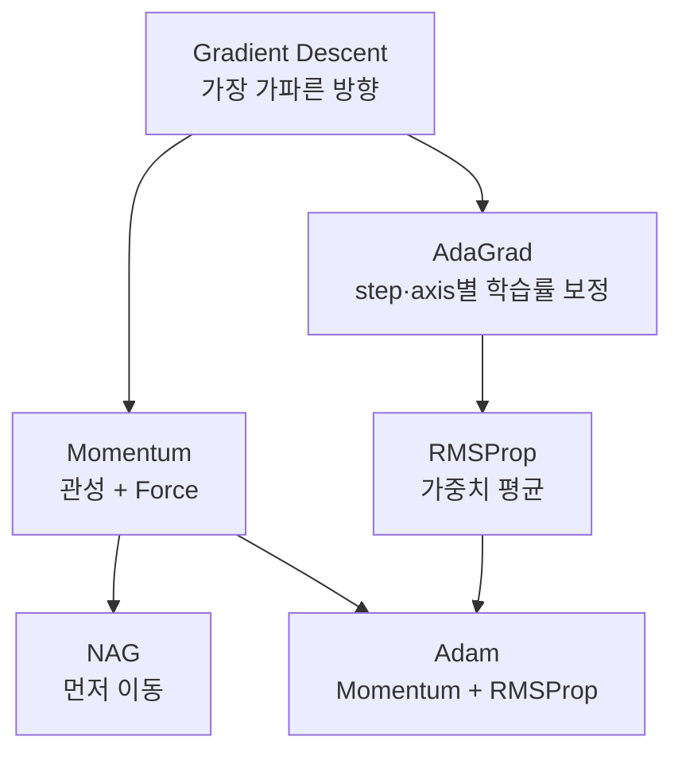

> [!abstract] 한 줄 요약
> 기울기를 구하는 법은 앞 노트에서 끝났다.
> 이제는 **그 기울기를 어떻게 쓸 것인가** — 여기서 학습의 성패가 갈린다.

## 기본 경사하강법의 문제


$$
\mathbf{x}_{n+1} = \mathbf{x}_n - \eta \cdot \nabla f(\mathbf{x}_n)
$$

슬라이드 p.4는 연습문제를 낸다 — $f(x, y) = x^2 + 4y^2$, $\mathbf{x}_0 = (4, 2)$, $\eta = \tfrac{1}{4}$ 일 때 $\mathbf{x}_1, \mathbf{x}_2, \mathbf{x}_3$ 를 구하라.

<details>
<summary>풀이 — 직접 계산해 보면</summary>

$\nabla f = (2x,\; 8y)$ 이므로 한 단계씩 대입한다.

| 단계 | 위치 | 기울기 | 다음 위치 |
| :--: | :-- | :-- | :-- |
| 0 | $(4, 2)$ | $(8, 16)$ | $(4-2,\; 2-4) = (2, -2)$ |
| 1 | $(2, -2)$ | $(4, -16)$ | $(2-1,\; -2+4) = (1, 2)$ |
| 2 | $(1, 2)$ | $(2, 16)$ | $(1-0.5,\; 2-4) = (0.5, -2)$ |
| 3 | $(0.5, -2)$ | — | — |

</details>

계산 결과를 그려 보면 문제가 눈에 보인다.

```html preview
<div style="font-family:system-ui,sans-serif;padding:20px;color:var(--foreground)">
  <div style="display:flex;gap:22px;align-items:center;flex-wrap:wrap">
    <svg viewBox="0 0 240 200" style="width:240px;height:200px">
      <ellipse cx="120" cy="100" rx="100" ry="50" style="fill:none;stroke:var(--border)" stroke-width="1.5" />
      <ellipse cx="120" cy="100" rx="62" ry="31" style="fill:none;stroke:var(--border)" stroke-width="1.5" />
      <ellipse cx="120" cy="100" rx="28" ry="14" style="fill:none;stroke:var(--border)" stroke-width="1.5" />
      <line x1="20" y1="100" x2="228" y2="100" stroke-width="1" style="stroke:var(--border)" />
      <line x1="120" y1="14" x2="120" y2="190" stroke-width="1" style="stroke:var(--border)" />
      <polyline points="200,60 160,140 140,60 130,140" fill="none" stroke-width="2.4"
        style="stroke: var(--chart-5)" />
      <circle cx="200" cy="60" r="5" style="fill: var(--chart-5)" />
      <circle cx="160" cy="140" r="4.5" style="fill: var(--chart-5)" />
      <circle cx="140" cy="60" r="4.5" style="fill: var(--chart-5)" />
      <circle cx="130" cy="140" r="4.5" style="fill: var(--chart-5)" />
      <circle cx="120" cy="100" r="4" style="fill: var(--chart-2)" />
      <text x="206" y="54" font-size="11" style="fill: var(--muted-foreground)">x0</text>
      <text x="166" y="156" font-size="11" style="fill: var(--muted-foreground)">x1</text>
      <text x="131" y="52" font-size="11" style="fill: var(--muted-foreground)">x2</text>
      <text x="100" y="158" font-size="11" style="fill: var(--muted-foreground)">x3</text>
    </svg>
    <div style="flex:1;min-width:220px;padding:16px;background:var(--card);
      color:var(--card-foreground);border:1px solid var(--border);border-radius:var(--radius)">
      <div style="font-size:14px;font-weight:600;margin-bottom:8px">x는 수렴, y는 진동</div>
      <div style="font-size:13px;line-height:1.8;color:var(--muted-foreground)">
        x: 4 &rarr; 2 &rarr; 1 &rarr; 0.5 — 절반씩 줄어든다<br />
        y: 2 &rarr; <b style="color:var(--chart-5)">-2</b> &rarr; <b style="color:var(--chart-5)">2</b> &rarr; <b style="color:var(--chart-5)">-2</b> — 크기가 줄지 않는다<br />
        계수 4 때문에 y축 기울기가 너무 가파르기 때문이다.
      </div>
    </div>
  </div>
</div>
```

> [!important] 슬라이드가 짚는 두 가지 문제
>
> - **Local minimum 또는 saddle point** 에 걸릴 수 있다 — 초기 위치가 중요하다 (p.5)
> - Gradient 방향은 level curve 와 수직이지만, ==최적점 방향과는 차이가 클 수 있다== (p.6)

위 그림이 바로 두 번째 문제다. 지그재그로 움직이느라 정작 목표로는 느리게 간다.

## 옵티마이저 계보




<Tabs>
  <Tab label="Momentum">

관성을 도입한다 — 이전 이동량 $\mathbf{v}$ 를 이어받는다.

$$
\mathbf{x}_{n+1} = \mathbf{x}_n + \mathbf{v}_n
\qquad
\mathbf{v}_n = \alpha \mathbf{v}_{n-1} - \eta \cdot \nabla f(\mathbf{x}_n)
\qquad
\mathbf{v}_{-1} = 0
$$

$\alpha = 0$ 이면 기본 경사하강법과 같다. 진동하는 축은 서로 상쇄되고, 일관된 방향은 누적된다.

  </Tab>
  <Tab label="NAG">

Nesterov Accelerated Gradient — **기울기를 미래 지향적으로 반영**한다.

$$
\mathbf{v}_n = \alpha \mathbf{v}_{n-1} - \eta \cdot \nabla f(\mathbf{x}_n + \alpha \mathbf{v}_{n-1})
$$

Momentum 과 수식이 한 군데만 다르다 — 기울기를 **관성으로 먼저 이동한 지점**에서 구한다.

  </Tab>
  <Tab label="AdaGrad">

학습률을 **축별로, 스텝별로** 바꾸는 접근이다.

| 원칙 | 내용 |
| :-- | :-- |
| 스텝 | step 이 지날수록 learning rate 를 줄임 |
| 큰 변화 축 | 작은 learning rate |
| 작은 변화 축 | 큰 learning rate |

앞서 본 $y$ 축 진동은 "큰 변화 축"이므로 자동으로 제동이 걸린다.

  </Tab>
  <Tab label="RMSProp">

AdaGrad 는 누적치가 계속 커져 학습률이 결국 0으로 죽는다.

RMSProp 은 누적치와 현재 gradient 의 **가중 평균**을 써서 최근 값을 더 반영한다.

$\gamma$ 는 forgetting factor(decay rate) — 과거를 얼마나 잊을지를 정한다.

  </Tab>
  <Tab label="Adam">

**Momentum + RMSProp** — 가장 널리 쓰이는 옵티마이저다.

$$
\mathbf{m}_n = \beta_1 \mathbf{m}_{n-1} + (1-\beta_1)\nabla f(\mathbf{x}_n)
\qquad
\mathbf{h}_n = \beta_2 \mathbf{h}_{n-1} + (1-\beta_2)\nabla f(\mathbf{x}_n) \odot \nabla f(\mathbf{x}_n)
$$

초기값이 0이라 초반에 값이 작게 나오는 것을 보정한다.

$$
\hat{\mathbf{m}}_n = \frac{\mathbf{m}_n}{1 - \beta_1^{\,n+1}}
\qquad
\hat{\mathbf{h}}_n = \frac{\mathbf{h}_n}{1 - \beta_2^{\,n+1}}
\qquad
\mathbf{x}_{n+1} = \mathbf{x}_n - \eta \frac{1}{\sqrt{\hat{\mathbf{h}}_n}} \hat{\mathbf{m}}_n
$$

  </Tab>
</Tabs>

## 가중치 초기화


슬라이드는 극단 두 경우를 먼저 보여준다.

| 초기화 | 결과 |
| :-- | :-- |
| $W \sim N(0, 1^2)$ | **Vanishing Gradient Problem** |
| $W \sim N(0, 0.01^2)$ | **표현력 제한** |

둘 사이를 맞추는 공식들이 제안됐다.

| 방법 | 분산 | 쓰는 곳 |
| :-- | :-- | :-- |
| LeCun | $\dfrac{1}{n_{\text{in}}}$ | 일반 |
| Xavier | $\dfrac{2}{n_{\text{in}} + n_{\text{out}}}$ | Sigmoid · Tanh |
| He | $\dfrac{2}{n_{\text{in}}}$ | **활성화 함수가 ReLU 일 때** |

$n_{\text{in}}$ 은 입력 수, $n_{\text{out}}$ 은 출력 수다.

> [!tip] 외우기보다 구조를
> 세 공식 모두 **분모가 연결 수**다. 연결이 많을수록 개별 가중치를 작게 시작해야 합이 폭주하지 않는다는 발상이다.

## Batch Normalization


feature 개수 $D$ 인 데이터 $N$ 개를 $N \times D$ 행렬로 보고 **열 단위**로 정규화한다.

| 기호 | 정의 | 모양 |
| :-- | :-- | :-- |
| $\boldsymbol{\mu}$ | 열에 대한 평균 | 길이 $D$ 벡터 |
| $\mathbf{x}_c = \mathbf{x} - \boldsymbol{\mu}$ | 각 열의 평균을 0으로 | $N \times D$ |
| $\boldsymbol{\sigma}^2$ | 각 열의 분산 | 길이 $D$ 벡터 |
| $\mathbf{x}_N = \mathbf{x}_c / \boldsymbol{\sigma}$ | 각 열을 정규화 | $N \times D$ |
| $\boldsymbol{\gamma}, \boldsymbol{\beta}$ | 각 행에 곱하고 더하는 학습 파라미터 | 길이 $D$ 벡터 |

> [!success] 세 가지 효과 (p.36)
>
> - 학습속도 개선
> - 초기값에 덜 의존
> - overfitting 억제

## 과적합 대책


| 방법 | 내용 |
| :-- | :-- |
| Weight decay (L2) | 가중치 제곱합을 손실에 더해 큰 가중치를 억제 |
| L1 regularizer | 가중치 절대값 합을 더함 — 희소해지는 효과 |
| Dropout | 학습 중 일부 뉴런을 무작위로 끔 |

## 하이퍼파라미터


지금까지 나온 계수들은 학습으로 정해지는 것이 아니다.

> [!important] Parameter 와의 구분
> **Parameter** 는 weight — 학습으로 정해진다.
> **Hyperparameter** 는 사람이 정하는 것이다 — 층의 개수, 뉴런의 개수, learning rate, 손실함수의 종류, 배치 크기, 훈련 회수, optimizer 계수, 가중치 초기값, 가중치 감소 계수, dropout 비율.

슬라이드는 솔직하게 적어둔다 — *"좋은 값을 찾기 위해서는 여러 값을 직접 시도해보는 수밖에 없다."*

다만 관례적으로 고정된 값도 있다.

| 하이퍼파라미터 | 권장값 |
| :-- | :--: |
| Momentum 계수 $\alpha$ | 0.9 |
| Adam $\beta_1$ | 0.9 |
| Adam $\beta_2$ | 0.999 |

### 데이터를 세 갈래로 나눈다

| 데이터 | 쓰임새 |
| :-- | :-- |
| train | **parameter** 학습 |
| validation | **hyperparameter** 성능 평가 |
| test | 신경망의 범용 성능 평가 |

> [!caution] 세 갈래가 아니라 두 갈래로 나누면
> hyperparameter 를 test 데이터로 고르면, test 성능이 더 이상 **범용 성능이 아니게 된다.**

<details>
<summary>K-fold validation</summary>

train 데이터를 $K$ 등분하여, 하나를 검증용으로 나머지를 훈련용으로 $K$ 번 반복한 뒤 평균을 낸다.

데이터가 적어 validation 을 따로 떼기 아까울 때 쓴다.

</details>

## 핵심 정리

| 개념 | 정의 | 왜 중요한가 |
| :-- | :-- | :-- |
| Momentum | 이전 이동량을 이어받는 관성 | 진동을 상쇄시킨다 |
| AdaGrad · RMSProp | 축별·스텝별 학습률 보정 | 기울기 크기 차이를 흡수한다 |
| Adam | 둘을 합친 것 | 사실상의 기본값 |
| He 초기화 | 분산 $2/n_{\text{in}}$ | ReLU 와 짝을 이룬다 |
| Batch Normalization | 열 단위 정규화 + 학습 파라미터 | 속도·안정성·일반화를 한꺼번에 |
| Hyperparameter | 사람이 정하는 값 | 직접 시도하는 수밖에 없다 |

## 관련 개념

- **prerequisite** — [04. 오차역전파법](<./04. 오차역전파법.md>) : 기울기를 구하는 방법이 먼저다
- **applies** — [03. 신경망 학습](<./03. 신경망 학습.md>) : 경사하강법과 학습률의 정의를 가져온다
- **applies** — [02. 인공신경망과 활성화 함수](<./02. 인공신경망과 활성화 함수.md>) : He 초기화가 ReLU 와 짝인 이유가 여기 있다

> [!question]- 스스로 점검
> **Q1.** 앞의 예제에서 $y$ 가 진동한 이유는?
>
> **A1.** $f = x^2 + 4y^2$ 에서 $y$ 축 기울기가 $8y$ 로 $x$ 축($2x$)보다 4배 가파르다. 같은 $\eta$ 를 쓰면 $y$ 쪽은 너무 크게 움직여 반대편으로 넘어간다.
>
> **Q2.** Adam 이 $\hat{\mathbf{m}}, \hat{\mathbf{h}}$ 로 보정하는 이유는?
>
> **A2.** $\mathbf{m}_{-1} = \mathbf{h}_{-1} = 0$ 에서 시작하므로 초반 몇 스텝은 값이 실제보다 작게 나온다. $1 - \beta^{n+1}$ 로 나누어 그 편향을 제거한다.

## 출처


- 강의 인용 출처: 『밑바닥부터 시작하는 딥러닝』(사이토 고키, 한빛미디어)
