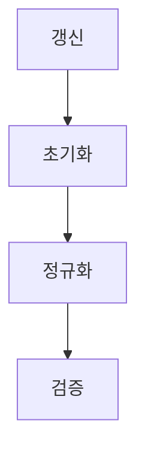

> [!abstract] 한 줄 요약
> 학습 기술들은 ==손실을 낮추는 갱신==을 더 안정적으로 만들고, 초기값·데이터 분할·과적합을 함께 다루는 방법이다.

## 이 노트의 지도



## 1. 갱신 규칙과 옵티마이저

강의는 경사하강법을 $x_{n+1}=x_n-\eta\nabla f(x_n)$로 제시하고, 초기 위치에 따라 local minimum 또는 saddle point에 도달할 수 있음을 함께 언급한다.

$$
x_{n+1}=x_n-\eta\nabla f(x_n)
$$

<details>
<summary>Momentum과 NAG의 갱신</summary>

Momentum은 속도 항을 사용해 다음 위치를 갱신한다.

$$
x_{n+1}=x_n+v_n,
\qquad
v_n=\alpha v_{n-1}-\eta\nabla f(x_n),
\qquad
v_{-1}=0
$$

강의는 NAG를 “Gradient를 미래 지향적으로 반영”하는 방법으로 설명하고, 기울기를 $x_n+\alpha v_{n-1}$에서 평가하는 식을 제시한다.

</details>

> [!important] 옵티마이저 비교
> 강의는 AdaGrad를 축·단계별 학습률 조정으로, RMSProp을 최근 gradient를 더 반영하는 가중 평균으로, Adam을 Momentum과 RMSProp의 결합으로 소개한다.

<Tabs>
  <Tab label="학습률 보정">
    AdaGrad는 큰 변화 축에는 작은 학습률, 작은 변화 축에는 큰 학습률을 설정한다고 제시한다.
  </Tab>
  <Tab label="최근값 반영">
    RMSProp은 누적치와 현재 gradient의 가중 평균을 사용하고, forgetting factor 또는 decay rate를 둔다.
  </Tab>
</Tabs>

```html preview
<div style="font-family:system-ui,sans-serif;padding:20px">
  <div id="cards" style="display:flex;gap:14px;flex-wrap:wrap"></div>
  <script>
    var stats = [
      ['옵티마이저', '6종', 'GD, Momentum, NAG, AdaGrad, RMSProp, Adam', 'var(--chart-2)'],
      ['초기화', '3종', 'LeCun, Xavier, He', 'var(--chart-1)'],
      ['데이터 역할', '3개', 'train, validation, test', 'var(--chart-5)']
    ];
    document.getElementById('cards').innerHTML = stats.map(function (s) {
      return '<div style="flex:1;min-width:150px;padding:16px;background:var(--card);' +
        'color:var(--card-foreground);border:1px solid var(--border);' +
        'border-radius:var(--radius)">' +
        '<div style="font-size:13px;color:var(--muted-foreground)">' + s[0] + '</div>' +
        '<div style="font-size:26px;font-weight:700;margin-top:4px">' + s[1] + '</div>' +
        '<div style="font-size:12px;font-weight:600;margin-top:4px;color:' + s[3] + '">' +
        s[2] + '</div>' +
        '</div>';
    }).join('');
  </script>
</div>
```

## 2. 초기화와 배치 정규화

강의는 초기 가중치의 분산이 너무 크거나 작을 때 vanishing gradient 또는 표현력 제한이 생길 수 있음을 제시한다. 이어 LeCun·Xavier·He 초기화를 비교하며, He 초기화는 활성화 함수가 ReLU일 때의 방법으로 소개한다.

<details>
<summary>배치 정규화의 계산 흐름</summary>

강의는 feature 수 $D$인 데이터 $N$개를 $N\times D$ 행렬로 두고, 열 평균 $\mu$를 빼 중심화한 뒤 분산 $\sigma^2$로 정규화한다. 그 후 길이 $D$의 벡터 $\gamma$를 곱하고 $\beta$를 더하는 구조를 제시한다.

</details>

> [!tip] 강의가 제시한 효과
> 배치 정규화는 학습속도 개선, 초기값 의존 완화, overfitting 억제를 함께 제시한다.

## 3. 과적합과 검증

강의는 overfitting 다음에 weight decay, L2 norm, L1 norm, Dropout을 다룬다. 또한 하이퍼파라미터 예로 층 수, 뉴런 수, learning rate, 손실함수, 배치 크기, 훈련 횟수, optimizer 계수, 초기값, 가중치 감소, dropout 비율을 나열한다.

<details>
<summary>데이터 분할과 K-fold validation</summary>

- train 데이터: parameter 학습
- validation 데이터: hyperparameter 성능 평가
- test 데이터: 신경망의 범용 성능 평가

K-fold validation은 train 데이터를 $K$등분하고, 하나를 검증용으로 두며 나머지를 훈련용으로 쓰는 과정을 $K$번 반복한 뒤 평균을 낸다고 강의가 설명한다.

</details>

| 주제 | 강의에서의 역할 | 학습 시점 |
| :-- | :-- | :-- |
| 초기화 | vanishing gradient·표현력 제한과 연결 | 학습 전 |
| Batch Normalization | 중심화·정규화 뒤 $\gamma$, $\beta$ 적용 | 계층 내부 |
| Weight decay·Dropout | 과적합 대책 | 학습 중 |
| validation | hyperparameter 평가 | 선택 과정 |
| test | 범용 성능 평가 | 최종 평가 |

> [!warning] 소스 경고
> 현재 추출문의 PDF 메타데이터 title은 이 수업 주제와 일치하지 않는다. 초기화 식 일부와 하이퍼파라미터 표기에는 훼손된 문자가 있어, 이 노트에서는 명확히 확인되는 이름·역할·수치만 기록했다.

<details>
<summary>스스로 점검</summary>

**Q.** validation 데이터와 test 데이터의 역할은 어떻게 구분되는가?

**A.** 강의는 validation을 하이퍼파라미터 성능 평가에, test를 신경망의 범용 성능 평가에 사용한다고 제시한다.

</details>

## 출처와 한계

- 근거: 현재 로컬 “AIE309 6장 학습 기술들” 추출문.
- 원본 PDF 링크, 쪽수 표기, 원본 슬라이드 이미지와 assets 임베드는 이 공개 노트에서 제외했다.
