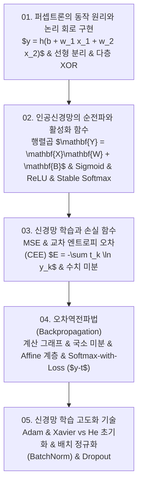

# 📚 인공신경망 (Neural Networks & Deep Learning Foundations) 전체 강의 로드맵

생물학적 뉴런을 모방한 단층 퍼셉트론과 논리 회로(AND/OR/NAND/XOR) 구현, 인공신경망(ANN)의 순전파와 활성화 함수(시그모이드, ReLU, 오버플로 방지 소프트맥스), 신경망 학습과 손실 함수(MSE, 교차 엔트로피 오차 CEE, 수치 미분 기울기), 계산 그래프와 연쇄 법칙에 기반한 고속 오차역전파법(Backpropagation), 그리고 최적화 알고리즘(Momentum, AdaGrad, Adam), 가중치 초기화(Xavier, He), 정규화(Dropout, BatchNorm)까지 밑바닥부터 구현하는 딥러닝 핵심 원리를 다룹니다.

---

## 🗺️ 강의 목차 (Curriculum Overview)

---

## 📑 개별 정리 문서 목록

1. [01. 퍼셉트론(Perceptron)의 동작 원리와 논리 회로 구현](file:///Users/um-yunsang/work/edu/ComputerScience/03_ai-ml-data/neural-networks/notes/01.%20%ED%8D%BC%EC%85%89%ED%8A%B8%EB%A1%A0(Perceptron)%EC%9D%98%20%EB%8F%99%EC%9E%91%20%EC%9B%90%EB%A6%AC%EC%99%80%20%EB%85%BC%EB%A6%AC%20%ED%9A%8C%EB%A1%9C%20%EA%B5%AC%ED%98%84.md)
   - 퍼셉트론 수식, 편향의 물리적 의미, 다층 XOR 조합, 대화형 논리 게이트 진리표 연산기
2. [02. 인공신경망(ANN)의 순전파와 활성화 함수 - 계단함수, 시그모이드, ReLU, 소프트맥스](file:///Users/um-yunsang/work/edu/ComputerScience/03_ai-ml-data/neural-networks/notes/02.%20%EC%9D%B8%EA%B3%B5%EC%8B%A0%EA%B2%BD%EB%A7%9D(ANN)%EC%9D%98%20%EC%88%9C%EC%A0%84%ED%8C%8C%EC%99%80%20%ED%99%9C%EC%84%B1%ED%99%94%20%ED%95%A8%EC%88%98%20-%20%EA%B3%84%EB%8B%A8%ED%95%A8%EC%88%98,%20%EC%8B%9C%EA%B7%B8%EB%AA%A8%EC%9D%B4%EB%93%9C,%20ReLU,%20%EC%86%8C%ED%94%84%ED%8A%B8%EB%A7%A5%EC%8A%A4.md)
   - 비선형성 도입 필수성, Stable Softmax 오버플로 방지 공식, 대화형 활성화 함수 및 도함수 계산기
3. [03. 신경망 학습과 손실 함수 - MSE, 교차 엔트로피 오차(CEE) 및 수치 미분 경사하강법](file:///Users/um-yunsang/work/edu/ComputerScience/03_ai-ml-data/neural-networks/notes/03.%20%EC%8B%A0%EA%B2%BD%EB%A7%9D%20%ED%95%99%EC%8A%B5%EA%B3%BC%20%EC%86%80%EC%8B%A4%20%ED%95%A8%EC%88%98%20-%20MSE,%20%EA%B5%90%EC%B0%A8%20%EC%97%94%ED%8A%B8%EB%A1%9C%ED%94%BC%20%EC%98%A4%EC%B0%A8(CEE)%20%EB%B0%8F%20%EC%88%98%EC%B9%98%20%EB%AF%B8%EB%B6%84%20%EA%B2%BD%EC%82%AC%ED%95%98%EA%B0%95%EB%B2%95.md)
   - 손실 함수 연속성, 수치 미분 중앙 차분, 미니배치 CEE, 실시간 교차 엔트로피 손실 연산기
4. [04. 오차역전파법(Backpropagation) - 계산 그래프, 연쇄 법칙 및 계층별 역전파 구현](file:///Users/um-yunsang/work/edu/ComputerScience/03_ai-ml-data/neural-networks/notes/04.%20%EC%98%A4%EC%B0%A8%EC%97%AD%EC%A0%84%ED%8C%8C%EB%B2%95(Backpropagation)%20-%20%EA%B3%84%EC%82%B0%20%EA%B7%B8%EB%9E%98%ED%94%84,%20%EC%97%B0%EC%87%84%20%EB%B2%95%EC%B9%99%20%EB%B0%8F%20%EA%B3%84%EC%층%EB%B3%84%20%EC%97%AD%EC%A0%84%ED%8C%8C%20%EA%B5%AC%ED%98%84.md)
   - 덧셈/곱셈 노드 역전파, Affine 행렬 곱 역전파, Softmax-with-Loss, 대화형 계산 그래프 역전파 시뮬레이터
5. [05. 신경망 학습 고도화 기술 - 매개변수 갱신(SGD·Momentum·AdaGrad·Adam), 가중치 초기화 및 정규화(Dropout·BatchNorm)](file:///Users/um-yunsang/work/edu/ComputerScience/03_ai-ml-data/neural-networks/notes/05.%20%EC%8B%A0%EA%B2%BD%EB%A7%9D%20%ED%95%99%EC%8A%B5%20%EA%B3%A0%EB%8F%84%ED%99%94%20%EA%B8%B0%EC%88%A0%20-%20%EB%A7%A4%EA%B0%9C%EB%B3%80%EC%88%98%20%EA%B0%B1%EC%8B%A0(SGD%C2%B7Momentum%C2%B7AdaGrad%C2%B7Adam),%20%EA%B0%80%EC%A4%91%EC%B9%98%20%EC%B4%88%EA%B8%B0%ED%99%94%20%EB%B0%8F%20%EC%A0%95%EA%B7%9C%ED%99%94(Dropout%C2%B7BatchNorm).md)
   - 4대 옵티마이저 수식, Xavier vs He 분산 보존 공식, 배치 정규화, 대화형 가중치 초기화 적합도 검사기
