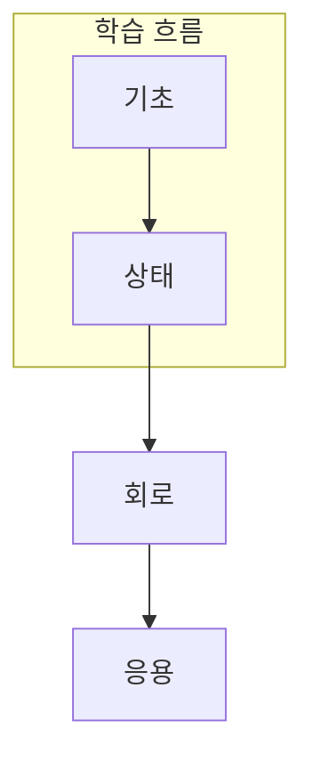

> [!abstract] 한 줄 요약
> 양자 강의는 상태 변화, 측정, 문제 매핑의 세 관점으로 읽는다.

## 강의 흐름 지도

[00. quantum-lecture 강의 흐름 지도](<./notes/00. quantum-lecture 강의 흐름 지도.md>)

## 이 과정의 지도



## 학습 경로

<Tabs>
  <Tab label="기초">게이트와 선형대수로 상태 표현을 잡는다.</Tab>
  <Tab label="상태">알고리즘과 클라우드 작업으로 실행 흐름을 본다.</Tab>
  <Tab label="응용">VQA·QML·SQD·하드웨어로 응용 조건을 비교한다.</Tab>
</Tabs>

```html preview
<div style="font-family:system-ui,sans-serif;padding:20px">
  <div id="cards" style="display:flex;gap:14px;flex-wrap:wrap"></div>
  <script>
    var stats = [['기초', '1', '표현과 배경', 'var(--chart-1)'], ['회로', '2', '게이트와 측정', 'var(--chart-2)'], ['응용', '3', '하이브리드 설계', 'var(--chart-3)']];
    document.getElementById('cards').innerHTML = stats.map(function (s) {
      return '<div style="flex:1;min-width:150px;padding:16px;background:var(--card);' +
        'color:var(--card-foreground);border:1px solid var(--border);' +
        'border-radius:var(--radius)">' +
        '<div style="font-size:13px;color:var(--muted-foreground)">' + s[0] + '</div>' +
        '<div style="font-size:26px;font-weight:700;margin-top:4px">' + s[1] + '</div>' +
        '<div style="font-size:12px;font-weight:600;margin-top:4px;color:' + s[3] + '">' +
        s[2] + '</div>' +
        '</div>';
    }).join('');
  </script>
</div>
```

<details>
<summary>과정 사용법</summary>

각 노트에서는 학습 질문을 먼저 읽고, 상태·회로·측정 중 무엇이 바뀌는지 확인한 뒤 비교표와 점검 질문으로 돌아온다.

</details>

> [!tip] 순서의 이유
> ==상태 표현==을 이해한 뒤 게이트와 회로를 읽으면, 측정값을 단순한 숫자가 아니라 설계 결과로 해석할 수 있다.

## 노트 목록

- [양자 기초 게이트 설명](<./notes/01. 양자 기초 게이트 설명.md>)
- [양자 알고리즘 소개 — Grover와 Shor](<./notes/01-1. 양자 알고리즘 소개 — Grover와 Shor.md>)
- [양자클라우드 Braket 기초 사용법](<./notes/02. 양자클라우드 Braket 기초 사용법.md>)
- [양자컴퓨팅을 위한 물리 및 선형대수](<./notes/03. 양자컴퓨팅을 위한 물리 및 선형대수.md>)
- [화학 알고리즘 소개 — VQA](<./notes/03-1. 화학 알고리즘 소개 — VQA.md>)
- [양자 머신러닝 알고리즘 소개 — QML](<./notes/04. 양자 머신러닝 알고리즘 소개 — QML.md>)
- [양자컴퓨팅 하드웨어에 대한 이해](<./notes/05. 양자컴퓨팅 하드웨어에 대한 이해.md>)
- [하이브리드 알고리즘 소개 — SQD](<./notes/05-1. 하이브리드 알고리즘 소개 — SQD.md>)

| 구간 | 주된 질문 | 다음 단계 |
| :-- | :-- | :-- |
| 기초 | 무엇을 표현하는가 | 상태 |
| 상태 | 무엇이 바뀌는가 | 회로 |
| 응용 | 무엇을 측정하는가 | 평가 |

> [!question]- 스스로 점검
> **Q.** 다음 노트로 넘어가기 전에 적어둘 한 문장은 무엇인가?
>
> **A.** 현재 노트에서 입력·변환·관측 중 무엇이 핵심인지다.

## 출처

- 공개 노트에는 원본 강의 자료, 자산 이미지, 페이지 단위 근거를 포함하지 않는다.
