> [!abstract] 사용법
> 이 문서는 원본 PDF의 **순서 → 핵심 단서 → 학습 점검**을 한 번에 보는 지도입니다. 세부 개념은 같은 폴더의 주제 노트와 원본 PDF를 함께 대조하세요.

## 강의 흐름

```mermaid
flowchart LR
    A["1. 양자 기초 게이트 설명_Jun.2026"]
    B["1. 양자 알고리즘 소개-Grover Shor Algo"]
    C["2. 양자클라우드 Bracket 기초 사용법_Jun.2"]
    D["3. 양자컴퓨팅을 위한 물리 및 선형대수_Jun.202"]
    E["3. 화학 알고리즘 소개-VQA_Jun.2026"]
    F["4. 양자 머신러닝 알고리즘 소개-QML_Jun.202"]
    G["5. 양자컴퓨팅 하드웨어에 대한 이해 _Jun.2026"]
    H["5. 하이브리드 알고리즘 소개-SQD_Jun.2026"]
    A --> B
    B --> C
    C --> D
    D --> E
    E --> F
    F --> G
    G --> H
```



<Tabs>
  <Tab label="파일 순서">파일명과 주차·장 제목을 강의 진행 신호로 삼아 처음부터 읽습니다.</Tab>
  <Tab label="읽기 전략">이론에서 실습·평가로 이동하며 같은 주제의 중복 PDF는 보조 자료로 비교합니다.</Tab>
  <Tab label="검증">텍스트가 빈약한 자료는 추출되지 않은 도식·수식을 임의로 채우지 않고 원본에서 확인합니다.</Tab>
</Tabs>

## 원본 PDF 목록

| 파일 | 쪽수 | 첫 페이지 단서 |
| :-- | --: | :-- |
| 1. 양자 기초 게이트 설명_Jun.2026.pdf | — | 양자 기초 게이트 구현

                                                            Quantum Innovation Lab


Copyright 2026 © MegazoneCloud CORP. AL |
| 1. 양자 알고리즘 소개-Grover Shor Algorithm_Jun.2026.pdf | — | Grover&Shor Algorithm

                                                                Yousung Kang,
                                        |
| 2. 양자클라우드 Bracket 기초 사용법_Jun.2026.pdf | — | 양자클라우드 Braket 기초 사용법

                                                                Yousung Kang,
                                         |
| 3. 양자컴퓨팅을 위한 물리 및 선형대수_Jun.2026.pdf | — | 양자컴퓨팅을 위한 물리 및 선형대수


Copyright 2026 © MegazoneCloud CORP. ALL RIGHTS RESERVED. |
| 3. 화학 알고리즘 소개-VQA_Jun.2026.pdf | — | Variational Quantum Algorithms

                                                                Yousung Kang,
                               |
| 4. 양자 머신러닝 알고리즘 소개-QML_Jun.2026.pdf | — | Quantum Machine Learning

                                                                  HYUNHO PARK
                                     |
| 5. 양자컴퓨팅 하드웨어에 대한 이해 _Jun.2026.pdf | — | Quantum Hardwares

                                                                Yousung Kang,
                                            |
| 5. 하이브리드 알고리즘 소개-SQD_Jun.2026.pdf | — | Sample-Based Quantum
                                          Diagonalization
                                                              |
| MEGAZONE_Quantum_Computing_Certificate.pdf | — | 텍스트 추출 빈약 — 원본 시각 자료 확인 필요 |

## 원본 단계 인터랙티브

```html preview
<div style="font-family:system-ui,sans-serif;padding:20px;color:var(--foreground)">
  <label for="flowdataquantumlecture" style="font-size:14px;font-weight:600">원본 자료 단계</label>
  <div id="flowdataquantumlecture-out" style="font-size:24px;font-weight:700;color:var(--chart-1);margin:6px 0">1. 양자 기초 게이트 설명_Jun.2026</div>
  <input id="flowdataquantumlecture" type="range" min="1" max="9" step="1" value="1" style="width:100%;accent-color:var(--primary)" />
  <p style="font-size:13px;color:var(--muted-foreground)">슬라이더를 움직이면 파일명 순서대로 자료의 역할을 확인합니다.</p>
  <script>
    var flowdataquantumlecture = document.getElementById('flowdataquantumlecture');
    var flowdataquantumlectureOut = document.getElementById('flowdataquantumlecture-out');
    var flowdataquantumlectureSteps = ["1. 양자 기초 게이트 설명_Jun.2026","1. 양자 알고리즘 소개-Grover Shor Algorithm_Jun.2026","2. 양자클라우드 Bracket 기초 사용법_Jun.2026","3. 양자컴퓨팅을 위한 물리 및 선형대수_Jun.2026","3. 화학 알고리즘 소개-VQA_Jun.2026","4. 양자 머신러닝 알고리즘 소개-QML_Jun.2026","5. 양자컴퓨팅 하드웨어에 대한 이해 _Jun.2026","5. 하이브리드 알고리즘 소개-SQD_Jun.2026","MEGAZONE_Quantum_Computing_Certificate"];
    flowdataquantumlecture.addEventListener('input', function () {
      flowdataquantumlectureOut.textContent = flowdataquantumlectureSteps[Number(flowdataquantumlecture.value) - 1];
    });
  </script>
</div>
```

## 점검 포인트

- **범위:** 9개 PDF, 총 0쪽.
- **근거:** 첫 페이지 추출 단서를 표에 남겨 주제명과 흐름을 확인했습니다.
- **시각 자료:** 1개 파일은 첫 페이지 텍스트가 빈약하므로 필요한 경우 승인된 크롭 후보로만 별도 검토합니다.

> [!warning] 과해석 방지
> 이 지도에는 파일명·쪽수·추출된 첫 페이지 단서만 기록했습니다. PDF에 없는 구현 세부, 성능 수치, 권장 설정은 추가하지 않습니다.

<details>
<summary>다음 읽기</summary>

현재 단계의 파일을 선택한 뒤, 같은 폴더의 주제 노트에서 정의·절차·실습 결과를 대조하세요.

</details>
