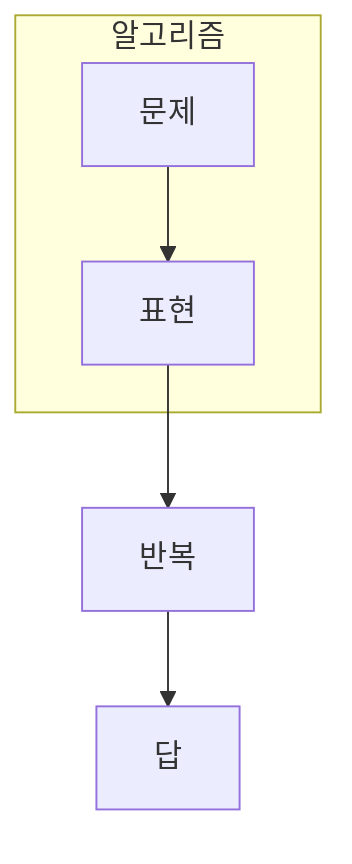

> [!abstract] 한 줄 요약
> Grover는 후보를 증폭하고 Shor는 주기를 찾아, 서로 다른 구조의 정보를 꺼낸다.

## 이 노트의 지도



## 1. 찾고 싶은 정보가 다르다

Grover는 표시된 항목을 더 자주 관측되도록 만들고, Shor는 함수의 반복 구조에서 주기를 찾아 인수분해 문제로 연결한다. ==정보 목표==는 이 노트에서 결과보다 먼저 추적할 대상이다.

$$
O(\sqrt{N})
$$

<details>
<summary>Grover 반복을 왜 같은 횟수로 끝내지 않을까?</summary>

표시 상태의 진폭은 반복마다 달라진다. 너무 적게 반복하면 증폭이 부족하고, 너무 많이 반복하면 진폭이 다시 다른 상태로 이동할 수 있다.

</details>

```html preview
<div style="font-family:system-ui,sans-serif;padding:20px;color:var(--foreground)">
  <label for="amt" style="font-size:14px;font-weight:600">Grover 반복 횟수</label>
  <div id="out" style="font-size:30px;font-weight:700;color:var(--chart-1);margin:6px 0">반복 2회</div>
  <input id="amt" type="range" min="0" max="8" step="1" value="2"
    style="width:100%;accent-color:var(--primary)" />
  <p style="font-size:13px;color:var(--muted-foreground)">반복 횟수는 후보 진폭을 증폭하는 설계 변수다.</p>
  <script>
    var amt = document.getElementById('amt');
    var out = document.getElementById('out');
    amt.addEventListener('input', function () {
      out.textContent = '반복 ' + Number(amt.value).toLocaleString() + '회';
    });
  </script>
</div>
```

## 2. 복잡도 표기는 문제 조건과 함께 읽는다

두 알고리즘 모두 모든 계산에서 자동으로 우위를 주지 않는다. 입력 표현, 오류, 읽어내야 하는 결과의 형태가 함께 맞아야 한다.

```html preview
<div style="font-family:system-ui,sans-serif;padding:20px;color:var(--foreground)">
  <h3 style="margin:0 0 14px;font-size:15px;font-weight:600">비정렬 탐색의 비교 연산 수</h3>
  <div id="bars" style="display:flex;align-items:flex-end;gap:14px;height:170px"></div>
  <script>
    var data = [["고전",16],["Grover",4]];
    var max = Math.max.apply(null, data.map(function (d) { return d[1]; }));
    document.getElementById('bars').innerHTML = data.map(function (d, i) {
      return '<div style="flex:1;display:flex;flex-direction:column;align-items:center;' +
        'gap:6px;height:100%;justify-content:flex-end">' +
        '<span style="font-size:12px;font-weight:600">' + d[1] + '</span>' +
        '<div style="width:100%;height:' + (d[1] / max * 100) + '%;' +
        'background:var(--chart-' + (i + 1) + ');' +
        'border-radius:var(--radius) var(--radius) 0 0"></div>' +
        '<span style="font-size:12px;color:var(--muted-foreground)">' + d[0] + '</span>' +
        '</div>';
    }).join('');
  </script>
</div>
```

> [!caution] 해석의 범위
> 막대는 16개 후보의 이상화된 탐색 횟수 비교다. 실제 실행 시간이나 오류 비용을 뜻하지 않는다.

```html preview
<div style="font-family:system-ui,sans-serif;padding:20px">
  <div id="cards" style="display:flex;gap:14px;flex-wrap:wrap"></div>
  <script>
    var stats = [["Grover","탐색","후보 증폭","var(--chart-1)"],["Shor","주기","구조 추출","var(--chart-2)"],["공통","회로","측정 필요","var(--chart-3)"]];
    document.getElementById('cards').innerHTML = stats.map(function (s) {
      return '<div style="flex:1;min-width:150px;padding:16px;background:var(--card);' +
        'color:var(--card-foreground);border:1px solid var(--border);' +
        'border-radius:var(--radius)">' +
        '<div style="font-size:13px;color:var(--muted-foreground)">' + s[0] + '</div>' +
        '<div style="font-size:26px;font-weight:700;margin-top:4px">' + s[1] + '</div>' +
        '<div style="font-size:12px;font-weight:600;margin-top:4px;color:' + s[3] + '">' +
        s[2] + '</div>' +
        '</div>';
    }).join('');
  </script>
</div>
```

## 기하 또는 상태로 회수하기

```html preview
<div style="font-family:system-ui,sans-serif;padding:20px;display:flex;align-items:center;gap:20px;color:var(--foreground)">
  <svg width="120" height="120" viewBox="0 0 120 120" role="img" aria-label="halfway through an amplitude amplification cycle">
    <circle cx="60" cy="60" r="46" stroke-width="14" style="fill: none; stroke: var(--border)" />
    <circle cx="60" cy="60" r="46" stroke-width="14"
      stroke-linecap="round" stroke-dasharray="289" stroke-dashoffset="145"
      transform="rotate(-90 60 60)" style="fill: none; stroke: var(--chart-1)" />
    <text x="60" y="67" text-anchor="middle" font-size="22" font-weight="700"
      style="fill: var(--foreground)">50%</text>
  </svg>
  <div>
    <div style="font-weight:600;font-size:15px">진폭 증폭의 중간 상태</div>
    <div style="font-size:13px;color:var(--muted-foreground);margin-top:2px">반복 횟수는 고정된 정답이 아니라 문제 크기에 의존한다.</div>
  </div>
</div>
```

<Tabs>
  <Tab label="Grover">표시 상태의 진폭을 반복적으로 키운다.</Tab>
  <Tab label="Shor">주기 추출을 인수분해 절차에 연결한다.</Tab>
  <Tab label="공통">측정 전 상태 조작과 결과 읽기가 필요하다.</Tab>
</Tabs>

## 핵심 정리

| 관점 | 확인할 질문 | 학습상 의미 |
| :-- | :-- | :-- |
| 목표 | 어떤 정보를 꺼내는가 | 알고리즘 선택 |
| 반복 | 어떤 변환을 누적하는가 | 회로 설계 |
| 측정 | 무엇을 읽는가 | 결과 해석 |

> [!question]- 스스로 점검
> **Q.** Grover와 Shor를 모두 ‘빠른 계산’이라는 말로만 설명하면 빠지는 차이는 무엇인가?
>
> **A.** 각각 증폭하려는 후보와 찾아내려는 주기라는 정보 목표가 다르다.

## 출처

- 공개 노트에는 원본 강의 자료, 자산 이미지, 페이지 단위 근거를 포함하지 않는다.
