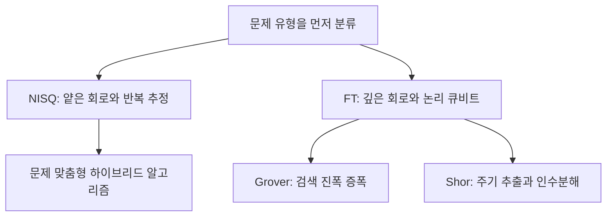
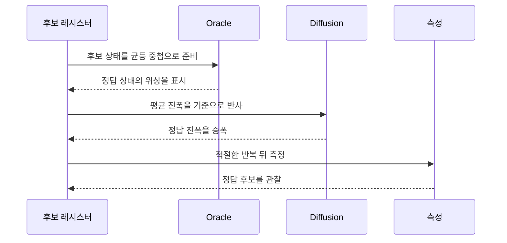

> [!abstract] 이 문서가 답하는 질문
> Grover와 Shor는 모두 양자 회로를 쓰지만, 하나는 후보 검색의 진폭을 키우고 다른 하나는 숨은 주기를 읽는다. 두 알고리즘의 입력·반복·측정 구조를 어떻게 구분할 수 있는가?

## 알고리즘 지형



강의는 현재 장비에 맞춰 얕은 회로와 반복 추정을 활용하는 NISQ 알고리즘, 내결함성 장비에서 깊은 회로와 논리 큐비트를 활용하는 FT 알고리즘을 대비시킨다. 이 문서는 그 구분 위에서 Grover와 Shor의 회로 아이디어를 따라간다.

<Tabs>
  <Tab label="NISQ">
    <p><strong>특징:</strong> 얕은 회로, 양자–고전 하이브리드 구조, 변분 원리, 노이즈 강인성, 측정 효율성.</p>
    <p><strong>해석:</strong> 정밀한 한 번의 계산보다 반복 측정으로 답을 추정한다.</p>
  </Tab>
  <Tab label="FT">
    <p><strong>특징:</strong> 깊은 회로, 논리 큐비트, 전체 Hilbert 공간 사용, 양자 우위, 큐비트 효율성.</p>
    <p><strong>해석:</strong> 강의는 Grover와 Shor를 미래 내결함성 시대의 예시로 배치한다.</p>
  </Tab>
</Tabs>

| 구분 | NISQ 알고리즘 | FT 알고리즘 |
| --- | --- | --- |
| 회로 | 얕은 회로 | 깊은 회로 |
| 자원 | 현재 수준의 장비와 물리 큐비트 | 논리 큐비트 |
| 계산 방식 | 반복 측정으로 추정 | 넓은 양자공간을 활용 |
| 강의의 예시 | VQA, VQE, QAOA 등 | Grover, Shor |

> [!note] 범위 표시
> 위 표는 강의 슬라이드가 제시한 분류를 재배열한 것이다. 알고리즘의 실제 성능·오류율·하드웨어 요구량을 별도로 검증한 결과로 읽지 않는다.

## 1. Grover: 정답 상태의 진폭을 키우는 검색

Grover의 본질은 많은 후보 중 정답 후보를 표시하고, 그 후보의 진폭을 반복적으로 키워 측정 가능성을 높이는 것이다. 강의는 보안·금융·제조·물류·추천 등 여러 응용을 예로 들지만, 공통 구조는 “검색”으로 묶는다.

| 분야 | 검색 대상의 예 | 강의가 붙인 기대 효과 |
| --- | --- | --- |
| 보안·암호 | AES 키 후보 | 키 서치 속도 단축 |
| 금융 | 이상거래 후보 | 거래 모니터링 고도화 |
| 제조 품질 | 불량 탐지 로직 | 조기 탐지 정확성 향상 |
| SCM·물류 | 공급 조합 | 조합 최적화 가능성 |
| AI·추천 | 후보 중 하나 | 하이브리드 ML 가능성 |



### Oracle과 Diffusion을 한 쌍으로 읽기

1. **초기화**: 가능한 후보를 균등한 중첩으로 준비한다.
2. **Oracle**: 정답 상태에 위상 표시를 남긴다.
3. **Diffusion**: 평균 진폭을 기준으로 반사해 정답 진폭을 키운다.
4. **반복과 측정**: 두 연산을 적절한 횟수만큼 반복한 뒤 측정한다.


슬라이드의 도식은 상태 벡터가 정답 상태 방향으로 조금씩 회전하다가, 반복을 지나치면 정답 확률이 다시 감소하는 주기성을 보여준다. 따라서 “많이 반복할수록 항상 좋다”가 아니라, 문제 크기와 해의 개수에 맞춰 반복 수를 정해야 한다.

$$
R \approx \frac{\pi}{4}\sqrt{\frac{N}{M}}
$$

여기서 \(N\)은 후보 상태 수, \(M\)은 정답 상태 수로 읽는다. 식은 강의 슬라이드에 표시된 반복 횟수의 근사식이며, 실제 장비의 노이즈나 구현 비용까지 포함한 최적화 식은 아니다.

```html preview
<div style="font-family:system-ui,sans-serif;padding:20px;color:var(--foreground)">
  <h3 style="margin:0 0 14px;font-size:15px;font-weight:600">Grover 한 번의 반복</h3>
  <div id="grover-stages" style="display:grid;grid-template-columns:repeat(4,1fr);gap:10px"></div>
  <script>
    var stages = [
      ['1', '초기화', '후보를 균등 중첩'],
      ['2', 'Oracle', '정답 위상 표시'],
      ['3', 'Diffusion', '평균 기준 반사'],
      ['4', '측정', '반복 후 정답 관찰']
    ];
    document.getElementById('grover-stages').innerHTML = stages.map(function (s, i) {
      return '<div style="padding:12px;background:var(--card);border:1px solid var(--border);border-radius:var(--radius)">' +
        '<div style="font-size:12px;color:var(--chart-' + (i + 1) + ');font-weight:700">' + s[0] + '</div>' +
        '<div style="font-size:14px;font-weight:600;margin-top:6px">' + s[1] + '</div>' +
        '<div style="font-size:12px;color:var(--muted-foreground);margin-top:4px">' + s[2] + '</div>' +
        '</div>';
    }).join('');
  </script>
</div>
```

> [!warning] 반복 횟수의 함정
> 강의의 over-rotation 예시처럼 Oracle과 Diffusion을 무조건 많이 반복하면 정답 확률이 다시 낮아질 수 있다. 반복 수는 \(N\)과 \(M\)의 관계를 보고 정해야 한다.

## 2. Binary Sudoku: Oracle을 문제 규칙에 맞추기

Binary Sudoku 예시는 Grover의 일반 구조를 특정 제약 문제에 적용한다. 강의의 회로는 변수 큐비트와 절(clause) 큐비트, 출력 큐비트, 고전 비트를 만들고, Oracle과 Diffusion을 두 번 반복한 뒤 변수 큐비트를 측정한다.

| 회로 단계 | 하는 일 | 읽을 포인트 |
| --- | --- | --- |
| 초기화 | 변수 레지스터 준비 | 가능한 해를 중첩으로 둔다 |
| Sudoku Oracle | 제약을 만족하는 상태를 표시 | 문제 규칙이 Oracle 안에 들어간다 |
| Diffusion | 상태 진폭을 다시 증폭 | Grover의 공통 연산 |
| 측정 | 변수 큐비트와 고전 비트 연결 | 후보 해를 읽는다 |


```python
qc = QuantumCircuit(var_qubits, clause_qubits, output_qubit, cbits)

# 1. 초기화
qc.append(initial(4), range(4))

# 2. Grover 반복
for j in range(2):
    sudoku_oracle(qc, clause_list, clause_qubits)
    qc.append(diffusion(4), [0, 1, 2, 3])

# 3. 측정
qc.measure(var_qubits, cbits)
```

<details>
<summary>왜 이 예시에서 Oracle을 다시 작성하는가</summary>

Grover의 회로 뼈대는 초기화–Oracle–Diffusion–측정으로 유지되지만, 어떤 상태를 정답으로 표시할지는 문제마다 다르다. Binary Sudoku에서는 변수와 절의 관계를 판정하는 Sudoku Oracle이 그 역할을 맡는다. 슬라이드는 Oracle과 Diffusion을 2회 반복하는 작은 예시를 보여준다.

</details>

> [!example] 회로를 읽는 순서
> 코드에서 먼저 레지스터의 역할을 확인하고, 그 다음 Oracle이 어떤 제약을 표시하는지, 마지막으로 어느 큐비트를 측정하는지 확인하면 회로의 목적을 놓치지 않는다.

## 3. Shor: 숨은 주기를 찾아 인수분해하기

Shor 부분은 RSA 맥락과 작은 정수 예시를 통해 인수분해 문제를 소개한다. 슬라이드는 “119의 약수는?”이라는 질문을 제시하고, 주기 \(r\)를 찾은 뒤 인수 후보를 얻는 흐름으로 양자 부분을 설명한다.


| 단계 | 양자·고전 역할 | 문서에서의 질문 |
| --- | --- | --- |
| 함수 준비 | \(f(x)=a^x \bmod N\) 형태의 주기 함수 | 반복되는 값은 무엇인가? |
| QPE | 위상 정보를 양자 상태에 인코딩 | 주기를 어떤 위상으로 표현하는가? |
| QFT | Fourier basis에서 위상 패턴을 분리 | 숨은 주기를 어떻게 읽는가? |
| 측정 후 처리 | 주기 후보를 바탕으로 인수 후보 계산 | 후보가 유효한가? |

$$
f(x+r)=f(x),\qquad a^r\equiv 1\pmod N
$$

이 식은 모듈러 연산에서 반복 간격을 \(r\)로 표시하는 강의 부록의 수학 표기를 정리한 것이다. 실제 인수 후보를 선택하려면 서로소 조건과 측정 결과 검증이 함께 필요하다.


슬라이드는 QFT를 고전 이산 푸리에 변환의 양자 버전으로 소개하고, 양자 상태의 숨은 주기 정보를 추출하는 목적과 고전 대비 지수적 속도 향상을 함께 제시한다.

<Tabs>
  <Tab label="고전 DFT">
    <p>시간 영역의 신호를 주파수 영역으로 바꾸는 고전 변환으로 설명된다.</p>
    <p>슬라이드의 비교 그림은 입력 크기에 따른 고전 계산량을 $O(N^2)$로 표시한다.</p>
  </Tab>
  <Tab label="양자 QFT">
    <p>양자 상태의 계산 기저를 Fourier 기저로 바꾸어 주기 정보를 읽는 데 사용된다.</p>
    <p>슬라이드는 비교 그림에서 양자 계산량을 $O(N^2)$로 표시하고 별도의 속도 향상 영역을 그린다.</p>
  </Tab>
</Tabs>

<details>
<summary>QPE와 Phase Kickback의 연결</summary>

강의 부록의 회로 제목은 상태 준비, Phase Kickback, Quantum Phase Estimation, QFT, 역 QFT와 측정의 순서를 이어 보여준다.

1. 제어 레지스터와 대상 레지스터를 준비한다.
2. 제어된 연산이 대상 상태에 위상을 부여한다.
3. 그 위상이 제어 레지스터로 되돌아오는 Phase Kickback을 만든다.
4. QFT의 역변환을 적용해 위상 패턴을 측정 가능한 형태로 바꾼다.
5. 측정값을 주기 후보로 해석한다.

</details>

> [!warning] 슬라이드의 속도 표현
> “지수적 함수 속도 향상”은 원본 슬라이드가 제시한 비교 표현이다. 이 문서는 그 문구를 반복해 적을 뿐, 특정 하드웨어·오류 모델에서의 우위를 새로 검증한 것은 아니다.

> [!caution] 원본 표기 오류
> 슬라이드에는 Quantum Superemency, Measurment처럼 철자 오류가 있는 표기가 보인다. 원본의 표현은 임의로 고치지 않고, 여기서는 문맥상 의미만 설명한다.

## 핵심 비교

| 질문 | Grover | Shor |
| --- | --- | --- |
| 무엇을 찾나? | 후보 공간의 정답 상태 | 모듈러 함수의 숨은 주기 |
| 핵심 연산 | Oracle + Diffusion | QPE + QFT |
| 결과를 읽는 방법 | 진폭이 커진 후보 측정 | 주기 후보를 측정 후 고전 처리 |
| 강의의 위치 | FT 알고리즘 예시 | FT 알고리즘 예시 |

> [!question]- 스스로 점검
> **Q1.** Grover에서 Oracle과 Diffusion을 반복하는 이유는 무엇인가?
>
> **A1.** Oracle이 정답 상태를 표시하면 Diffusion이 그 상태의 진폭을 키우기 때문이다. 다만 과도한 반복은 정답 확률을 다시 낮출 수 있다.
>
> **Q2.** Shor에서 QFT가 직접 출력하는 것은 인수인가?
>
> **A2.** 아니다. QFT는 주기 정보가 드러나는 Fourier 기저로 상태를 바꾸고, 측정 뒤 주기 후보를 고전적으로 해석해 인수 후보를 계산한다.
>
> **Q3.** Binary Sudoku의 Oracle은 왜 문제마다 달라지는가?
>
> **A3.** 어떤 상태를 정답으로 표시할지는 제약식의 구조에 달려 있기 때문이다. Grover의 회로 뼈대는 같아도 Oracle의 내용은 문제에 맞춰 바뀐다.

## 출처

- [1. 양자 알고리즘 소개-Grover Shor Algorithm_Jun.2026.pdf](<../sources/1. 양자 알고리즘 소개-Grover Shor Algorithm_Jun.2026.pdf>)

슬라이드 근거는 본문에 실제로 임베드한 렌더 이미지 세 장으로 제한했다.